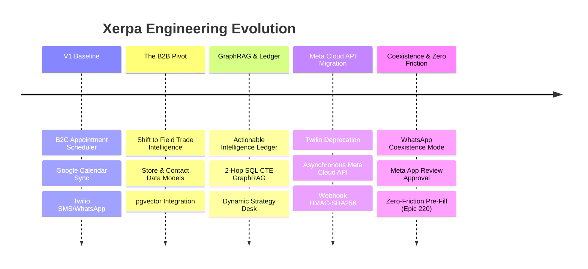

# 🧭 Xerpa (Sherpa) — Master Team Handoff & System Guide

Welcome to the **Xerpa** (formerly *Sherpa*) engineering team! This master handoff document is designed to give you a complete, end-to-end understanding of the product, the problems we solve, the system architecture, everything that has been built to date, and where the project stands today.

---

## 📑 Table of Contents
1. [Product Vision & The "Why"](#1-product-vision--the-why)
2. [Product Evolution & How We Got Here](#2-product-evolution--how-we-got-here)
3. [Current Production & Infrastructure State](#3-current-production--infrastructure-state)
4. [System Architecture & Monorepo Topology](#4-system-architecture--monorepo-topology)
5. [Core Technical Subsystems Deep-Dive](#5-core-technical-subsystems-deep-dive)
   - [5.1 Ingestion Pipeline & Store Action Ledger](#51-ingestion-pipeline--store-action-ledger)
   - [5.2 GraphRAG & Relational Knowledge Engine](#52-graphrag--relational-knowledge-engine)
   - [5.3 WhatsApp Cloud API & Embedded Signup](#53-whatsapp-cloud-api--embedded-signup)
   - [5.4 Dynamic Feature Gating & Multi-Tenancy](#54-dynamic-feature-gating--multi-tenancy)
   - [5.5 Frontend Architecture & UI Standards](#55-frontend-architecture--ui-standards)
6. [Engineering Guardrails & Non-Negotiables](#6-engineering-guardrails--non-negotiables)
7. [Active Backlog & Next Roadmap Milestones](#7-active-backlog--next-roadmap-milestones)
8. [Developer Quickstart & Day 1–7 Onboarding Runbook](#8-developer-quickstart--day-17-onboarding-runbook)
9. [Documentation Directory Index](#9-documentation-directory-index)

---

## 1. Product Vision & The "Why"

### The Problem
In Latin America and emerging markets, B2B wholesale commerce and consumer packaged goods (CPG) distribution happen in the field. Field sales representatives (reps) visit dozens of mom-and-pop stores (*tienditas*, bodegas, pharmacies, hardware stores) every day.
- **Traditional CRMs fail here**: Field reps will **never** open Salesforce, HubSpot, or complex web forms while standing in a busy store or driving between accounts.
- **Lost Intelligence**: Crucial commercial insights (competitor promotions, stockouts, new product feedback, broken display stands) are shared as informal WhatsApp voice notes or text chats, and are lost immediately.
- **Blind Visits**: When a sales rep walks into a store, they often have no structured context on past agreements, store owner personal preferences, credit issues, or active promotions.

### The Solution: Xerpa (Sherpa)
Xerpa is a **Zero-Friction B2B Sales Intelligence Platform**.
- **Frictionless Ingestion**: Reps simply send WhatsApp text or voice notes to their Sherpa AI assistant as if texting a colleague (*"Visited Bodega San Martin. Competitor brand X is running a 2x1 promo on 1L oils. Owner Don Carlos agreed to take 5 boxes of our new premium salsa if we bring a shelf display."*).
- **Automated Intelligence Ledger**: The AI extracts structured **Store Actions** (categorized as Commercial or Marketing), maps them against strategic business objectives, tracks inventory/order signals, and stores embeddings in a relational knowledge graph.
- **Contextual Pre-Visit Briefs**: When the rep arrives at the next store, Sherpa delivers a contextual pre-visit brief summarizing key account contacts, historical agreements, pending marketing commitments, and customized cross-sell opportunities.

### The North Star Persona: "Marco"
- **Role**: Field Sales Representative managing 80+ wholesale retail accounts.
- **Habits**: Operates 100% on WhatsApp and mobile. Impatient with complex software. Needs immediate, voice-friendly, zero-friction answers.
- **Success Metric**: Zero manual form entries required; 100% intelligence captured from natural conversation.

---

## 2. Product Evolution & How We Got Here

To understand the codebase, you should understand how it evolved:



1. **Phase 1 (V1 Baseline)**: Started as an AI-driven automated appointment booking assistant for service businesses (spas, clinics, consultants) connecting WhatsApp/Telegram to Google Calendar.
2. **Phase 2 (The B2B Trade Pivot)**: Realized the massive opportunity in B2B field sales. Built the `trade` module: Point-of-Sale (`Store`) accounts, Retailers (`Client`), Orders, Products catalog, and Mexican postal code geography databases (157k+ records).
3. **Phase 3 (Actionable Ledger & GraphRAG)**: Evolved visit notes into a structured `StoreAction` ledger (Commercial vs. Marketing) linked to dynamic company objectives. Built hybrid search (pgvector + full text + RRF ranking) and relational Graph links.
4. **Phase 4 (Meta Cloud API Migration)**: Replaced high-cost/fragile Twilio messaging with direct Meta WhatsApp Cloud API (Graph API `v22.0`), asynchronous Celery dispatch, and 24-hour compliance gating.
5. **Phase 5 (Coexistence & Zero-Friction Onboarding — Current State)**: 
   - Enabled WhatsApp Coexistence mode so personal WhatsApp Business mobile app users do not lose their chats.
   - Secured official **Meta App Review Live Approval** (`public_profile` Advanced Access).
   - Delivered **Epic 220** (auto-prefill business parameters into Meta's Embedded Signup modal).

---

## 3. Current Production & Infrastructure State

### Deployed Services on Railway
The platform is actively running in production on Railway as a Multi-Service Project targeting the `main` branch (and staging on `staging`):

| Service Name | Technology | Start Command | Role | RAM Allocation |
| :--- | :--- | :--- | :--- | :--- |
| **`sherpa`** | FastAPI (Python 3.11, Nixpacks) | `./pre_deploy.sh && PYTHONPATH=. uvicorn app.main:app --host 0.0.0.0 --port $PORT` | Backend REST API & Inbound Webhooks | 512 MB |
| **`worker`** | Celery (Python 3.11, Nixpacks) | `celery -A app.core.celery_app worker --loglevel=warning --concurrency=1 --max-tasks-per-child=50` | Background AI note parsing, GraphRAG embeddings, message delivery | 512 MB |
| **`web`** | Next.js 14 (Node 20, Nixpacks) | `npm run start` | Web Dashboard & Mobile Responsive UI | 1024 MB |
| **PostgreSQL** | Postgres 16 + pgvector | Railway Managed | Relational DB + Vector Embeddings | 512 MB |
| **Redis** | Redis 7 | Railway Managed | Celery Task Broker, Rate Limiting, Window Cache | 256 MB |

### Production URLs & Domains
- **Production Dashboard**: [`https://app.xerpaa.com`](https://app.xerpaa.com) (Root domain `xerpaa.com` redirects 301 to `app.xerpaa.com`)
- **Staging Dashboard**: `https://web-staging-ee436.up.railway.app`
- **Backend API**: `https://sherpa-production-xxxx.up.railway.app` (Health check at `/health`)

---

## 4. System Architecture & Monorepo Topology

```
/sherpa
├── backend/
│   ├── app/
│   │   ├── api/                  # FastAPI router endpoints
│   │   │   ├── auth.py           # JWT login, refresh, password reset, demo request intake
│   │   │   ├── business.py       # Multi-tenant business profile, feature flags, stats
│   │   │   ├── crm.py            # B2C client management & dynamic custom attributes
│   │   │   ├── integrations.py   # WhatsApp Meta Embedded Signup & connection endpoints
│   │   │   ├── whatsapp.py       # WhatsApp Cloud API webhook receiver (HMAC verified)
│   │   │   ├── telegram.py       # Telegram bot webhook receiver
│   │   │   ├── admin.py          # Superadmin panel (demo requests, tenant management)
│   │   │   └── trade/            # B2B Trade intelligence sub-package
│   │   │       ├── stores.py     # Accounts (Points of Sale), dossiers, zip metadata
│   │   │       ├── actions.py    # StoreAction ledger CRUD & analytics
│   │   │       ├── objectives.py # Dynamic strategic objectives & action templates
│   │   │       ├── products.py   # Wholesale catalog products & categories
│   │   │       └── orders.py     # Wholesale orders ledger & lifecycle
│   │   ├── core/                 # Infrastructure configuration
│   │   │   ├── config.py         # Pydantic BaseSettings, strict env validation
│   │   │   ├── database.py       # Async SQLAlchemy engine (NullPool for Celery, capped API pool)
│   │   │   ├── memory.py         # Redis conversation history buffer (capped at 20 msgs)
│   │   │   ├── security.py       # Password hashing & JWT token handling
│   │   │   ├── limiter.py        # SlowAPI rate limiting configuration
│   │   │   └── webhook_security.py # Meta HMAC-SHA256 signature verification
│   │   ├── models/               # SQLAlchemy 2.x declarative models
│   │   │   ├── business.py       # BusinessProfile, User, Integration, FeatureConfig
│   │   │   ├── knowledge.py      # KnowledgeCorpus (pgvector embeddings), KnowledgeLink
│   │   │   ├── demo_request.py   # Gated registration demo leads
│   │   │   └── trade/            # Modularized B2B models (Store, StoreAction, Objective, Order)
│   │   ├── schemas/              # Pydantic V2 request & response schemas
│   │   ├── services/             # Core business logic & AI orchestration
│   │   │   ├── graphrag.py       # Hybrid search (vector + full-text + RRF) & SQL Graph
│   │   │   ├── agentic_orchestrator.py # LangGraph visit briefing & state machine
│   │   │   ├── prospect_qualifier.py   # Inbound lead qualification engine
│   │   │   └── messaging/        # Messaging engine abstraction
│   │   │       ├── base.py       # Abstract BaseMessagingEngine
│   │   │       ├── meta_cloud_engine.py # Asynchronous Meta Graph API v22.0 client
│   │   │       ├── twilio_engine.py     # Legacy Twilio fallback client
│   │   │       └── meta_provisioner.py  # Embedded Signup OAuth code exchanger
│   │   └── tasks/                # Celery background tasks
│   │       ├── messages.py       # Webhook processing, AI note extraction, WhatsApp delivery
│   │       └── ingestion.py      # Bulk CSV ingestion & vector embedding sync
│   └── tests/                    # Pytest test suite (63+ automated tests)
└── frontend/
    ├── app/                      # Next.js 14 App Router
    │   ├── (dashboard)/page.tsx  # Main dashboard overview & intake activity
    │   ├── trade/
    │   │   ├── stores/           # Accounts (Points of Sale) list & V2 detail dossier
    │   │   ├── prospects/        # Unified prospect leads & verification
    │   │   ├── products/         # Catalog, categories, and inventory units
    │   │   └── orders/           # Wholesale orders ledger
    │   ├── crm/                  # B2C Client CRM list & custom field drawers
    │   ├── settings/             # Business profile, integrations, WhatsApp connection
    │   ├── (admin)/admin/        # Superadmin console (demo requests, tenant overrides)
    │   └── auth/                 # Login, password reset, demo request form
    ├── components/               # Shared components & sliding V2 Drawers
    │   ├── v2/                   # High-density V2 drawers (AccountDrawer, ClientDrawer, CatalogDrawer)
    │   ├── WhatsAppModal.tsx     # Facebook SDK Embedded Signup modal with prefill
    │   └── Sidebar.tsx           # Dynamic feature-gated navigation sidebar
    ├── lib/
    │   └── apiClient.ts          # Centralized typed fetch client (handles JWT & auto-refresh)
    └── types/
        └── api.ts                # Auto-generated TypeScript types from backend openapi.json
```

---

## 5. Core Technical Subsystems Deep-Dive

### 5.1 Ingestion Pipeline & Store Action Ledger
When a sales rep sends notes into WhatsApp:
1. **Webhook Reception**: `POST /webhook` in `app/api/whatsapp.py` validates the HMAC-SHA256 signature using `META_APP_SECRET`.
2. **Asynchronous Hand-off**: The raw payload is normalized and handed off to Celery immediately via `apply_async()`, responding `200 OK` to Meta within <200ms.
3. **AI Entity Extraction**: Celery worker invokes `tasks/messages.py` $\rightarrow$ LLM parsing step:
   - Identifies the target account (`Store`) and contact (`Client`).
   - Classifies commitments into structured **`StoreAction`** records:
     - `category`: `COMMERCIAL` (inventory, orders, volume) or `MARKETING` (shelf space, competitor threat, POSM).
     - `objective`: Dynamic objective key (e.g., `SHARE_OF_SHELF`, `THREAT_RESPONSE`, `PREVENT_STOCKOUTS`).
     - `impact`: `LOW`, `MEDIUM`, `HIGH`.
     - `details`: Structured JSONB payload containing extracted quantities and competitor brand names.
4. **Vector Embedding**: Note chunks are embedded via OpenAI `text-embedding-3-small` and saved in `KnowledgeCorpus` with `pgvector` index.

### 5.2 GraphRAG & Relational Knowledge Engine
Sherpa uses **Relational Graph-Enriched RAG** (`app/services/graphrag.py`):
- **Hybrid Search**: Combines pgvector cosine similarity search with Postgres full-text keyword search (`tsvector`), ranking results using **Reciprocal Rank Fusion (RRF)**.
- **Relational 2-Hop SQL Traversals**: Instead of expensive Neo4j graph databases, Sherpa executes fast SQL Common Table Expressions (CTEs) traversing:
  $$\text{Store} \xrightarrow{\text{1 Hop}} \text{Client (Owner)} \xrightarrow{\text{2 Hops}} \text{Other Stores / Shared Competitors}$$
- **Context Briefing**: The LangGraph state machine (`agentic_orchestrator.py`) synthesizes this relational context into a crisp 3-bullet pre-visit briefing for reps before entering a store.

### 5.3 WhatsApp Cloud API & Embedded Signup
- **Meta Cloud API Engine (`meta_cloud_engine.py`)**: Direct HTTP calls to Graph API `v22.0` via non-blocking `httpx.AsyncClient`.
- **Zero-Friction Embedded Signup (`WhatsAppModal.tsx` & `integrations.py`)**:
  - The frontend loads the Facebook JavaScript SDK.
  - When the user clicks "Conectar WhatsApp", the modal calls `GET /whatsapp/config` to fetch `prefill` parameters (`business_name`, `category`, `website: "https://xerpaa.com"`).
  - Injects `setup.business` directly into `FB.login()`.
  - Meta returns an OAuth authorization code, which `POST /whatsapp/meta-onboard` exchanges for permanent WABA and Phone Number credentials.
- **Coexistence Mode**: Users can keep their personal WhatsApp Business mobile app active on their phone while Sherpa operates simultaneously on the Cloud API.
- **24-Hour Compliance Gating**: Outbound free-form messages check `Conversation.extra_data["whatsapp_24h_window_start"]`. If expired, the engine automatically falls back to an approved Meta template (`hello_world`).

### 5.4 Dynamic Feature Gating & Multi-Tenancy
Sherpa supports multiple business vertical configurations stored in `BusinessProfile.features_config`:
- `b2b_solutions`: Activates Stores, Store Actions, Strategy Desk, and Wholesale Orders.
- `products_catalog`: Activates Catalog Drawer, Category Management, and SKU tracking.
- `services`: Activates B2C Services, Appointment Scheduling, and Google Calendar sync.
- `sales_intelligence`: Activates GraphRAG dossiers, visit briefings, and AI Opportunity suggestions.

The UI (`Sidebar.tsx`, pages, drawers) dynamically toggles views based on these tenant flags.

### 5.5 Frontend Architecture & UI Standards
- **Next.js 14 App Router** with React Query (`@tanstack/react-query`) for cache management and optimistic updates.
- **Centralized API Client (`lib/apiClient.ts`)**: All HTTP requests flow through `apiClient`. Raw `fetch()` with inline authorization headers is strictly banned.
- **V2 Sliding Drawers (`components/v2/`)**: High-density desktop and tablet sliding drawers (`AccountDrawer`, `ClientDrawer`, `CatalogDrawer`) built with `react-hook-form` and `zod` validation schemas.
- **Simplified Terminology & Objective Labels**:
  - `THREAT_RESPONSE` $\rightarrow$ `Competitive Response`
  - `SHARE_OF_SHELF` $\rightarrow$ `Shelf Presence Check`
  - `NEW_PRODUCT_INTRODUCTION` $\rightarrow$ `Launch New Product`
  - `INVENTORY_VELOCITY_OOS_PREVENTION` $\rightarrow$ `Prevent Stockouts`
  - `PERFECT_STORE_ASSORTMENT_COMPLIANCE` $\rightarrow$ `Store Standards Check`
  - `SEASONAL_EVENT_ACTIVATION` $\rightarrow$ `Seasonal Promotion`
  - `TRADE_LOYALTY_VOLUME_PUSHING` $\rightarrow$ `Drive Larger Orders`
  - `POSM_MAINTENANCE_ASSET_PURITY` $\rightarrow$ `Maintain Promo Materials`

---

## 6. Engineering Guardrails & Non-Negotiables

> [!CAUTION]
> The following rules were established to prevent costly production outages, security vulnerabilities, and memory ballooning. All team members must adhere to them strictly.

### 1. RAM Optimization Guardrails ($10/mo $\rightarrow$ $1.50/mo Preservation)
- **NullPool for Celery**: `backend/app/core/database.py` — Celery workers must use `poolclass=NullPool`. This prevents idle database connection pool memory accumulation.
- **Capped DB Pool for API**: `backend/app/core/database.py` — API server must use `pool_size=5, max_overflow=10, pool_recycle=1800`.
- **Worker Memory Recycling**: `Procfile` / start commands must enforce `--max-tasks-per-child=50` and `--concurrency=1` to continuously recycle leaked memory.
- **Redis History Bounding**: `backend/app/core/memory.py` — Conversation history buffers must be capped at 20 messages using `ltrim`.

### 2. Branching & Deployment Safety Protocol
- **`main`**: Production code. Deployed automatically to Railway production.
- **`staging`**: Integration hub for all developers. Primary target for PRs.
- **`feature/[role]/[task]`**: Workspace for individual features (e.g., `feature/backend/order-revert`).
- **Staging Merge Gate**: Always obtain explicit confirmation before merging feature branches into `staging` or `main`.

### 3. Database & Schema Integrity
- **Strict Human Approval for Migrations**: Obtain explicit permission before modifying SQLAlchemy models or applying Alembic migrations.
- **Local Isolation**: All development and testing must run against local Docker containers (`docker-compose.yml`). Direct connections to production databases are strictly prohibited.

### 4. Security Standards
- **No Default `SECRET_KEY`**: `config.py` must crash at startup if `SECRET_KEY` is missing in production.
- **Authenticated Endpoints**: All data-mutating routes must enforce `Depends(get_current_user)` or API key validation.
- **No Bare Excepts**: `except: pass` is prohibited. Always catch explicit exception classes.

---

## 7. Active Backlog & Next Roadmap Milestones

The prioritized active backlog is maintained in [`project/BACKLOG.md`](project/BACKLOG.md). Here is the roadmap for upcoming sprints:

| Epic | Name | Priority | Description |
| :--- | :--- | :--- | :--- |
| **Epic 205** | Trade CRM & Feedback Actions | 🔴 Immediate | Inbox AI brain reasoning traces, order status backward progression, category & UOM editing in Catalog Drawer. |
| **Epic 219** | Xerpa Virtual Numbers (1-Click) | 🟡 High | Provision 1-click WhatsApp numbers via Twilio + Xerpa WABA binding for users without Facebook Login. |
| **Epic 214** | Stripe & PayPal Billing | 🟢 Planned | Multi-tier subscription billing with checkout webhooks. |
| **Epic 215** | Qualified Lead WhatsApp Routing | 🟢 Planned | Automated WhatsApp alerts to business owners upon wholesale prospect qualification. |
| **Epic 217** | Internationalization (i18n) | 🟢 Planned | Spanish / English localization across web dashboard and marketing flows. |
| **Epic 218** | Mobile-First & PWA Overhaul | 🟢 Planned | Mobile bottom sheets, offline caching, and PWA manifest for field reps. |

---

## 8. Developer Quickstart & Day 1–7 Onboarding Runbook

### Prerequisites
- Python 3.11+
- Node.js 20+ & npm
- Docker & Docker Compose
- Git

### Quickstart Setup (Day 1)

1. **Clone & Set Up Environment**:
   ```bash
   git clone https://github.com/breyesr/sherpa.git
   cd sherpa
   ```

2. **Start Local Docker Infrastructure**:
   ```bash
   docker-compose up -d postgres redis
   ```

3. **Backend Setup**:
   ```bash
   cd backend
   python3.11 -m venv venv
   source venv/bin/activate
   pip install -r requirements.txt
   cp .env.example .env  # Configure local DB & test keys
   alembic upgrade head
   pytest  # Run full backend test suite (all 63+ tests should pass)
   ```

4. **Frontend Setup**:
   ```bash
   cd ../frontend
   npm install
   npm run build  # Verify zero TypeScript compilation errors
   npm run dev    # Starts dashboard on http://localhost:3000
   ```

### 7-Day Onboarding Plan for New Engineers

- **Day 1: Setup & System Sanity Check**
  - Bring up local Docker environment (Postgres + Redis).
  - Run backend `pytest` and frontend `npm run build`.
  - Log into local dashboard and create a test business profile.
- **Day 2: Architecture & Webhook Ingestion Deep-Dive**
  - Walk through `app/api/whatsapp.py` and `app/tasks/messages.py`.
  - Simulate an inbound WhatsApp note payload using the test suite (`test_integrations_api.py`).
  - Observe how `StoreAction` records are extracted into the database.
- **Day 3: GraphRAG & Relational Search**
  - Review `app/services/graphrag.py` and `agentic_orchestrator.py`.
  - Test vector similarity + full-text search against the local store corpus.
- **Day 4: Frontend V2 Drawers & Contract Sync**
  - Review `frontend/components/v2/` (`AccountDrawer`, `CatalogDrawer`, `ClientDrawer`).
  - Learn how to run `npm run gen:api` to synchronize TypeScript types whenever FastAPI models change.
- **Day 5: First Feature / Bugfix Ticket**
  - Pick a task from **Epic 205** in [`project/BACKLOG.md`](project/BACKLOG.md).
  - Create branch `feature/[role]/[task-name]`.
  - Implement, write unit tests, and submit a PR against `staging`.
- **Day 6–7: Railway Deployments & Coexistence Testing**
  - Review Railway staging deployment logs.
  - Test the Meta Embedded Signup modal in developer manual mode.

---

## 9. Documentation Directory Index

| File | Purpose |
| :--- | :--- |
| **[`HANDOFF_GUIDE.md`](HANDOFF_GUIDE.md)** | **This Document**: Master project & architecture guide. |
| **[`project/NORTH_STAR.md`](project/NORTH_STAR.md)** | B2B Sales Intelligence product vision and "Marco" persona. |
| **[`project/PRODUCTION_STATUS.md`](project/PRODUCTION_STATUS.md)** | Live production deployments and Railway service status. |
| **[`project/BACKLOG.md`](project/BACKLOG.md)** | Active prioritized epics and engineering tickets. |
| **[`project/ARCHIVE_BACKLOG.md`](project/ARCHIVE_BACKLOG.md)** | Historical archive of completed epics. |
| **[`project/HANDOFF_STATE.md`](project/HANDOFF_STATE.md)** | Current active session state and immediate next steps. |
| **[`project/HANDOFF_LOG.md`](project/HANDOFF_LOG.md)** | Chronological log of all engineering sessions and decisions. |
| **[`deployment_guide.md`](deployment_guide.md)** | Railway multi-service configuration & environment variables. |
| **[`ARCHITECTURE.md`](ARCHITECTURE.md)** | Complete backend and frontend module tree. |
| **[`design_system.md`](design_system.md)** | UI/UX specifications for Trade Actions and Strategy Desk. |
| **[`IMPORT_MAP.md`](IMPORT_MAP.md)** | Python module import graph and refactoring map. |

