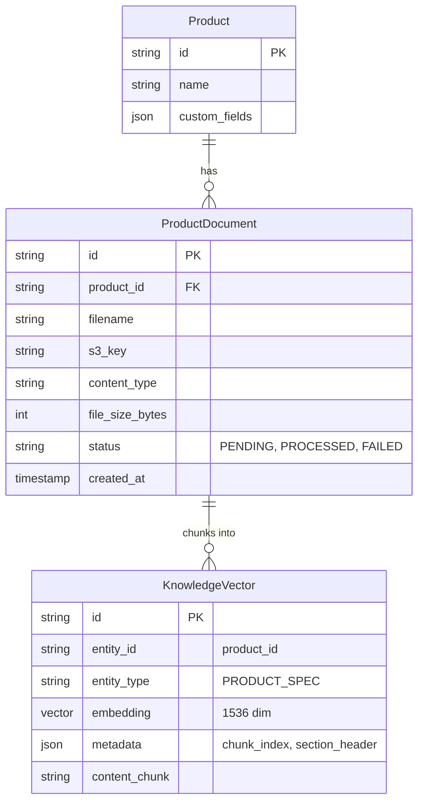

# Architecture Design: Product Technical Data Sheet Ingestion & RAG

## Executive Summary
This document outlines the architecture for supporting technical data sheet uploads (PDF, DOCX, XLSX) linked to individual products in Sherpa's B2B trade catalog. When field representatives or customer leads ask complex technical questions (e.g. tensile strength, cure times, chemical resistance, ASTM certifications), the AI retrieves chunked technical embeddings linked to the target product.

---

## 1. Data Model & Storage



### Key Entities
1. **`ProductDocument` (`models/trade/catalog.py`)**:
   - `id`: UUID7 identifier.
   - `product_id`: Foreign key to `Product.id` (cascade delete).
   - `file_url` / `s3_key`: Storage locator (S3 / Cloudflare R2 / Railway volume).
   - `status`: Processing state (`PENDING`, `PARSING`, `EMBEDDED`, `FAILED`).
   - `metadata_extracted`: JSON summary extracted by LLM (e.g. key specs, compliance certifications).

2. **`KnowledgeVector` (`models/knowledge.py`)**:
   - Reuses Sherpa's existing `KnowledgeVector` pgvector schema with `entity_type="PRODUCT_SPEC"` and `entity_id=Product.id`.

---

## 2. Ingestion Pipeline (DataGateway + Celery)

```
[User Uploads PDF in CatalogDrawer] 
         │
         ▼
[POST /trade/products/{id}/documents (FastAPI Multipart)]
         │
         ├── 1. Save file to Object Storage (S3 / R2)
         ├── 2. Create ProductDocument record (status=PENDING)
         └── 3. Dispatch Celery Task: `tasks.process_product_datasheet.delay(doc_id)`
                  │
                  ▼
         [Worker (Low Memory / Concurrency=1)]
         ├── A. Extract text with `pdfplumber` / `pypdf`
         ├── B. Semantic Markdown Chunking (500 tokens, 100 overlap)
         ├── C. Generate OpenAI / LiteLLM Embeddings (text-embedding-3-small)
         └── D. Bulk Insert into `knowledge_vectors` & mark status=PROCESSED
```

---

## 3. Retrieval & Inference Integration

When a user asks:
> *"¿Cuál es la resistencia a la compresión a los 28 días del Cemento Extra Forte?"*

1. **Entity Extraction**: Identify product mention (`Cemento Extra Forte`).
2. **Targeted Vector Search**:
   ```sql
   SELECT content_chunk, cosine_distance(embedding, :query_vector) AS dist
   FROM knowledge_vectors
   WHERE entity_type = 'PRODUCT_SPEC' AND entity_id = :product_id
   ORDER BY dist ASC
   LIMIT 3;
   ```
3. **Context Injection**: Append the retrieved spec snippets directly into `CatalogContextBuilder` under `### DETALLES TÉCNICOS ADICIONALES (HOJA DE DATOS)`.

---

## 4. RAM & Cost Guardrails
- **Worker Memory**: Data sheet parsing is offloaded to the Celery `slow` queue (`--max-tasks-per-child=50`) so PDF parser memory leaks are immediately recycled.
- **Deduplication**: Files are SHA-256 hashed to prevent duplicate uploads of identical supplier data sheets.
