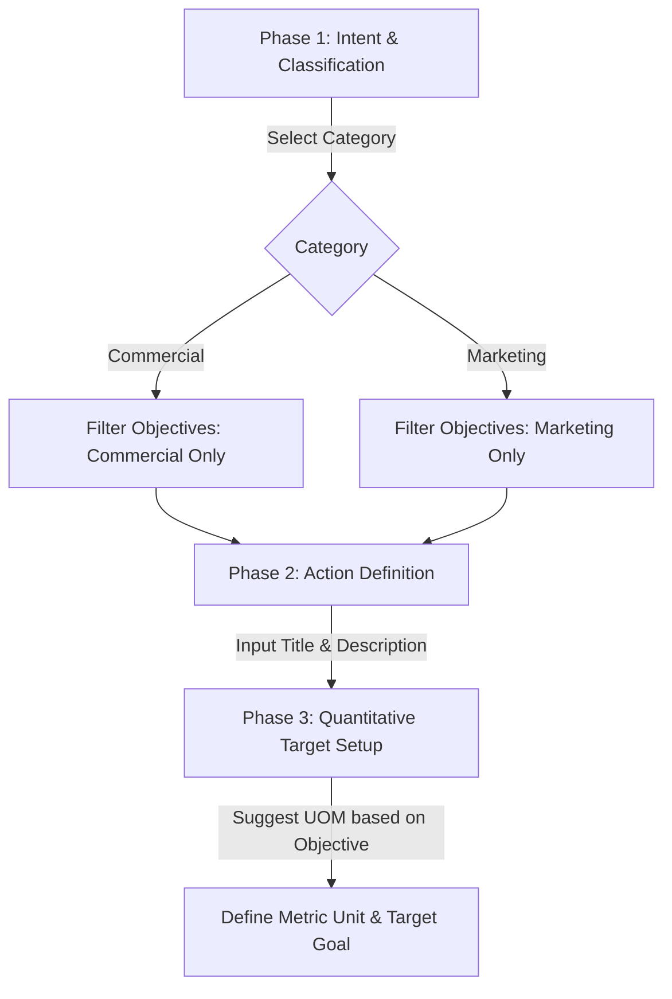

# Sherpa Design System: Trade/Actions Flow Guidelines

This document outlines the UX/UI standards and interface guidelines for the **Trade/Actions Flow** within the Sherpa B2B Sales Intelligence platform. It provides product managers, designers, and developers with specifications for implementing high-performance, accessible, and responsive action-creation interfaces.

---

## 1. Flow Breakdown & Usability Architecture

Creating tactical actions for field reps requires balancing administrative control (by sales managers on desktop) with rapid, error-free execution (by reps on mobile). The configuration flow consists of three distinct phases:



### Phase 1: Classification & Intent
*   **Category Selection (Commercial vs. Marketing)**
    *   **Commercial (Sales/Stock/Revenue)**: Focused on inventory velocity, replenishment, order values, volume targets.
    *   **Marketing (Promo/Visibility/Audit)**: Focused on Share of Shelf, POSM placement, asset purity, competitor threats.
    *   *UX Guideline*: Do not use a simple select dropdown. Use a **Segmented Control** (toggle group) with clear visual icons. This establishes immediate mental categorization.
*   **Action Type (Objective Selection)**
    *   *Behavior*: Populated dynamically based on the active Category.
    *   *UX Guideline*: For desktop, use a grid list of interactive cards with icon indicators and sub-descriptions. For mobile/drawers, use a searchable combobox (`Popover` + `Command`) to support quick keyboard filtering.

### Phase 2: Action Definition
*   **Main Action (Title Input)**
    *   *Behavior*: Free-form text input with a 50-character limit to enforce readability on mobile list views.
    *   *UX Guideline*: Provide **Contextual Suggestion Chips** below the input. When a user selects the "Share of Shelf" objective, suggest titles like: `"Auditoría de Anaquel Premium"`, `"Bloqueo de Competencia Frontal"`. Clicking a chip populates the input.
*   **Description (Guidelines / Details)**
    *   *Behavior*: Multi-line textarea for instructions.
    *   *UX Guideline*: Use dynamic placeholders based on the selected Objective. For example, if the objective is `POSM_MAINTENANCE_ASSET_PURITY`, display: *"e.g., Clean the brand display rack, remove competitor items, and take a photo of the completed shelf."*

### Phase 3: Quantitative Target Setup (Metrics & Goals)
*   **Metric Unit (UOM)**
    *   *Behavior*: Text input or suggestion menu that configures the unit of measure for tracking success.
    *   *UX Guideline*: Bind common default units directly to objectives:
        *   `SHARE_OF_SHELF` $\rightarrow$ Suggest `%` or `frentes` (facings).
        *   `INVENTORY_VELOCITY_OOS_PREVENTION` $\rightarrow$ Suggest `sacos` (bags), `cajas` (boxes), `unidades` (units).
        *   `POSM_MAINTENANCE_ASSET_PURITY` $\rightarrow$ Suggest `exhibidores` (displays), `lonas` (banners).
*   **Metric Goal (Numeric Target)**
    *   *Behavior*: Numeric input accepting integers and decimals.
    *   *UX Guideline*: Display the selected Metric Unit as an inline suffix within the input box (e.g., `[ 150 ] frentes`). Prevent sub-zero values and enforce validation bounds (e.g., `%` goal must be $\le 100$).

---

## 2. Layout Specifications & Wireframes

### Desktop Strategy Desk Layout (Split Screen)

For desktop administrators, a **two-column split screen** is the ideal layout pattern. The left pane contains the progressive input form, and the right pane displays a live, interactive mockup of the field rep's mobile application. This reduces error rates by showing the creator exactly what the rep will see in the field.

```
+-----------------------------------------------------------------------------+
|  Strategy Desk > Create New Store Action                                    |
+-----------------------------------------------------------------------------+
|                                      |                                      |
|  [Phase 1: Classification]           |  [LIVE MOBILE PREVIEW]               |
|  Category                            |  +--------------------------------+  |
|  +--------------------+------------+ |  | < Store: Cemenquin Centro      |  |
|  | * COMMERCIAL (Sales) | MARKETING| |  |                                |  |
|  +--------------------+------------+ |  | [M] COMMERCIAL ACTION          |  |
|                                      |  |--------------------------------|  |
|  Objective                           |  | Title: Replenish Arabica SKU   |  |
|  +---------------------------------+ |  |                                |  |
|  | Search or select objective... v | |  | Objective: Inventory Velocity  |  |
|  +---------------------------------+ |  |                                |  |
|                                      |  | Target: 150 sacos              |  |
|  [Phase 2: Action Definition]        |  |                                |  |
|  Main Action Title                   |  | Description: Please check back |  |
|  +---------------------------------+ |  | stock and reload the main rack.|  |
|  | Replenish Arabica SKU           | |  +--------------------------------+  |
|  +---------------------------------+ |                                      |
|                                      |                                      |
|  [Phase 3: Quantitative Target]      |                                      |
|  Metric Unit         Metric Goal     |                                      |
|  +-----------------+ +-------------+ |                                      |
|  | sacos           | | 150         | |                                      |
|  +-----------------+ +-------------+ |                                      |
|                                      |                                      |
|  +---------------------------------+ |                                      |
|  | [ Dispatch Action to Field ]    | |                                      |
|  +---------------------------------+ |                                      |
+-----------------------------------------------------------------------------+
```

---

## 3. Dynamic Filtering Logic & Form Constraints

To maintain speed and data integrity, implement conditional logic at the form layer.

### Category-to-Objective Dynamic Matrix

| Category | Default Supported Objectives (`store_action_objectives`) | Suggested Units | Suffix Display | Validation Rules |
| :--- | :--- | :--- | :--- | :--- |
| **COMMERCIAL** | `THREAT_RESPONSE`<br>`NEW_PRODUCT_INTRODUCTION`<br>`INVENTORY_VELOCITY_OOS_PREVENTION`<br>`TRADE_LOYALTY_VOLUME_PUSHING` | `sacos`, `cajas`, `unidades`, `pedidos` | String | Value must be $\ge 1$ |
| **MARKETING** | `SHARE_OF_SHELF`<br>`SEASONAL_EVENT_ACTIVATION`<br>`PERFECT_STORE_ASSORTMENT_COMPLIANCE`<br>`POSM_MAINTENANCE_ASSET_PURITY` | `%`, `exhibidores`, `frentes`, `fotos` | `%` / String | If `%`, must be between `1` and `100` |

### Code Implementation Pattern (TypeScript Specification)

```typescript
interface ObjectiveDefinition {
  name: string;
  label: string;
  category: 'COMMERCIAL' | 'MARKETING';
  suggestedUnits: string[];
  validationSchema?: any;
}

const OBJECTIVE_REGISTRY: Record<string, ObjectiveDefinition> = {
  SHARE_OF_SHELF: {
    name: 'SHARE_OF_SHELF',
    label: 'Share of Shelf',
    category: 'MARKETING',
    suggestedUnits: ['%', 'frentes'],
  },
  INVENTORY_VELOCITY_OOS_PREVENTION: {
    name: 'INVENTORY_VELOCITY_OOS_PREVENTION',
    label: 'Inventory Velocity & OOS Prevention',
    category: 'COMMERCIAL',
    suggestedUnits: ['sacos', 'cajas', 'unidades'],
  },
  // Additional mappings...
};
```

---

## 4. Mobile Drawer Adaptations (Bottom Sheet Pattern)

Field reps operate on mobile devices, often in conditions of high physical movement or low connectivity. Action creation or resolution forms must adapt from full desktop page splits to **mobile-friendly bottom drawers**.

```
+------------------------------------+
|  [=]                               |  <- Swipe-down handle (120px active hit area)
|  Create Action                     |
|  --------------------------------  |
|  Category                          |
|  ( ) Commercial    ( ) Marketing   |  <- Segmented Toggle Cards (48px high)
|                                    |
|  Objective                         |
|  [ Select Objective            v ] |  <- Full-width Select (touch height 52px)
|                                    |
|  Title                             |
|  [ Replenish Arabica SKU         ] |
|                                    |
|  Metric Target                     |
|  +-----------------+-------------+ |
|  | 150             | sacos       | |  <- Merged field with large numerical pad trigger
|  +-----------------+-------------+ |
|                                    |
|  +-------------------------------+ |
|  |       Dispatch Action         | |  <- Fixed bottom button (active on viewport height)
|  +-------------------------------+ |
+------------------------------------+
```

### Mobile UX Guidelines:
1.  **Swipe-to-Dismiss Gestures**: Implement a drawer component using `vaul` (Radix-based) that supports smooth swipe-down gestures.
2.  **Thumb-Optimized Touch Targets**: Every input, selector, and button must have a minimum interactive surface area of **$48\text{px} \times 48\text{px}$** (preferably $52\text{px}$ for selects).
3.  **Visual Keyboard Accommodations**: Ensure the drawer has a `pb-[keyboardHeight]` dynamic offset so inputs are not obscured by the native virtual keyboard. Focus shifting should automatically scroll the active input field to the vertical center of the viewport.
4.  **Hardware-Level Form Assist**:
    *   Set `inputmode="decimal"` or `type="number"` for the "Metric Goal" field to force the numerical keypad instead of the full text keyboard.
    *   Disable auto-correct and auto-capitalize on fields like "Metric Unit".
5.  **Offline State Affordance**: If the device loses internet access in a store basement:
    *   Maintain form state in memory (local client state).
    *   Provide a warning banner: *"Offline Mode - Action will queue and dispatch automatically when connection returns."*
    *   The "Dispatch Action" button should remain clickable and transition the UI to an optimistic success state, writing the transaction to IndexedDB/LocalStorage.

---

## 5. Tailwind CSS & shadcn/ui Component Spec

Translate these design guidelines into reusable Tailwind UI classes:

### 1. Category Selector (Segmented Cards)
```tsx
import * as ToggleGroup from '@radix-ui/react-toggle-group';
import { ShoppingBag, Megaphone } from 'lucide-react';

export function CategorySelector({ value, onChange }) {
  return (
    <ToggleGroup.Root
      type="single"
      value={value}
      onValueChange={onChange}
      className="grid grid-cols-2 gap-4 w-full"
    >
      <ToggleGroup.Item
        value="COMMERCIAL"
        className="flex flex-col items-center justify-center p-4 rounded-2xl border-2 border-gray-100 hover:border-slate-300 data-[state=on]:border-slate-900 data-[state=on]:bg-slate-50 transition-all duration-200 outline-none"
      >
        <ShoppingBag className="w-6 h-6 mb-2 text-slate-700" />
        <span className="text-sm font-bold text-slate-900">Commercial</span>
        <span className="text-[10px] text-gray-400 font-medium mt-1">Sales & Inventory</span>
      </ToggleGroup.Item>
      
      <ToggleGroup.Item
        value="MARKETING"
        className="flex flex-col items-center justify-center p-4 rounded-2xl border-2 border-gray-100 hover:border-slate-300 data-[state=on]:border-slate-900 data-[state=on]:bg-slate-50 transition-all duration-200 outline-none"
      >
        <Megaphone className="w-6 h-6 mb-2 text-slate-700" />
        <span className="text-sm font-bold text-slate-900">Marketing</span>
        <span className="text-[10px] text-gray-400 font-medium mt-1">Visibility & Promo</span>
      </ToggleGroup.Item>
    </ToggleGroup.Root>
  );
}
```

### 2. Suffix-Integrated Numeric Goal Input
```tsx
interface GoalInputProps {
  value: number;
  onChange: (val: number) => void;
  unit: string;
}

export function GoalInput({ value, onChange, unit }: GoalInputProps) {
  return (
    <div className="relative flex items-center w-full rounded-2xl bg-gray-50 border-2 border-transparent focus-within:border-slate-950 transition-all">
      <input
        type="number"
        inputMode="decimal"
        value={value}
        onChange={(e) => onChange(parseFloat(e.target.value))}
        className="w-full p-4 bg-transparent outline-none font-bold text-slate-900"
        placeholder="0.00"
      />
      {unit && (
        <span className="absolute right-4 text-sm font-black uppercase text-slate-400 tracking-wider select-none pointer-events-none">
          {unit}
        </span>
      )}
    </div>
  );
}
```

---

## 6. Accessibility (A11y) Checklists

All forms must satisfy WCAG 2.1 Level AA conformance criteria:

1.  **Semantic Association**: Every form element must have an explicit label paired via `id` and `htmlFor`. Do not rely solely on placeholders.
2.  **Screen Reader Context**: Dynamic updates (such as changing objectives or pre-populating units) must be announced using `aria-live="polite"` containers.
3.  **Keyboard Focus Ring**: All inputs, toggles, and buttons must display a highly visible focus indicator (e.g. `focus:ring-2 focus:ring-slate-900 focus:ring-offset-2`).
4.  **Color Contrast**: Standard text must exceed **4.5:1** contrast ratio against the background. Disabled buttons should reflect `opacity-40` with an explicit `aria-disabled="true"` attribute rather than absolute removal from the focus flow.
5.  **Error Announcement**: In case of dynamic validation failure, shift screen reader focus to the validation banner using `tabIndex={-1}` and set `aria-invalid="true"` on the failing form control.
