# Epic 218: Mobile-First Overhaul — Execution Plan

> **Date**: 2026-08-13  
> **Status**: Draft — Awaiting Approval  
> **Audited By**: UX/UI Expert, Frontend Dev, Backend Dev  
> **Target Persona**: "Marco" — B2B field sales rep using Sherpa on a smartphone

---

## Executive Summary

A cross-cutting audit of the Sherpa codebase reveals that the platform is **desktop-first** with minimal mobile adaptation. The field sales rep persona ("Marco") primarily operates from a smartphone, making this a business-critical gap. This plan covers 4 phases across **23 active tasks** (2 deferred to future sprints), progressing from foundational backend/infra changes through UI component refactoring to PWA delivery and native app preparation.

> [!IMPORTANT]
> This epic touches nearly every frontend page and several backend endpoints. It should be executed incrementally — each phase delivers standalone mobile improvements that can be shipped independently.

> [!CAUTION]
> **Epic 205 (Trade CRM Feedback Actions)** has open tasks that modify overlapping files (Orders detail, CatalogDrawer). Those tasks must be completed or explicitly deferred **before** Phase 3 begins to avoid merge conflicts. See [Prerequisites](#prerequisites) below.

---

## Current State Assessment

### What Works on Mobile
- ✅ Sidebar has a hamburger toggle on `< md` screens
- ✅ Most list endpoints are paginated (`limit`/`offset`)
- ✅ Account V2 cards use `grid-cols-1` on mobile
- ✅ CORS configuration is PWA-compatible (explicit origins)
- ✅ Dark theme is consistent and readable

### What's Broken or Missing
| Area | Severity | Issue |
|---|---|---|
| **No PWA** | 🔴 P0 | No `manifest.json`, no service worker, no "Add to Home Screen" |
| **No GZip Compression** | 🔴 P0 | API responses uncompressed — slow on mobile networks |
| **Inbox is broken** | 🔴 P0 | Two-panel layout doesn't collapse on mobile |
| **Data tables overflow** | 🔴 P0 | Strategy Desk, Orders — horizontal scroll on mobile |
| **No bottom sheets** | 🟡 P1 | All modals/drawers use desktop patterns on mobile |
| **No bottom navigation** | 🟡 P1 | Users must open hamburger for every navigation |
| **Calendar unusable** | 🟡 P1 | FullCalendar month/week views are tiny on phones |
| **No push notifications** | 🟡 P1 | No Web Push API — no background alerts |
| **Dashboard waterfall** | 🟡 P1 | 5-10 API calls to load dashboard on mobile |
| **No image optimization** | 🟡 P1 | Full-res images served to mobile devices |
| **No offline support** | 🟠 P2 | Field reps in areas with spotty connectivity get nothing |
| **No native app path** | 🟠 P2 | Architecture not evaluated for Capacitor wrapping |

---

## Prerequisites

The following must be resolved **before** execution begins:

| # | Prerequisite | Reason | Owner |
|---|---|---|---|
| P1 | **Complete or defer Epic 205 open tasks** (205.2, 205.4, 205.5) | These tasks modify `trade/orders/[id]/page.tsx` and `CatalogDrawer` — the same files Phase 3 refactors. Running both epics in parallel guarantees merge conflicts. | PM |
| P2 | **Generate VAPID key pair** for Web Push | Task 218.1.4 requires a VAPID public/private key pair. Generate once via `npx web-push generate-vapid-keys` and store in Railway env vars (`VAPID_PUBLIC_KEY`, `VAPID_PRIVATE_KEY`). Per AGENTS.md: no fallback values — must crash at startup if unset. | DevOps |
| P3 | **Verify `@ducanh2912/next-pwa` compatibility** with Next.js 14.2.35 | PWA libraries have had App Router issues. Run a spike branch with the library installed and confirm service worker registration works before committing to Phase 4. Alternative: `serwist`. | Frontend Dev |
| P4 | **Alembic migration approval** for `push_subscription` table | Task 218.1.4 requires a new DB model. Per AGENTS.md: **"STRICT HUMAN APPROVAL REQUIRED"** before running `alembic upgrade` or modifying SQLAlchemy models. | Human (HITM) |

---

## Phase 1: Backend Foundation (Sprint 1)
**Goal**: Optimize API responses for mobile networks. No frontend changes required.

### Task 218.1.1 — Add GZip Compression Middleware
- **File**: [`main.py`](file:///Users/bernardo/projects/sherpa/backend/app/main.py)
- **Change**: Add `GZipMiddleware` from Starlette with `minimum_size=500`
- **Impact**: 60-80% reduction in JSON response sizes over the wire
- **Complexity**: Low
- **Acceptance Criteria**:
  - **Given** a client sends a request with `Accept-Encoding: gzip`,
  - **When** the response body exceeds 500 bytes,
  - **Then** the response must be gzip-compressed with the `Content-Encoding: gzip` header.

### Task 218.1.2 — Dashboard Composite API Endpoint
- **File**: New endpoint in [`trade.py`](file:///Users/bernardo/projects/sherpa/backend/app/api/trade.py) or new file `dashboard.py`
- **Change**: Create `GET /api/v1/dashboard/summary` that returns KPIs, recent actions, upcoming appointments, and top accounts in a single response
- **Impact**: Reduces mobile dashboard load from 5-10 waterfall requests to 1
- **Complexity**: Medium
- **Acceptance Criteria**:
  - **Given** an authenticated user calls `GET /api/v1/dashboard/summary`,
  - **When** the endpoint processes,
  - **Then** return a composite JSON with `kpis`, `recent_actions` (last 10), `upcoming_appointments` (next 7 days), and `top_accounts` (top 5 by activity) — all in a single HTTP response.

### Task 218.1.3 — Cache-Control Headers
- **Files**: Key read-heavy endpoints in [`trade.py`](file:///Users/bernardo/projects/sherpa/backend/app/api/trade.py)
- **Change**: Add `Cache-Control` response headers to stable endpoints
- **Complexity**: Low
- **Acceptance Criteria**:
  - Dashboard summary: `Cache-Control: private, max-age=300` (5 min)
  - Product catalog list: `Cache-Control: private, max-age=3600` (1 hour)
  - Objectives list: `Cache-Control: private, max-age=1800` (30 min)

### Task 218.1.4 — Web Push Notification Infrastructure
- **Files**: New `backend/app/api/notifications.py`, new `backend/app/models/push_subscription.py`, new `backend/app/services/push_service.py`
- **Change**: Implement Web Push API server-side with `pywebpush`
- **Complexity**: Medium
- **Acceptance Criteria**:
  - `POST /api/v1/notifications/subscribe` — stores a push subscription (endpoint, p256dh, auth) per user/device.
  - `DELETE /api/v1/notifications/subscribe` — removes a subscription.
  - `send_push_notification(user_id, title, body, url)` utility function available for Celery tasks.
  - Push notifications triggered for: new WhatsApp messages (background), upcoming appointments (1h before), AI-generated action recommendations.
- **Dependencies**: Requires VAPID key pair generation (see [Prerequisites](#prerequisites)).

> [!WARNING]
> **RAM Guardrail**: The push notification Celery tasks must run on the existing worker with `--concurrency=1` and `--max-tasks-per-child` recycling. Do NOT spawn a separate worker process. The `pywebpush` library is lightweight, but sending bulk notifications should be batched (max 50 per task invocation) to avoid memory accumulation.

### ~~Task 218.1.5 — Image Resize Proxy~~ ⛔ DEFERRED
- **Status**: **Deferred to a future sprint.**
- **Reason**: Pillow is memory-hungry. Processing images inside the API process or Celery worker risks **regressing the RAM guardrails** that reduced Railway billing from $10/mo → $1.50/mo (see AGENTS.md). An in-process image resize under load could spike memory past Railway limits and trigger OOM kills.
- **Alternative for now**: Use Next.js `<Image>` component with `width`/`height` props for client-side resizing. Evaluate a CDN-based solution (Cloudinary, imgproxy, or Cloudflare Image Resizing) in a future sprint where the cost/benefit can be assessed independently.

---

## Phase 2: Frontend Foundation & Design System (Sprint 1-2)
**Goal**: Establish mobile-first infrastructure, component primitives, and navigation patterns.

### Task 218.2.1 — Tailwind Mobile Utilities & Breakpoints
- **File**: [`tailwind.config.ts`](file:///Users/bernardo/projects/sherpa/frontend/tailwind.config.ts)
- **Change**:
  - Add `xs: '375px'` breakpoint for narrow phones
  - Add utility classes: `.touch-target` (min 44x44px), `.safe-area-*` padding
- **Complexity**: Low
- **Acceptance Criteria**:
  - `xs:` breakpoint available for narrow-phone-specific styles.
  - `.touch-target` class applies `min-h-[44px] min-w-[44px]` (Apple HIG minimum).
  - `safe-area-bottom` applies `pb-[env(safe-area-inset-bottom)]` for notched devices.

### Task 218.2.2 — Responsive Sheet/Drawer Wrapper Component
- **Files**: New `frontend/components/ui/responsive-drawer.tsx`
- **Dependency**: Install `vaul` (bottom sheet by Emil Kowalski, shadcn-compatible)
- **Change**: Create a `<ResponsiveDrawer>` component that renders as:
  - **Desktop (≥ md)**: Standard shadcn `Sheet` (side panel)
  - **Mobile (< md)**: `vaul` `Drawer` (bottom sheet with drag-to-dismiss, snap points)
- **Complexity**: Medium
- **Acceptance Criteria**:
  - **Given** the viewport is below `md` breakpoint,
  - **When** a `<ResponsiveDrawer>` is opened,
  - **Then** it renders as a bottom sheet with drag handle, swipe-to-dismiss, and 50%/90% snap points.
  - **Given** the viewport is at or above `md`,
  - **Then** it renders as a standard right-side Sheet.

### Task 218.2.3 — Bottom Navigation Bar Component
- **Files**: New `frontend/components/BottomNav.tsx`, modify [`DashboardLayout.tsx`](file:///Users/bernardo/projects/sherpa/frontend/components/DashboardLayout.tsx)
- **Change**: Create a fixed bottom navigation bar visible only on mobile (`md:hidden`) with 5 key routes:
  1. 🏠 Home (Dashboard)
  2. 🏪 Trade (Accounts)
  3. 📅 Calendar
  4. 💬 Inbox
  5. ⚙️ More (Settings/Profile)
- **Complexity**: Medium
- **Acceptance Criteria**:
  - **Given** a user is on any authenticated page on a mobile device,
  - **When** viewing the screen,
  - **Then** a fixed bottom navigation bar with 5 icons is visible, with the active route highlighted.
  - The bottom nav must respect `safe-area-inset-bottom` for notched devices.
  - The sidebar hamburger menu remains available for accessing secondary navigation items.

### Task 218.2.4 — Responsive Data Table Component
- **Files**: New `frontend/components/ui/responsive-table.tsx`
- **Change**: Create a `<ResponsiveTable>` wrapper that:
  - **Desktop (≥ md)**: Renders as a standard `<table>` with sortable columns
  - **Mobile (< md)**: Renders each row as a stacked card with key-value pairs
- **Complexity**: Medium
- **Acceptance Criteria**:
  - **Given** a table with columns `[Name, Status, Date, Amount, Actions]`,
  - **When** viewed on mobile,
  - **Then** each row becomes a card showing the primary column as a header and remaining columns as labeled key-value rows.
  - Supports column priority: columns marked as `hiddenOnMobile` are collapsed into an expandable "More" section.

### Task 218.2.5 — Network Status Hook & Offline Banner
- **Files**: New `frontend/hooks/useNetworkStatus.ts`, new `frontend/components/OfflineBanner.tsx`
- **Change**: Implement `useNetworkStatus()` hook using `navigator.onLine` + event listeners. Show a non-intrusive banner when offline.
- **Complexity**: Low
- **Acceptance Criteria**:
  - **Given** the device loses network connectivity,
  - **When** the user is on any page,
  - **Then** a slim banner appears at the top: "You're offline. Changes will sync when reconnected."
  - **When** connectivity is restored,
  - **Then** the banner auto-dismisses after 2 seconds.

### Task 218.2.6 — Viewport Meta & Safe Area Configuration
- **File**: [`layout.tsx`](file:///Users/bernardo/projects/sherpa/frontend/app/layout.tsx)
- **Change**: Ensure proper viewport meta tag with `viewport-fit=cover` and mobile web app capable meta tags.
- **Complexity**: Low
- **Acceptance Criteria**:
  ```html
  <meta name="viewport" content="width=device-width, initial-scale=1, viewport-fit=cover" />
  <meta name="apple-mobile-web-app-capable" content="yes" />
  <meta name="apple-mobile-web-app-status-bar-style" content="black-translucent" />
  ```

---

## Phase 3: Page-by-Page Mobile Refactor (Sprint 2-3)
**Goal**: Refactor each major page/section for mobile-first layouts using Phase 2 primitives.

### Task 218.3.1 — Conversations/Inbox Mobile Layout (P0)
- **Files**: [`conversations/page.tsx`](file:///Users/bernardo/projects/sherpa/frontend/app/conversations/page.tsx), `conversations/[id]/page.tsx`
- **Change**:
  - Replace two-panel layout with single-panel on mobile: conversation list → tap → full-screen conversation detail → back button to return
  - Sticky message input at bottom with virtual keyboard awareness
  - Reduce chat bubble horizontal padding on mobile
  - Add unread message count badges
- **Complexity**: High
- **Acceptance Criteria**:
  - **Given** a user is on mobile viewing the inbox,
  - **When** the page loads,
  - **Then** they see only the conversation list (full-width).
  - **When** they tap a conversation,
  - **Then** they navigate to a full-screen conversation view with a back button.
  - **When** the virtual keyboard opens,
  - **Then** the message input remains visible and the message list scrolls up.

### Task 218.3.2 — Strategy Desk Mobile Refactor (P0)
- **Files**: [`strategy/page.tsx`](file:///Users/bernardo/projects/sherpa/frontend/app/trade/strategy/page.tsx)
- **Change**:
  - Replace data table with `<ResponsiveTable>` (cards on mobile)
  - Move filter bar into a "Filter" button → bottom sheet pattern
  - Action buttons become a floating action button (FAB) with expandable menu
- **Complexity**: High
- **Acceptance Criteria**:
  - **Given** a user views the Strategy Desk on mobile,
  - **When** they see the action list,
  - **Then** each action is a card with objective, store name, status badge, and date.
  - **When** they tap "Filters",
  - **Then** a bottom sheet opens with all filter options.

### Task 218.3.3 — Orders List & Detail Mobile Refactor (P0)
- **Files**: `trade/orders/page.tsx`, `trade/orders/[id]/page.tsx`
- **Change**:
  - Orders list: Use `<ResponsiveTable>` with priority columns (Order #, Client, Status, Total)
  - Order detail: Stack sections vertically, full-width status timeline
  - All drawers → `<ResponsiveDrawer>` (bottom sheets on mobile)
- **Complexity**: Medium

### Task 218.3.4 — Calendar Mobile Optimization (P1)
- **Files**: [`calendar/page.tsx`](file:///Users/bernardo/projects/sherpa/frontend/app/calendar/page.tsx)
- **Change**:
  - Default to `listDay` or `listWeek` view on mobile (most readable)
  - Only show `dayGridMonth` on tablet/desktop
  - Replace view toggle toolbar with a simple dropdown on mobile
  - `AddAppointmentModal` → `<ResponsiveDrawer>` (bottom sheet on mobile)
  - Add swipe gestures for next/previous day navigation
- **Complexity**: Medium
- **Acceptance Criteria**:
  - **Given** a user opens the calendar on a phone,
  - **When** the page loads,
  - **Then** it defaults to `listDay` view with a date picker at the top.
  - **When** they swipe left,
  - **Then** it navigates to the next day.

### Task 218.3.5 — DashboardHome Mobile Refactor (P1)
- **Files**: [`DashboardHome.tsx`](file:///Users/bernardo/projects/sherpa/frontend/app/DashboardHome.tsx)
- **Change**:
  - Split the 36KB monolith file into sub-components: `KPIGrid.tsx`, `RecentActions.tsx`, `TopAccounts.tsx`, `ActivityChart.tsx`
  - KPI cards: `grid-cols-1 sm:grid-cols-2 lg:grid-cols-4` (single column on narrow phones)
  - Charts: Simplified mobile variants (smaller, no legend, horizontal bar)
  - Tables: Replace with card lists using `<ResponsiveTable>`
  - Add a mobile-specific "Today's Focus" card at the top (upcoming visits, pending actions count)
  - Use the new composite `GET /dashboard/summary` endpoint
- **Complexity**: High (file refactor + layout changes)
- **Acceptance Criteria**:
  - `DashboardHome.tsx` is split into ≤4 sub-components, none exceeding 400 lines.
  - **Given** a user opens the dashboard on mobile,
  - **When** the page loads,
  - **Then** a "Today's Focus" card is the first visible element, followed by single-column KPIs, then a simplified chart, then recent actions as cards.

> [!WARNING]
> **Refactor Safety**: This file is 36KB — the main page users see. Execute in **two separate PRs**:
> 1. **PR A (structural only)**: Split into sub-components with zero logic changes. Verify desktop rendering is pixel-identical before/after.
> 2. **PR B (mobile layout)**: Apply responsive grid changes and integrate the composite dashboard API.
> Do NOT combine both changes into a single PR.

### Task 218.3.6 — Trade Account & Contact Detail Pages (P1)
- **Files**: V2 account and people detail pages under `trade/v2/`
- **Change**:
  - AI Intelligence sidebar → collapsible bottom panel on mobile (triggered by a floating "🧠 AI" button)
  - Tab panels: full-width, horizontally scrollable tab headers on mobile
  - Contact cards: ensure min 44px touch targets on action buttons
- **Complexity**: Medium

### Task 218.3.7 — All Modals Migration to ResponsiveDrawer (P1)
- **Files**: All modal components in [`components/`](file:///Users/bernardo/projects/sherpa/frontend/components/)
- **Change**: Replace direct `Dialog`/`Sheet` usage with `<ResponsiveDrawer>` in:
  - `WhatsAppModal.tsx`
  - `TelegramModal.tsx`
  - `AddProductModal.tsx`
  - `AddAppointmentModal.tsx`
  - `RescheduleAppointmentModal.tsx`
  - `AddCategoryModal.tsx`
  - Any `CatalogDrawer` components in trade pages
- **Complexity**: Medium (mechanical but many files)

### Task 218.3.8 — Landing Page Mobile Polish (P2)
- **File**: [`page.tsx`](file:///Users/bernardo/projects/sherpa/frontend/app/page.tsx)
- **Change**:
  - Verify hero text doesn't overflow on 320px screens
  - Ensure CTA buttons have minimum 48px touch targets
  - Test and fix testimonial/feature section stacking on mobile
- **Complexity**: Low

---

## Phase 4: PWA & Native App Preparation (Sprint 3-4)
**Goal**: Ship the PWA and lay groundwork for native apps.

### Task 218.4.1 — PWA Manifest & Icons
- **Files**: New `frontend/public/manifest.webmanifest`, icon assets, [`layout.tsx`](file:///Users/bernardo/projects/sherpa/frontend/app/layout.tsx)
- **Change**:
  - Create `manifest.webmanifest` with:
    ```json
    {
      "name": "Sherpa Sales Intelligence",
      "short_name": "Sherpa",
      "start_url": "/",
      "display": "standalone",
      "background_color": "#0a0a0f",
      "theme_color": "#0a0a0f",
      "icons": [
        { "src": "/icons/icon-192.png", "sizes": "192x192", "type": "image/png" },
        { "src": "/icons/icon-512.png", "sizes": "512x512", "type": "image/png" },
        { "src": "/icons/icon-maskable.png", "sizes": "512x512", "type": "image/png", "purpose": "maskable" }
      ]
    }
    ```
  - Generate app icons in required sizes
  - Link manifest in `layout.tsx` `<head>`
- **Complexity**: Low
- **Acceptance Criteria**:
  - **Given** a user visits Sherpa on Chrome Android or Safari iOS,
  - **When** the browser detects the manifest,
  - **Then** the "Add to Home Screen" prompt is available.
  - **When** installed, the app launches in standalone mode (no browser chrome).

### Task 218.4.2 — Service Worker & Offline Caching
- **Files**: New config for `@ducanh2912/next-pwa` in [`next.config.js`](file:///Users/bernardo/projects/sherpa/frontend/next.config.js)
- **Dependency**: Install `@ducanh2912/next-pwa` (or `serwist` — see [Prerequisites](#prerequisites))
- **Change**:
  - Configure `next-pwa` with `dest: 'public'`, `register: true`, `skipWaiting: true`
  - Define runtime caching strategies:
    - **Static assets** (JS, CSS, fonts): CacheFirst, 30-day expiry
    - **API responses** (`/api/v1/dashboard/*`, `/api/v1/trade/accounts`): StaleWhileRevalidate, 5-min expiry
    - **Images**: CacheFirst, 7-day expiry
  - Create an offline fallback page (`/offline`)
- **Complexity**: Medium
- **Acceptance Criteria**:
  - **Given** the user has previously loaded the dashboard,
  - **When** they lose connectivity,
  - **Then** cached pages and data are still accessible.
  - **When** navigating to an uncached page while offline,
  - **Then** the offline fallback page is displayed with a message: "You're offline. This page will load when you reconnect."

> [!CAUTION]
> **Service Worker + JWT Auth Safety**: This is the #1 technical trap with PWA + authenticated apps. The following rules are **non-negotiable**:
> - All routes under `/api/v1/` MUST use `NetworkFirst` or `NetworkOnly` strategy — **never** `CacheFirst` for authenticated endpoints.
> - The `/auth/refresh` and `/auth/login` endpoints MUST be excluded from SW caching entirely (`NetworkOnly`).
> - On user logout, the service worker cache for API responses MUST be cleared to prevent the next user from seeing stale data.
> - The `Authorization` header must never be stored in cached responses.

### Task 218.4.3 — Push Notification Frontend Integration
- **Files**: New `frontend/lib/pushNotifications.ts`, modify [`Providers.tsx`](file:///Users/bernardo/projects/sherpa/frontend/components/Providers.tsx)
- **Change**:
  - Request notification permission on first authenticated load
  - Subscribe to Web Push using VAPID public key
  - Send subscription to `POST /api/v1/notifications/subscribe`
  - Handle notification clicks (navigate to relevant page)
- **Complexity**: Medium
- **Acceptance Criteria**:
  - **Given** a user is authenticated and hasn't been prompted yet,
  - **When** they first access the dashboard,
  - **Then** they are prompted: "Enable notifications to get alerts about new messages and appointments?"
  - **When** they accept and receive a push notification,
  - **When** they tap it,
  - **Then** the app opens to the relevant page (e.g., the specific conversation or appointment).

### Task 218.4.4 — Offline Mutation Queue V1 (P2 — Scoped Down)
- **Files**: New `frontend/lib/offlineQueue.ts`, modify [`apiClient.ts`](file:///Users/bernardo/projects/sherpa/frontend/lib/apiClient.ts)
- **Change**:
  - Implement a **limited** queue for **append-only** mutations that occur while offline
  - Store queued mutations in IndexedDB via `idb-keyval`
  - Replay queued mutations when connectivity is restored
  - Show a "Pending sync: X changes" indicator
- **Complexity**: Medium (scoped down from High)
- **Scope Limitation (V1)**:
  - ✅ **Supported**: Creating visit notes (append-only, no conflict risk)
  - ✅ **Supported**: Updating action status (last-write-wins, simple conflict resolution)
  - ❌ **NOT supported in V1**: Editing existing records, deleting records, creating new stores/contacts
  - ❌ **NOT supported in V1**: Multi-device conflict resolution, dependency-chain mutations
- **Acceptance Criteria**:
  - **Given** the user is offline,
  - **When** they create a visit note or update an action status,
  - **Then** the mutation is queued locally with a visual indicator.
  - **When** connectivity is restored,
  - **Then** queued mutations are replayed in order and the indicator clears.
  - **When** a replayed mutation fails (e.g., 409 Conflict),
  - **Then** it is logged to the console and the user is shown a toast: "Some offline changes couldn't be synced. Please review."

> [!NOTE]
> **Why scoped down**: Full offline CRUD with conflict resolution (optimistic concurrency, merge strategies, server-generated ID dependencies) is a multi-sprint effort on its own. V1 focuses on the two most common field-rep offline actions: jotting down notes and marking actions as done. Full offline support can be revisited once V1 usage data validates the need.

### Task 218.4.5 — React Query Persistence
- **Files**: Modify [`Providers.tsx`](file:///Users/bernardo/projects/sherpa/frontend/components/Providers.tsx)
- **Dependency**: Install `@tanstack/react-query-persist-client`
- **Change**:
  - Persist React Query cache to IndexedDB so previously-loaded data survives app restarts
  - Configure `gcTime` (garbage collection) to 24 hours for key queries
- **Complexity**: Medium

### Task 218.4.6 — Capacitor Architecture Assessment (P3 — Document Only)
- **Deliverable**: New `docs/architecture/native_app_assessment.md`
- **Change**: Research and document:
  - Capacitor vs React Native trade-off analysis for Sherpa
  - Which native APIs are needed (camera for product photos, GPS for store check-in, contacts)
  - Integration architecture: Capacitor wrapping the Next.js export vs standalone React app
  - Estimated timeline and resource requirements
  - App Store / Play Store submission requirements
- **Complexity**: Low (document, no code)

---

## Risk Register

| # | Risk | Severity | Mitigation | Owner |
|---|---|---|---|---|
| R1 | **RAM guardrail regression** — New dependencies (pywebpush) or Celery tasks blow past Railway memory limits | 🔴 High | Push notifications must batch ≤50 per task. Image Proxy deferred entirely. Monitor Railway memory dashboard after Phase 1 deploy. | Backend Dev |
| R2 | **Service Worker caches auth data** — Logged-out user sees previous session's data, or stale JWT breaks API calls | 🔴 High | Enforce `NetworkFirst`/`NetworkOnly` for all `/api/v1/` routes. Clear SW cache on logout. See Task 218.4.2 safety note. | Frontend Dev |
| R3 | **Epic 205 merge conflicts** — Orders detail and CatalogDrawer files modified by both Epic 205 and Phase 3 | 🔴 High | Complete Epic 205 open tasks before starting Phase 3. See [Prerequisites](#prerequisites). | PM |
| R4 | **DashboardHome refactor breaks main page** — 36KB monolith split introduces state/prop regressions | 🟡 Medium | Execute in 2 PRs: structural split first (pixel-identical), mobile layout second. See Task 218.3.5 note. | Frontend Dev |
| R5 | **PWA library incompatibility** — `@ducanh2912/next-pwa` may not work with Next.js 14 App Router | 🟡 Medium | Run spike branch before Phase 4 commitment. Fallback: `serwist`. See Prerequisites P3. | Frontend Dev |
| R6 | **Bottom nav overlaps content** — Fixed bottom bar hides page content on all authenticated pages | 🟡 Medium | Apply bottom padding in `DashboardLayout` wrapper (not per-page). Test on all 4 reference devices. | Frontend Dev |
| R7 | **ResponsiveDrawer doubles testing surface** — Every modal now has 2 render paths (Sheet vs Drawer) | 🟡 Medium | Create `useIsMobile()` hook with test override param for deterministic unit testing. Both paths must be tested per consumer. | Frontend Dev |
| R8 | **OpenAPI contract desync** — Phase 1 adds new backend endpoints; frontend types not regenerated | 🟢 Low | Backend must update `openapi.json` after each new endpoint. Frontend runs `npm run gen:api` before consuming. Standard protocol per AGENTS.md. | Backend + Frontend |
| R9 | **Offline queue scope creep** — Full CRUD offline support is multi-sprint complexity | 🟢 Low | V1 scoped to append-only notes + last-write-wins status updates only. See Task 218.4.4 scope note. | Frontend Dev |
| R10 | **VAPID keys not configured** — Push notifications fail silently in production | 🟢 Low | Prerequisite P2 requires VAPID setup before Phase 1 merge. Config must crash at startup if unset (per AGENTS.md security rules). | DevOps |

---

## Dependency Graph

```mermaid
graph TD
    E205["⚠️ Epic 205 Complete"]:::prereq

    subgraph "Phase 1: Backend"
        T1_1["218.1.1 GZip Middleware"]
        T1_2["218.1.2 Dashboard Composite API"]
        T1_3["218.1.3 Cache-Control Headers"]
        T1_4["218.1.4 Web Push Backend"]
        T1_5["218.1.5 Image Proxy"]:::deferred
    end

    subgraph "Phase 2: Frontend Foundation"
        T2_1["218.2.1 Tailwind Utilities"]
        T2_2["218.2.2 ResponsiveDrawer"]
        T2_3["218.2.3 Bottom Nav Bar"]
        T2_4["218.2.4 ResponsiveTable"]
        T2_5["218.2.5 Network Status Hook"]
        T2_6["218.2.6 Viewport Meta"]
    end

    subgraph "Phase 3: Page Refactors"
        T3_1["218.3.1 Inbox Mobile"]
        T3_2["218.3.2 Strategy Desk"]
        T3_3["218.3.3 Orders Mobile"]
        T3_4["218.3.4 Calendar Mobile"]
        T3_5["218.3.5 Dashboard Refactor"]
        T3_6["218.3.6 Account Detail"]
        T3_7["218.3.7 Modals Migration"]
        T3_8["218.3.8 Landing Page"]
    end

    subgraph "Phase 4: PWA & Native"
        T4_1["218.4.1 PWA Manifest"]
        T4_2["218.4.2 Service Worker"]
        T4_3["218.4.3 Push Notifications FE"]
        T4_4["218.4.4 Offline Queue V1"]
        T4_5["218.4.5 React Query Persist"]
        T4_6["218.4.6 Capacitor Assessment"]
    end

    E205 --> T3_3
    E205 --> T3_7
    T1_1 --> T2_6
    T2_1 --> T2_2
    T2_1 --> T2_3
    T2_1 --> T2_4
    T2_2 --> T3_1
    T2_2 --> T3_2
    T2_2 --> T3_3
    T2_2 --> T3_4
    T2_2 --> T3_7
    T2_4 --> T3_2
    T2_4 --> T3_3
    T2_4 --> T3_5
    T2_3 --> T3_1
    T1_2 --> T3_5
    T2_5 --> T4_4
    T1_4 --> T4_3
    T4_1 --> T4_2
    T4_2 --> T4_4
    T4_2 --> T4_5

    classDef prereq fill:#f59e0b,stroke:#d97706,color:#000
    classDef deferred fill:#6b7280,stroke:#4b5563,color:#fff
```



> **Legend**: 🟡 Yellow = prerequisite gate | ⬜ Gray = deferred task

---

## New Dependencies to Install

### Backend (`requirements.txt`)
```
pywebpush>=2.0.0      # Web Push notifications
```

### Frontend (`package.json`)
```
vaul                          # Bottom sheet drawer (shadcn-compatible)
@ducanh2912/next-pwa          # PWA service worker + manifest (or serwist — pending spike)
@tanstack/react-query-persist-client  # Offline query cache persistence
idb-keyval                    # Simple IndexedDB wrapper for offline queue
```

> [!NOTE]
> Pillow has been **removed** from backend dependencies. Task 218.1.5 (Image Resize Proxy) is deferred due to RAM guardrail risk. Use Next.js `<Image>` with `width`/`height` for client-side optimization in the interim.

---

## Estimated Effort

| Phase | Active Tasks | Deferred | Dev Time | Soak/Validate | Risk |
|---|---|---|---|---|---|
| Phase 1 + 2 (Deploy 1) | 10 tasks | 1 (Image Proxy) | 1.5-2 weeks | 2-3 days | Low — isolated changes |
| Phase 3 batch 1 (Deploy 2) | 3 tasks | 0 | 1 week | 1 week | Medium — core mobile pages |
| Phase 3 batch 2 (Deploy 3) | 5 tasks | 0 | 1.5 weeks | 3-5 days | Medium — many files, regression risk |
| Phase 4 (Deploy 4) | 5 active + 1 doc | 0 | 1.5 weeks | 1 week | Medium — SW + auth complexity |
| **Total** | **23 active** | **1 deferred** | **~5.5 weeks dev** | **~2.5 weeks soak** | **~7-8 weeks total** |

> [!IMPORTANT]
> The extra ~2 weeks compared to a compressed execution are **soak periods** — not idle time. During soak, the team monitors Railway RAM, collects field rep feedback, and runs real-device testing. These windows prevent deploying broken service workers or blowing past memory limits.

---

## Testing Strategy

### Mobile Testing Checklist
For every task in Phase 3, the following must be verified:

1. **Devices**: iPhone SE (375px), iPhone 14 (390px), Pixel 7 (412px), iPad Mini (768px)
2. **Touch targets**: All interactive elements ≥ 44x44px
3. **Orientation**: Portrait primary, landscape should not break
4. **Virtual keyboard**: Forms and chat inputs must remain visible when keyboard opens
5. **Notch/safe-area**: Content must not overlap with device notch or home indicator
6. **Performance**: LCP < 2.5s on 4G, no layout shift (CLS < 0.1)

### PWA Testing
- **Lighthouse PWA audit**: Must score ≥ 90 on all criteria
- **Offline mode**: Core pages accessible after first load
- **Install prompt**: "Add to Home Screen" available on Chrome Android + Safari iOS
- **Push notifications**: Delivered within 30 seconds on mobile Chrome

### Responsive Component Testing
- Create a `useIsMobile()` hook with an optional `forceValue` parameter for deterministic unit testing.
- Every consumer of `<ResponsiveDrawer>` and `<ResponsiveTable>` must be tested at both the desktop and mobile breakpoints.
- Use Playwright or Cypress with viewport presets matching the 4 reference devices above.

### Auth + Service Worker Testing
- **Logout cache clearing**: After logout, verify no cached API responses are served to a new user.
- **Token refresh**: Verify service worker does not intercept or cache `/auth/refresh` calls.
- **Stale data**: Verify `NetworkFirst` strategy on API routes returns fresh data when online, cached data only when offline.

---

## Backlog Integration

> [!NOTE]
> Once approved, these tasks should be added to [BACKLOG.md](file:///Users/bernardo/projects/sherpa/docs/project/BACKLOG.md) under Epic 218, replacing the current 3 placeholder tasks (218.1, 218.2, 218.3) with this detailed breakdown.

### Mapping to Existing Epic 218 Tasks
| Original Task | Covered By |
|---|---|
| Task 218.1 (Mobile Responsive Audit) | Phase 2 + Phase 3 (all page refactors) |
| Task 218.2 (PWA Configuration) | Phase 4 (218.4.1 through 218.4.5) |
| Task 218.3 (Native Apps Planning) | Phase 4 (218.4.6 Capacitor Assessment) |

---

## Execution Timeline: 4 Deploy Milestones

> [!TIP]
> Each deploy is an independent, shippable increment. **Do not batch deploys together.** The soak period between each deploy is where you catch issues that staging alone can't surface — real device behavior, RAM under production load, and field rep feedback.

### Prerequisites (Week 0)

```
⚠️  Complete Epic 205 open tasks (205.2, 205.4, 205.5)
⚠️  Generate VAPID key pair, add to Railway env vars
⚠️  Run PWA library spike branch (next-pwa vs serwist)
⚠️  Obtain Alembic migration approval for push_subscription table
```

---

### 🚀 Deploy 1 — Foundation (Week 1-2 dev → deploy → 2-3 day soak)

**What ships**: Phase 1 (backend) + Phase 2 (frontend foundation)

| Task | Description |
|---|---|
| 218.1.1 | GZip Compression Middleware |
| 218.1.2 | Dashboard Composite API |
| 218.1.3 | Cache-Control Headers |
| 218.1.4 | Web Push Backend Infrastructure |
| 218.2.1 | Tailwind Mobile Utilities |
| 218.2.2 | ResponsiveDrawer Component |
| 218.2.3 | Bottom Navigation Bar |
| 218.2.4 | ResponsiveTable Component |
| 218.2.5 | Network Status Hook |
| 218.2.6 | Viewport Meta + Safe Area |

**Branch strategy**: Two parallel feature branches (`feature/frontend/mobile-foundation`, `feature/backend/mobile-api`). Merge backend first, regenerate `openapi.json` + `npm run gen:api`, then merge frontend.

**Go/No-Go Criteria before proceeding to Deploy 2**:
- [ ] GZip verified: API responses return `Content-Encoding: gzip` header
- [ ] Railway RAM stable: Memory usage within 5% of pre-deploy baseline for 48 hours
- [ ] Bottom nav renders correctly on iPhone SE, iPhone 14, Pixel 7, iPad Mini
- [ ] `<ResponsiveDrawer>` switches between Sheet ↔ Drawer at `md` breakpoint
- [ ] `<ResponsiveTable>` renders cards on mobile, table on desktop
- [ ] Offline banner appears when network is toggled off in DevTools
- [ ] No desktop regressions — existing UI unchanged on ≥1024px viewports
- [ ] `npm run build` passes cleanly, all existing backend tests pass

---

### 🚀 Deploy 2 — Core Mobile Pages (Week 3 dev → deploy → 1 week soak)

**What ships**: Phase 3, batch 1 — the 3 most-used mobile pages

| Task | Description |
|---|---|
| 218.3.1 | Conversations/Inbox Mobile Layout |
| 218.3.2 | Strategy Desk Mobile Refactor |
| 218.3.3 | Orders List & Detail Mobile Refactor |

**Branch strategy**: Single feature branch (`feature/frontend/mobile-core-pages`). Each page refactored in a separate commit for easy bisection if regressions occur.

**Go/No-Go Criteria before proceeding to Deploy 3**:
- [ ] Inbox: Single-panel list → detail → back navigation works on mobile
- [ ] Inbox: Virtual keyboard doesn't obscure message input
- [ ] Strategy Desk: Actions render as cards on mobile, table on desktop
- [ ] Strategy Desk: Filter bottom sheet opens/closes with drag-to-dismiss
- [ ] Orders: Priority columns visible on mobile, full table on desktop
- [ ] Orders: All drawers render as bottom sheets on mobile
- [ ] **Field rep feedback collected** — share staging URL with 1-2 reps, gather reactions
- [ ] No desktop regressions on any of the 3 refactored pages

> [!IMPORTANT]
> **This is the most critical soak period.** These are the pages Marco uses daily. The 1-week soak allows real field testing. If feedback reveals that a different page should be prioritized, re-order Deploy 3 tasks accordingly.

---

### 🚀 Deploy 3 — Remaining Pages (Week 5-6 dev → deploy → 3-5 day soak)

**What ships**: Phase 3, batch 2 — remaining page refactors + modal migration

| Task | Description |
|---|---|
| 218.3.4 | Calendar Mobile Optimization |
| 218.3.5 | DashboardHome Mobile Refactor (**2-PR approach**) |
| 218.3.6 | Trade Account & Contact Detail Pages |
| 218.3.7 | All Modals Migration to ResponsiveDrawer |
| 218.3.8 | Landing Page Mobile Polish |

**Branch strategy**: Single feature branch (`feature/frontend/mobile-remaining-pages`). DashboardHome refactor done as 2 sequential commits: (A) structural split, (B) mobile layout.

**Go/No-Go Criteria before proceeding to Deploy 4**:
- [ ] Calendar defaults to `listDay` on mobile, swipe navigation works
- [ ] DashboardHome: sub-components render pixel-identical to original on desktop
- [ ] DashboardHome: "Today's Focus" card visible as first element on mobile
- [ ] DashboardHome: Uses composite `GET /dashboard/summary` endpoint (1 request vs. 5-10)
- [ ] All 7 modals (WhatsApp, Telegram, AddProduct, AddAppointment, Reschedule, AddCategory, CatalogDrawer) render as bottom sheets on mobile
- [ ] AI Intelligence sidebar renders as collapsible bottom panel on mobile
- [ ] Landing page hero text doesn't overflow at 320px, CTAs are ≥48px touch targets
- [ ] Full regression test on all 4 reference devices — no page broken on mobile or desktop

---

### 🚀 Deploy 4 — PWA & Offline (Week 7-8 dev → deploy → 1 week soak)

**What ships**: Phase 4 — PWA, push notifications, offline V1, native assessment

| Task | Description |
|---|---|
| 218.4.1 | PWA Manifest & Icons |
| 218.4.2 | Service Worker & Offline Caching |
| 218.4.3 | Push Notification Frontend Integration |
| 218.4.4 | Offline Mutation Queue V1 (scoped: notes + status only) |
| 218.4.5 | React Query Persistence |
| 218.4.6 | Capacitor Architecture Assessment (doc only) |

**Branch strategy**: Single feature branch (`feature/frontend/pwa`). Deploy service worker + manifest first, offline queue as a follow-up commit.

**Go/No-Go Criteria for production release**:
- [ ] Lighthouse PWA audit ≥ 90
- [ ] "Add to Home Screen" works on Chrome Android + Safari iOS
- [ ] App launches in standalone mode (no browser chrome)
- [ ] Push notifications arrive within 30s on mobile Chrome
- [ ] Notification tap navigates to correct page
- [ ] **Auth safety verified**: Logout clears SW cache, `/auth/refresh` not cached, no stale user data served
- [ ] Offline: Previously-loaded pages render from cache when connectivity is lost
- [ ] Offline: Creating a note while offline queues it, syncs on reconnect
- [ ] Offline: Updating an action status while offline queues it, syncs on reconnect
- [ ] Offline: Failed sync shows user-friendly toast (not silent failure)
- [ ] Railway RAM stable for 72 hours post-deploy

---

### Visual Timeline

```
Week 0    │ Prerequisites: Epic 205, VAPID keys, PWA spike, migration approval
──────────┼─────────────────────────────────────────────────────────────────────
Week 1    │ ████████████████████ Deploy 1: Dev (Backend + Frontend Foundation)
Week 2    │ ████████████████████
Week 2.5  │ ░░░░░░ Soak: RAM monitoring, real-device testing
──────────┤ ✅ Go/No-Go checkpoint
Week 3    │ ████████████████████ Deploy 2: Dev (Inbox, Strategy, Orders)
Week 4    │ ░░░░░░░░░░░░░░░░░░░ Soak: Field rep feedback, 1 week
──────────┤ ✅ Go/No-Go checkpoint + feedback incorporation
Week 5    │ ████████████████████ Deploy 3: Dev (Calendar, Dashboard, Detail, Modals)
Week 6    │ ████████████████████
Week 6.5  │ ░░░░░░░░ Soak: Full regression, 3-5 days
──────────┤ ✅ Go/No-Go checkpoint
Week 7    │ ████████████████████ Deploy 4: Dev (PWA, Push, Offline V1)
Week 8    │ ░░░░░░░░░░░░░░░░░░░ Soak: Lighthouse audit, auth safety, 1 week
──────────┤ ✅ Final Go/No-Go → Production
```

> [!CAUTION]
> **Rule: Never skip a soak period.** If a Go/No-Go checkpoint fails, fix the issue and re-validate before proceeding to the next deploy. Do not "carry forward" known failures into the next batch — they compound.
