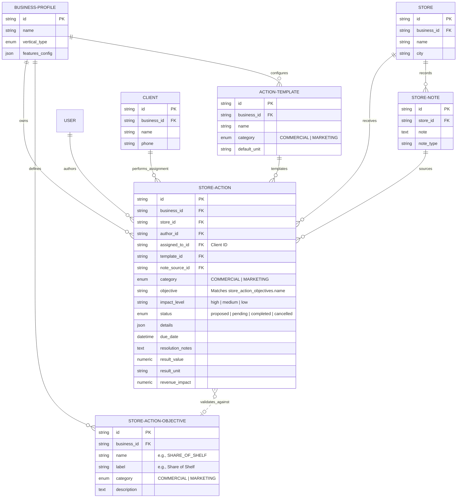

# action_system_composition

This document summarizes the composition of actions, templates, dynamic objectives, and their database relationships within the Sherpa platform.

---

## 🗄️ Detailed Table Composition & Constraints

### 1. `store_actions`
Stores the concrete actions assigned to representative clients at specific store accounts.
* **`business_id`** (FK to `business_profiles`): Enforces multi-tenancy bounds.
* **`store_id`** (FK to `stores`): Specifies the retail/distributor location.
* **`assigned_to_id`** (FK to `clients`): Specifies the contact manager who must fulfill the action.
* **`template_id`** (FK to `action_templates`, nullable): Links to standard action presets.
* **`note_source_id`** (FK to `store_notes`, nullable): Traces the field intelligence note that triggered this action.
* **`objective`** (VARCHAR, indexed): Decoupled text code validating against `store_action_objectives.name` for the current business.
* **`details`** (JSON): Contains payload parameters (e.g. `{"discount": 0.05, "item": "cement_bag"}`).
* **`status`** (`ActionStatus` Enum): Tracks progression (`proposed`, `pending`, `completed`, `cancelled`).
* **Strict Completion Validation**: If status transitions to `completed`, the API requires both a numeric `result_value` and a non-empty `resolution_notes`.

### 2. `store_action_objectives` (New in Epic 125)
Stores the strategic objectives configurable by the business.
* **`business_id`** (FK to `business_profiles`): Restricts strategies to their respective tenant.
* **`name`** (VARCHAR, indexed): The code key (e.g., `SHARE_OF_SHELF`). Enforced unique per business.
* **`label`** (VARCHAR): The human-readable string (e.g., `Share of Shelf`).
* **`category`** (`ActionCategory` Enum): Categorized as `COMMERCIAL` or `MARKETING`.

### 3. `action_templates`
Pre-defined templates configurable by the business.
* **`business_id`** (FK to `business_profiles`): Restricts templates to their tenant.
* **`category`** (`ActionCategory` Enum): Categorized as `COMMERCIAL` or `MARKETING`.
* **`default_unit`** (VARCHAR): Standard unit metric (e.g. `"sacos"`, `"exhibidores"`, `"visitas"`).

---

## 📊 Mapping UX & Execution Concepts to Database Columns

Here is how the front-end/sales execution concepts map to our physical database schema:

| UX / Product Concept | Database Column | Data Type | Notes |
| :--- | :--- | :--- | :--- |
| **Execute Status** | `status` | `ActionStatus` Enum | Tracks state transitions: `proposed`, `pending`, `completed`, `cancelled`. |
| **Execution Metrics** | `result_value`   `result_unit` | `Numeric(10,2)`   `VARCHAR(255)` | **Required on Completion**. Tracks the raw outcome (e.g., `500` `sacos`, `1` `lona`, or `10` `exchanges`). |
| **Revenue Impact** | `revenue_impact` | `Numeric(10,2)` | Optional. Monetary value generated by the action. |
| **Resolution Notes** | `resolution_notes` | `TEXT` | **Required on Completion**. Explains how the action was resolved. |
