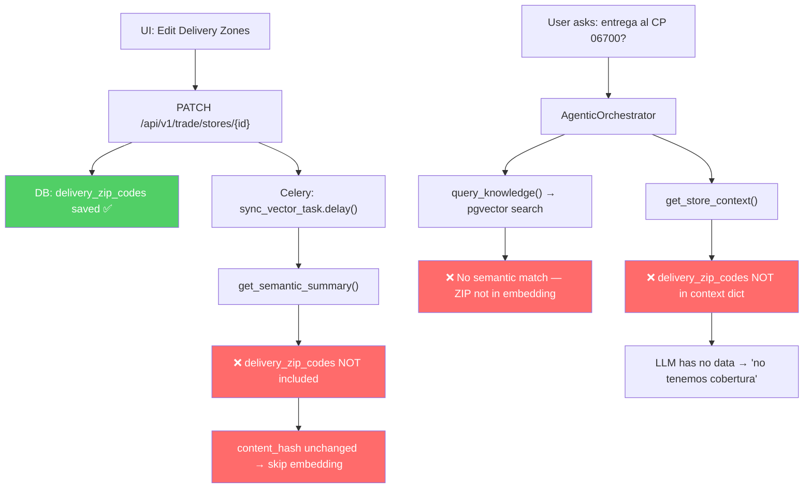

# 🐛 Bug Report: Delivery Zone ZIP Codes Invisible to RAG/AI

**Severity**: High — Core feature broken (AI cannot answer delivery coverage questions)  
**Reporter**: Bernardo (Manual QA)  
**Date**: 2026-07-08  
**Epic**: 113 (Relational Graph-Enriched RAG)

---

## Symptom

After updating "Delivery Zones / ZIP Codes" for a store via the UI, asking the AI tool about delivery to one of those ZIP codes returns:

> *"Sin embargo, lamento informarte que actualmente no tenemos cobertura de entrega a domicilio en el Código Postal 06700."*

The data IS saved correctly in the database. The AI simply **cannot see it**.

---

## Root Cause — Triple Omission

The `delivery_zip_codes` column exists on the Store model ([trade.py L158](file:///Users/bernardo/projects/sherpa/backend/app/models/trade.py#L158)) and is correctly persisted by the API. However, it is **excluded from all three data surfaces** that feed the AI:

### Gap 1: Semantic Summary (Vector Embedding Text)

[Store.get_semantic_summary()](file:///Users/bernardo/projects/sherpa/backend/app/models/trade.py#L222-L250) builds the text string that gets embedded into the `knowledge_corpus` pgvector table. It includes name, region, market, segment, address, phone, email, opening_date, contacts, and notes — but **never references `delivery_zip_codes`**.

```python
# L222-250 — delivery_zip_codes is completely absent
def get_semantic_summary(self, include_notes=False, include_contacts=False) -> str:
    summary = f"Punto de Venta (Store): {self.name}."
    # ... region, market, segment, address, phone, email, opening_date ...
    return summary  # ← No delivery zones
```

**Impact**: The vector embedding has zero semantic signal about delivery coverage. A cosine similarity search for "¿entregan al CP 06700?" will never retrieve this store.

### Gap 2: Knowledge Metadata

[Store.get_knowledge_metadata()](file:///Users/bernardo/projects/sherpa/backend/app/models/trade.py#L252-L261) returns structured metadata stored alongside the vector. It returns region, market, segment, name, state, city, and `zip_code` (store's own ZIP) — but **not `delivery_zip_codes`**.

```python
# L252-261
def get_knowledge_metadata(self) -> dict:
    return {
        "region": self.region, "market": self.market,
        "segment": self.segment, "name": self.name,
        "state": self.state, "city": self.city,
        "zip_code": self.zip_code  # ← store's OWN zip, not delivery zones
    }
```

### Gap 3: Store Context for LLM Prompts

[GraphRAGService.get_store_context()](file:///Users/bernardo/projects/sherpa/backend/app/services/graphrag.py#L493-L557) fetches the full relational context for the Jinja2 prompt templates (`synthesizer.j2`, `visit_briefer.j2`). It returns name, market, region, segment, contacts, history, and competitors — but **not `delivery_zip_codes`**.

```python
# L549-557
return {
    "name": store.name,
    "market": store.market,
    "region": store.region,
    "segment": store.segment,
    "contacts": contacts,
    "history": notes,
    "competitors": competitors
    # ← delivery_zip_codes missing
}
```

**Impact**: Even when the AI retrieves the correct store via direct SQL (non-vector path), the delivery zone data is never injected into the LLM prompt context.

---

## Secondary Issue: Content Hash Skip

[_sync_vector_logic()](file:///Users/bernardo/projects/sherpa/backend/app/tasks/knowledge.py#L99-L107) uses a content hash to avoid redundant embedding API calls. Because `delivery_zip_codes` is not part of `get_semantic_summary()`, changing only delivery zones produces an **identical hash** → the re-embedding is **skipped entirely**.

```python
# L104 — hash only covers the summary text, which doesn't include delivery zones
if old_metadata.get("content_hash") == content_hash and corpus_entry.embedding is not None:
    skip_embedding = True  # ← No re-embed even though delivery zones changed
```

---

## Data Flow Diagram



---

## Proposed Fix — 3 Surgical Changes + 1 Ops Task

> [!IMPORTANT]
> No schema migrations required. All changes are in Python application code.

### Change 1 — Add to Semantic Summary
**File**: [trade.py ~L249](file:///Users/bernardo/projects/sherpa/backend/app/models/trade.py#L249)

```diff
         if include_notes and self.notes:
             recent_notes = " | ".join([n.note[:100] for n in self.notes[:3]])
             summary += f" Notas recientes: {recent_notes}."
-            
+
+        if self.delivery_zip_codes:
+            summary += f" Zona de entrega a domicilio (Códigos Postales con cobertura): {', '.join(self.delivery_zip_codes)}."
+
         return summary
```

### Change 2 — Add to Knowledge Metadata
**File**: [trade.py ~L261](file:///Users/bernardo/projects/sherpa/backend/app/models/trade.py#L261)

```diff
         return {
             "region": self.region,
             "market": self.market,
             "segment": self.segment,
             "name": self.name,
             "state": self.state,
             "city": self.city,
-            "zip_code": self.zip_code
+            "zip_code": self.zip_code,
+            "delivery_zip_codes": self.delivery_zip_codes or []
         }
```

### Change 3 — Add to Store Context for LLM
**File**: [graphrag.py ~L549-557](file:///Users/bernardo/projects/sherpa/backend/app/services/graphrag.py#L549-L557)

```diff
         return {
             "name": store.name,
             "market": store.market,
             "region": store.region,
             "segment": store.segment,
             "contacts": contacts,
             "history": notes,
-            "competitors": competitors
+            "competitors": competitors,
+            "delivery_zip_codes": store.delivery_zip_codes or []
         }
```

### Ops Task — Full Corpus Re-index
After deploying, run the existing [full_backfill_corpus.py](file:///Users/bernardo/projects/sherpa/backend/full_backfill_corpus.py) script to regenerate embeddings for all existing stores with the new summary text.

---

## Acceptance Criteria

- **Given** a store has `delivery_zip_codes = ["06700", "06600"]`
- **When** a user asks "¿Pueden entregar al código postal 06700?"
- **Then** the AI responds confirming delivery coverage to that ZIP code, referencing the store

---

## Files Impacted

| File | Change | Risk |
|---|---|---|
| [trade.py](file:///Users/bernardo/projects/sherpa/backend/app/models/trade.py) | Add delivery_zip_codes to summary + metadata | Low — additive only |
| [graphrag.py](file:///Users/bernardo/projects/sherpa/backend/app/services/graphrag.py) | Add delivery_zip_codes to context dict | Low — additive only |
| Prompt templates (optional) | May want to add a `` section | Medium — prompt tuning |
| full_backfill_corpus.py | Run post-deploy | Ops — requires embedding API calls |
