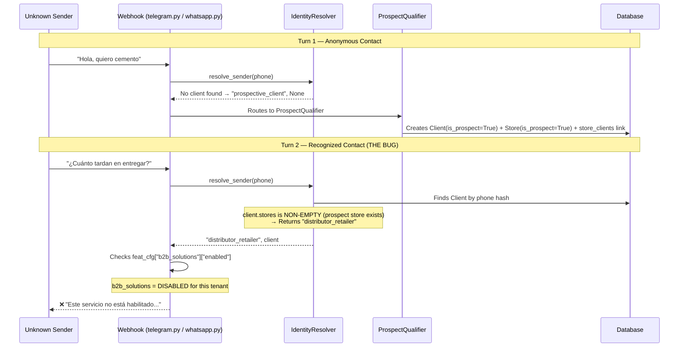
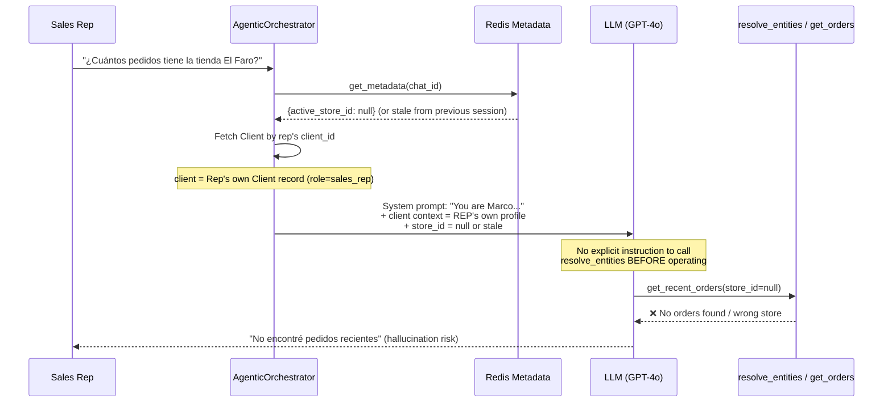

# Case Analysis: Prospect Lockout & Sales Rep Target Collision

**Date**: 2026-07-14  
**Status**: Proposal — Pending Approval  
**Scope**: Two bugs requiring coordinated changes across IdentityResolver, webhook routing, orchestrator state, Jinja prompts, and CRM API.

---

## Case 1: The "State Transition" Prospect Lockout

### Root Cause — Validated

The user's diagnosis is **confirmed and precise**. Here is the exact code path that causes the lockout:



#### Why It Happens — The Exact Lines

| Step | File | Lines | What Happens |
|------|------|-------|--------------|
| 1 | `identity_resolver.py` | L123-124 | `if client.stores:` → returns `"distributor_retailer"`. **Never checks `is_prospect`.** |
| 2 | `prospect_qualifier.py` | L531-594 | `qualify_lead` creates `Store(is_prospect=True)` and links it to the `Client` via `store_clients`. |
| 3 | `telegram.py` / `whatsapp.py` | L459 / L265 | For `distributor_retailer`, gates on `feat_cfg["b2b_solutions"]["enabled"]`. |
| 4 | Both webhooks | L474 / L280 | `if not feature_enabled or not flow_enabled:` → blocks the message. |

> [!IMPORTANT]
> The fallback at `identity_resolver.py:L127` that returns `"prospective_client"` only works for clients **without** stores. Once `qualify_lead` saves a prospect Store record with a `store_clients` link, the client **always** hits the `client.stores` check first (L123) and gets misclassified.

### Proposed Fix

**Single-point fix in `IdentityResolver.resolve_sender`** — Insert an `is_prospect` check **before** the `client.stores` check (before current L123):

```python
# NEW: Priority 2.5 — Prospect flag override (before store association check)
if client.is_prospect:
    return "prospective_client", client

# EXISTING Priority 3 — Store association check
if client.stores:
    return "distributor_retailer", client
```

#### Why This Is Safe

| Concern | Assessment |
|---------|------------|
| **Prospect → Distributor promotion** | When a business manually converts a prospect to an active client, they set `is_prospect = False`. The new check becomes a no-op, and the existing `client.stores` logic correctly classifies them as `distributor_retailer`. |
| **Prospects without stores** | Still handled by the fallback at L127. The new check catches them earlier (same result, cleaner path). |
| **B2C verticals** | B2C check happens at L115-116 (before our insertion point). B2C clients never reach this code. |
| **Sales reps** | Sales rep check happens at L119-120 (before our insertion point). Sales reps created by the system always have `is_prospect = False` (L61, L106). |

#### Files Changed

| File | Change | Impact |
|------|--------|--------|
| [identity_resolver.py](file:///Users/bernardo/projects/sherpa/backend/app/services/identity_resolver.py) | Add `is_prospect` check before L123 | ~2 lines |
| Unit test (new or existing) | Assert that a client with `is_prospect=True` + stores returns `"prospective_client"` | ~15 lines |

> [!NOTE]
> No webhook changes needed. No prompt changes needed. The fix is entirely contained within the IdentityResolver's resolution cascade.

---

## Case 2: The "Sender vs. Target" Context Collision

### Root Cause — Validated with Corrections

The user's diagnosis is **directionally correct but has a structural inaccuracy** that changes the implementation approach:

> [!WARNING]
> **There is no `active_client_id` in `AgentState`.** The LangGraph state ([agent_state.py](file:///Users/bernardo/projects/sherpa/backend/app/services/agent_state.py)) only contains `store_id`, not `client_id`. The client object is fetched separately in `_setup_graph()` (L67-74) and used **only for prompt rendering** — it is not part of the reactive state machine.

The **actual collision** is more subtle:



#### The Three Sub-Problems

| # | Problem | Location | Current State |
|---|---------|----------|---------------|
| **2a** | `store_id` may carry over from a previous session via Redis metadata, causing the LLM to operate on the wrong store | [agentic_orchestrator.py](file:///Users/bernardo/projects/sherpa/backend/app/services/agentic_orchestrator.py) L246-247 | Redis metadata is session-persistent; no reset on role-aware boundaries |
| **2b** | The system prompt (`b2b_sales_brain.j2`) does **not** instruct Marco to call `resolve_entities` before operational tools | [b2b_sales_brain.j2](file:///Users/bernardo/projects/sherpa/backend/app/core/prompts/b2b_sales_brain.j2) L4-24 | Only the tool's docstring says "ALWAYS call this first" — no system prompt reinforcement |
| **2c** | `GET /clients` does not filter out `sales_rep` records, polluting CRM dashboards | [crm.py](file:///Users/bernardo/projects/sherpa/backend/app/api/crm.py) L40-55 | Filters by `is_prospect` and `prospect_segment` only; no `role` filter |

### Proposed Fix — Three Coordinated Changes

#### Fix 2a: State Nullification for Sales Reps

In `agentic_orchestrator.py`, after fetching `active_store_id` from Redis (L247) and before passing it to `_setup_graph` (L255):

```python
# If the sender is a sales rep, force a clean operational context
# so the LLM doesn't accidentally operate on stale or personal store data
if client and client.role in ("representative", "sales_rep", "agent"):
    active_store_id = None
```

This ensures Marco **always** starts with `discovery_scope = "GLOBAL"` and `store_id = None`, forcing the LLM to resolve the target entity from the user's message.

**Tradeoff**: Sales reps lose "sticky" store context between turns. If a rep says "Check orders for El Faro" and then follows up with "And their last visit notes?", the second message won't automatically know "El Faro" is the target. However, the existing `resolve_entities` post-execution Redis update (L307-315) handles this: after the first turn resolves "El Faro", `store_id` is written to Redis metadata, and the second turn picks it up. So the context **does** persist within a continuous session — it just doesn't carry stale context from a previous session.

#### Fix 2b: System Prompt Reinforcement

Add a directive block to [b2b_sales_brain.j2](file:///Users/bernardo/projects/sherpa/backend/app/core/prompts/b2b_sales_brain.j2) inside the `sales_rep` branch (after L7):

```jinja2

{# ... existing Marco persona ... #}

## OPERATIONAL PROTOCOL FOR INTERNAL OPERATORS
You are assisting an internal sales representative — NOT the end customer.
- You MUST NEVER apply CRM updates, order lookups, or field notes to the rep's own profile.
- If no active store/account is set in context, you MUST call the `resolve_entities` tool FIRST
  to identify the external target Account/Store based on the rep's message BEFORE calling any
  operational tools (get_recent_orders, create_store_note, etc.).
- If the rep's message is ambiguous about which account they mean, ask for clarification
  before proceeding.

```

This reinforces the tool's docstring with an authoritative system-level directive, dramatically reducing hallucination risk.

#### Fix 2c: CRM Dashboard Filter

In [crm.py](file:///Users/bernardo/projects/sherpa/backend/app/api/crm.py), add a role exclusion filter to `GET /clients` (after the existing `is_prospect` filter, ~L50):

```python
# Exclude internal staff from CRM dashboard views
query = query.where(Client.role.notin_(["representative", "sales_rep", "agent"]))
```

> [!TIP]
> This is a **non-breaking additive filter**. Internal staff records remain in the database (needed for IdentityResolver) — they're just hidden from the CRM list UI. If a future admin view needs to see them, a separate `?include_staff=true` parameter can be added.

#### Files Changed

| File | Change | Impact |
|------|--------|--------|
| [agentic_orchestrator.py](file:///Users/bernardo/projects/sherpa/backend/app/services/agentic_orchestrator.py) | Nullify `active_store_id` for sales_rep senders before graph setup | ~3 lines |
| [b2b_sales_brain.j2](file:///Users/bernardo/projects/sherpa/backend/app/core/prompts/b2b_sales_brain.j2) | Add OPERATIONAL PROTOCOL block inside sales_rep branch | ~8 lines |
| [crm.py](file:///Users/bernardo/projects/sherpa/backend/app/api/crm.py) | Add `.where(Client.role.notin_(...))` to GET /clients query | ~1 line |
| Unit tests (new) | Assert state nullification + CRM filter exclusion | ~25 lines |

---

## Implementation Risk Assessment

| Risk | Severity | Mitigation |
|------|----------|------------|
| `is_prospect` flag not eagerly loaded in resolver query | Low | The resolver already fetches the full Client object via `selectinload`; `is_prospect` is a column attribute, not a relationship — always available. |
| Breaking existing distributor_retailer classification | Low | Only clients where `is_prospect == True` are affected. Active distributors always have `is_prospect = False`. |
| Sales rep losing cross-session store context | Medium | Mitigated by the existing `resolve_entities` Redis update after each turn (L307-315). Only affects the **first** message of a new session — subsequent turns within the same session retain context. |
| CRM filter hiding legitimate rep-as-client records | Low | Reps are internal staff, not CRM contacts. If needed, a `?include_staff=true` query param can be added later. |
| Prompt injection via `resolve_entities` results | Very Low | Tool returns structured JSON (store_id, name, confidence); no user-controlled free text. |

---

## Suggested Epic & Task Breakdown

### Epic 158: Identity Resolution & Operator Context Safety

- **Task 158.1**: **Prospect Flag Guard in IdentityResolver** — Add `is_prospect` check before store association in `resolve_sender`. Add unit test.
- **Task 158.2**: **Sales Rep State Decoupling** — Nullify `active_store_id` for sales_rep roles in `agentic_orchestrator.py` before graph initialization.
- **Task 158.3**: **Prompt Reinforcement for Internal Operators** — Add OPERATIONAL PROTOCOL block to `b2b_sales_brain.j2` for the sales_rep branch.
- **Task 158.4**: **CRM Dashboard Role Filtering** — Exclude `sales_rep` / `representative` / `agent` roles from `GET /clients` endpoint.
- **Task 158.5**: **Integration Tests** — Validate the full prospect re-engagement flow (Turn 1 → qualification → Turn 2 still routes to ProspectQualifier) and the sales rep isolation flow (rep message → `store_id=None` → must resolve entity first).

---

## Summary

| Case | Root Cause | Fix Complexity | Files Touched |
|------|-----------|----------------|---------------|
| **1: Prospect Lockout** | `IdentityResolver` checks `client.stores` before `client.is_prospect`, misclassifying saved prospects as `distributor_retailer` | **Simple** (~2 lines + test) | 1 file + test |
| **2: Rep Target Collision** | No `active_client_id` in state (user's premise was slightly off), stale `store_id` from Redis, no prompt directive for EntityResolver | **Medium** (~12 lines across 3 files + tests) | 3 files + tests |

**Total estimated LOC changed**: ~50 lines (including tests).  
**No database migrations required.**  
**No frontend changes required** (CRM filter is backend-only).
