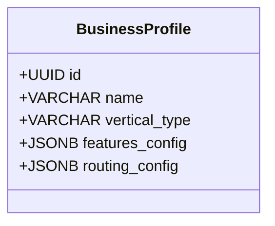
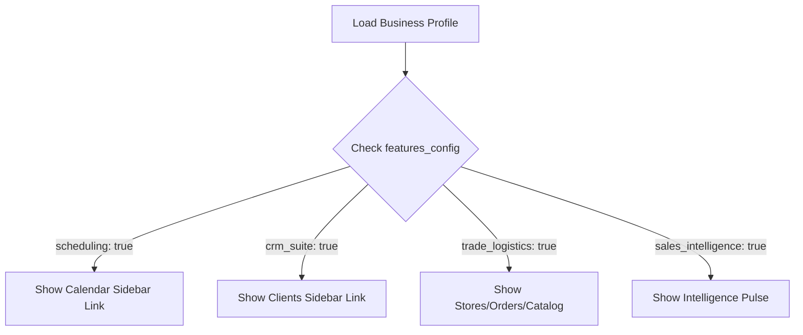

# Implementation Plan: Modular Feature Management (Admin Console Toggles)

This plan outlines the architecture, naming proposals, and database/UI changes required to transition from a rigid "Business Vertical" selection (`BASIC` vs `TRADE`) to a fully modular, toggleable **"Plug & Play" Feature Matrix** managed by the Superadmin.

---

## 1. Feature Modules & Nomenclature Proposals

To make the platform modular and easy to understand for clients, we propose the following module classifications and user-facing names:

| Current Name / Target | Proposed Name (Option A) | Proposed Name (Option B - Recommended) | Included Functionality |
| :--- | :--- | :--- | :--- |
| **Basic** | Core Calendar & Booking | **Appointment Scheduler** | Interactive calendar, appointment scheduling, services configurations, automated reminders. |
| **Business** | Brand & Profile Hub | **Business Identity Suite** | Integration setups (WhatsApp/Telegram/Google Calendar), general configurations, business hours. |
| **Client Management** | Client Directory (CRM) | **Client Relationship Suite (CRM)** | Detailed CRM lists, client categorization, behavioral tagging, custom data fields. |
| **Trade** | Distributors & Stores | **B2B Trade & Retail Logistics** | Physical stores inventory, product catalogs, order ledger, distributor mappings. |
| **User Intelligence** | AI Brain & Dossiers | **Sales Intelligence & AI Coach** | GraphRAG-driven briefs, visit dossier generation, active field check-ins, competitor matrices, Strategy Desk. |

---

## 2. Database Schema Refactor

We will replace the single `vertical_type` Enum check with a flexible **`features_config`** JSONB column on the `BusinessProfile` model. This allows us to toggle features dynamically without needing schema alterations when adding new modules.



### Proposed JSON structure for `features_config`:
```json
{
  "scheduling": { "enabled": true },
  "business_identity": { "enabled": true },
  "crm_suite": { "enabled": true },
  "trade_logistics": { "enabled": false },
  "sales_intelligence": { "enabled": false }
}
```

### Backend Default Configuration (`app/core/system_config.py`):
```python
DEFAULT_FEATURES = {
    "scheduling": {"enabled": True},
    "business_identity": {"enabled": True},
    "crm_suite": {"enabled": True},
    "trade_logistics": {"enabled": False},
    "sales_intelligence": {"enabled": False}
}
```

---

## 3. Backend Gating & API Enforcement

To prevent users from bypassing the UI and hitting disabled module endpoints, we will introduce a lightweight **Feature Gating Dependency** in FastAPI.

### Implementation Pattern (`app/api/deps.py`):
```python
from fastapi import HTTPException, Depends
from app.api.auth import get_current_user
from app.core.database import get_db

def require_feature(feature_key: str):
    async def dependency(current_user = Depends(get_current_user), db = Depends(get_db)):
        # Eager load business profile
        business = await get_full_business(db, current_user.id)
        if not business:
            raise HTTPException(status_code=404, detail="Business profile not found")
        
        cfg = business.features_config or DEFAULT_FEATURES
        if not cfg.get(feature_key, {}).get("enabled", False):
            raise HTTPException(
                status_code=403, 
                detail=f"The '{feature_key}' module is disabled for this business profile."
            )
        return business
    return dependency
```

### Endpoints Enforcement Example (`app/api/trade.py`):
```python
@router.post("/orders", dependencies=[Depends(require_feature("trade_logistics"))])
async def create_order(...):
    ...
```

---

## 4. Frontend Dynamic Sidebar Rendering

We will update the frontend sidebar navigation to read the user's business profile and dynamically render matching sidebar links.



### React Sidebar Link Filtering (`components/Sidebar.tsx`):
```typescript
const navItems = [
  { label: 'Dashboard', path: '/dashboard', icon: Home, feature: 'business_identity' },
  { label: 'Calendar', path: '/calendar', icon: Calendar, feature: 'scheduling' },
  { label: 'Clients', path: '/crm', icon: Users, feature: 'crm_suite' },
  { label: 'Pulse Feed', path: '/trade/v2/notes', icon: Activity, feature: 'sales_intelligence' },
  { label: 'Stores', path: '/trade/stores', icon: MapPin, feature: 'trade_logistics' },
  { label: 'Orders', path: '/trade/orders', icon: ShoppingBag, feature: 'trade_logistics' },
  { label: 'Catalog', path: '/trade/products', icon: Package, feature: 'trade_logistics' },
];

const visibleItems = navItems.filter(item => {
  if (!item.feature) return true;
  return business?.features_config?.[item.feature]?.enabled ?? true;
});
```

---

## 5. Superadmin Console UI (Toggles Panel)

In the edit/add user modal within `/admin/page.tsx`, we will replace the single business vertical dropdown with a high-density, toggleable checklist:

```
+-------------------------------------------------------------+
|                     MODULE CONFIGURATION                    |
+-------------------------------------------------------------+
|  [x] Appointment Scheduler                                  |
|      (Interactive calendar and scheduling core)            |
|                                                             |
|  [x] Client Relationship Suite (CRM)                       |
|      (Contact directory, segments, custom fields)          |
|                                                             |
|  [ ] B2B Trade & Retail Logistics                          |
|      (Stores, order ledgers, catalogs, stock tracking)      |
|                                                             |
|  [ ] Sales Intelligence & AI Coach                          |
|      (Dossiers, GraphRAG pulse, competitor matrices)        |
+-------------------------------------------------------------+
```

---

## 6. Execution Plan

1. **Phase 1: DB Migration**
   - Add `features_config` JSONB column to `BusinessProfile`.
   - Write an Alembic migration script. Write an upgrade step that populates existing `BASIC` businesses with only Scheduling and CRM enabled, and `TRADE` businesses with all features enabled.
2. **Phase 2: API Integration**
   - Add `features_config` fields to pydantic schemas.
   - Update the `/me` and `/admin/users` controllers to save features.
   - Apply `require_feature` guards on trade, calendar, and GraphRAG API route files.
3. **Phase 3: Frontend Dynamic Views**
   - Incorporate the checkbox toggles into the `/admin` user modals.
   - Implement dynamic sidebar filters based on the configuration.
4. **Phase 4: Verification & Integration Testing**
   - Write unit tests verifying that accessing a restricted endpoint (e.g. `/api/v1/trade/orders`) returns a `403 Forbidden` response when the corresponding feature is disabled.
