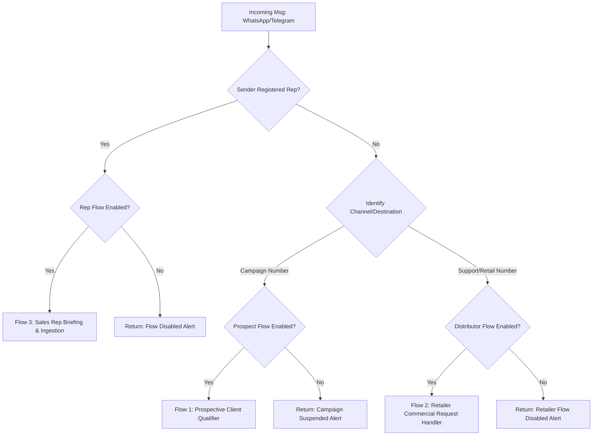

# Sherpa Modular Messaging Ingress & Agentic Routing Proposal

This document outlines the product strategy, database schema, webhook ingress logic, queue architecture, and LangGraph orchestration required to implement a modular message routing system in Sherpa. 

---

## 🎯 1. Product Strategy & User Flows

To handle incoming messages from different origins (WhatsApp/Telegram) dynamically, the system will categorize incoming messages into three distinct user flows:



### The Three Modular Flows
1. **Flow 1: Prospective Clients (Inbound Campaigns)**
   - **Target:** Unregistered contacts texting in response to Meta marketing/ad campaigns.
   - **Behavior:** Invokes the `ProspectQualifier` LangGraph state machine (built in Epic 126).
   - **Outcome:** Collects interest, quantity, location, contact, and company. If the quantity exceeds the wholesale threshold, it auto-generates a CRM `Client` record, a new `Store` lead, and schedules a `StoreAction` task (category: `COMMERCIAL`) to alert the sales representative. If below threshold, it routes them to nearby retail stores.
2. **Flow 2: Distributors/Retailers (Inbound Commercial Requests)**
   - **Target:** Existing registered store managers, store contacts, or distributors.
   - **Behavior:** A specialized prompt parses unstructured requests for commercial action (e.g., *"Need a new banner for the showcase"* or *"Missing invoice from last Thursday"*).
   - **Outcome:** Automatically structures the request and logs a `StoreAction` (category: `MARKETING` or `SUPPORT`) assigned to the respective sales representative.
3. **Flow 3: Sales Representatives (Field Operations)**
   - **Target:** Field reps interacting with the database.
   - **Behavior:** Interacts with the GraphRAG briefing engine and allows field report ingestion.
   - **Outcome:** Summarizes store history, competitor pricing, and registers visit intelligence.

---

## ⚙️ 2. Database Schema & Admin Controls

### Database Model Definition

We propose storing feature toggles and their specific parameters as a **JSONB** column (`routing_config`) on the `BusinessProfile` model. This avoids schema drift and allows us to attach settings dynamically (e.g. metadata templates, custom schedules, default models) without database migrations.

```python
# backend/app/models/business.py
from sqlalchemy import Column, String, Boolean, ForeignKey
from sqlalchemy.dialects.postgresql import JSONB

class BusinessProfile(Base):
    __tablename__ = "business_profiles"
    
    # ... existing fields (id, name, timezone, vertical_type, is_active) ...
    
    # Dynamic Routing Configuration
    # Default format:
    # {
    #     "prospective_clients": {"enabled": false, "config": {}},
    #     "distributors_retailers": {"enabled": false, "config": {}},
    #     "sales_reps": {"enabled": true, "config": {}}
    # }
    routing_config = Column(
        JSONB,
        nullable=False,
        default=lambda: {
            "prospective_clients": {"enabled": False},
            "distributors_retailers": {"enabled": False},
            "sales_reps": {"enabled": True}
        },
        server_default='{"prospective_clients": {"enabled": false}, "distributors_retailers": {"enabled": false}, "sales_reps": {"enabled": true}}'
    )
```

### Pydantic Validation Schema
To enforce data integrity, updates to routing configs are validated via Pydantic:

```python
# backend/app/schemas/business.py
from pydantic import BaseModel, Field
from typing import Dict, Any, Optional

class FlowSettings(BaseModel):
    enabled: bool = False
    config: Dict[str, Any] = Field(default_factory=dict)

class RoutingConfigSchema(BaseModel):
    prospective_clients: FlowSettings = Field(default_factory=FlowSettings)
    distributors_retailers: FlowSettings = Field(default_factory=FlowSettings)
    sales_reps: FlowSettings = Field(default_factory=FlowSettings)

class BusinessProfileUpdate(BaseModel):
    name: Optional[str] = None
    routing_config: Optional[RoutingConfigSchema] = None
```

### Superadmin Control UI Mockup
Superadmins toggle features via a panel at `/admin/businesses/[id]/routing`:

| Flow Toggle | Admin Config Parameters | Default State |
| :--- | :--- | :--- |
| **Prospective Campaigns** | Custom greeting template, wholesale threshold defaults. | `OFF` |
| **Distributors/Retailers** | Ticket priority rules, SLA automation thresholds. | `OFF` |
| **Sales Rep Assistance** | GraphRAG detail levels, auto-synced calendar limits. | `ON` (Trade-only) |

---

## 🧭 3. Webhook Ingress & Identity Resolution

To ensure we route users with high accuracy and zero cold-start delay, the inbound endpoint runs a deterministic identity checks hierarchy:

```python
# backend/app/services/identity_resolver.py
import re
from typing import Tuple, Optional
from sqlalchemy.ext.asyncio import AsyncSession
from sqlalchemy.future import select
from sqlalchemy.orm import selectinload
from app.models.crm import Client

class IdentityResolver:
    @staticmethod
    def clean_identifier(val: str) -> str:
        return re.sub(r"\D", "", val)

    @staticmethod
    async def resolve_sender(db: AsyncSession, business_id: str, platform_id: str) -> Tuple[str, Optional[Client]]:
        """
        Determines the sender's flow category:
        - 'sales_rep': Internal representative in the database.
        - 'distributor_retailer': A client associated with physical stores.
        - 'prospective_client': An unknown contact or designated prospect.
        """
        normalized_id = IdentityResolver.clean_identifier(platform_id)
        id_hash = Client.hash_id(normalized_id)

        # 1. Fetch Client with store relations pre-loaded
        result = await db.execute(
            select(Client)
            .where(
                Client.business_id == business_id,
                (Client.telegram_id_hash == id_hash) | (Client.whatsapp_id_hash == id_hash) | (Client.phone == normalized_id)
            )
            .options(selectinload(Client.stores))
        )
        client = result.scalars().first()

        if not client:
            return "prospective_client", None

        # 2. Check representative status
        if client.role in ("representative", "sales_rep", "agent"):
            return "sales_rep", client

        # 3. Check physical store mappings
        if client.stores:
            return "distributor_retailer", client

        # 4. Fallback to prospect
        return "prospective_client", client
```

---

## 🛠️ 4. Asynchronous Webhook Dispatch & Queue Split

To prevent webhook timeouts (the 4.8s limit before Twilio/Meta retries) and handle high-volume ad campaign bursts:
- The FastAPI controller acknowledges webhooks immediately with `200 OK`.
- Processing tasks are dispatched asynchronously to dedicated Celery queues.

```python
# backend/app/api/whatsapp.py (Ingress Handler Example)
@router.post("/webhook/twilio/ingress")
async def twilio_ingress_webhook(request: Request, db: AsyncSession = Depends(get_db)):
    form_data = await request.form()
    payload = dict(form_data)
    
    sender = payload.get("From", "")
    to_num = payload.get("To", "")
    text = payload.get("Body", "")

    if not text:
        return Response(content="<Response></Response>", media_type="text/xml")

    # 1. Resolve Integration & Business Profile
    integration = await get_integration(db, to_num)
    if not integration:
        return Response(content="<Response></Response>", media_type="text/xml")

    business = await get_business(db, integration.business_id)
    
    # 2. Match identity
    sender_type, client = await IdentityResolver.resolve_sender(db, business.id, sender)

    # 3. Check dynamic routing flags
    cfg = business.routing_config or {}
    flow_enabled = cfg.get(f"{sender_type}s", {}).get("enabled", False)

    if not flow_enabled:
        return send_twiml_reply("Servicio no disponible temporalmente.")

    # 4. Dispatch to isolated Celery queues
    if sender_type == "sales_rep":
        process_sales_rep_message.apply_async(
            args=[business.id, client.id, payload], queue="sales-reps"
        )
    elif sender_type == "distributor_retailer":
        process_distributor_message.apply_async(
            args=[business.id, client.id, payload], queue="distributors"
        )
    else:
        process_prospect_message.apply_async(
            args=[business.id, client.id if client else None, payload], queue="prospects"
        )

    return Response(content="<Response></Response>", media_type="text/xml")
```

### Celery Queue Topologies
*   `sales-reps` Queue: High priority, low execution latency.
*   `distributors` Queue: Standard priority. Handles marketing actions and logistics logging.
*   `prospects` Queue: Rate-limited queue to prevent API rate-limit exhaustion during ad spikes.

---

## 🤖 5. AI Graph Architecture & Context Ingestion

### Graph Isolation
To prevent context dilution, state corruption, or memory leaks, the system avoids monolithic routing graphs. Each flow is implemented as its own distinct LangGraph:
- `ProspectQualifierGraph`
- `DistributorGraph`
- `SalesRepOrchestratorGraph`

To isolate session checkpointers in PostgreSQL, the system namespaces the LangGraph `thread_id` dynamically:
- Prospective Clients: `prospect:{chat_id}`
- Distributors/Retailers: `distributor:{chat_id}`
- Sales Representatives: `sales_rep:{chat_id}`

### Dynamic Context Assemblers
To reduce costs and prevent hallucinations, `ContextAssembler` dynamically filters database and vector RAG context based on the sender:

| Flow | DB Context Loaded | Vector RAG Filter |
| :--- | :--- | :--- |
| **Prospects** | Active wholesale product list only. | `Scope: PUBLIC` (No internal metrics) |
| **Distributors** | Linked `Store` details, active campaigns, order history. | `Scope: STORE_GLOBAL` or specific `Store.id` |
| **Sales Reps** | Calendar availability, all managed stores, store briefs.| `Scope: ALL` |

---

## 💰 6. Feature Packaging & Monetization Strategy

To align technical complexity with commercial pricing models, we recommend the following monetization structure:

1.  **Basic Tier (B2C Scheduler)**
    *   *Features:* Single general agent, standard text reminders, booking calendar.
    *   *Limitations:* No vector database, no multi-flow routing. All ingress defaults to Basic agent.
2.  **Trade Tier (B2B Core Sales Intelligence)**
    *   *Features:* Unlocks `enable_sales_rep_flow`. Allows field rep GraphRAG context briefs, audio transcriptions, and visit history logs.
3.  **Add-on Modules (Enterprise Level)**
    *   *Lead Gen Campaign Add-on:* Unlocks `enable_prospect_flow` for Meta ad integration and wholesale lead capture.
    *   *Retailer Hub Add-on:* Unlocks `enable_distributor_flow` allowing distributors/retailers to text request triggers (marketing/support) directly into the CRM.

---

## 🚧 7. MVP Boundary Considerations
*   **Single-Number Webhook Ingress:** Rather than building a multi-number binding interface, incoming messages on the main company number will route based on sender classification.
*   **Static Campaign Configurations:** Qualification logic (wholesale thresholds, location boundaries) is managed through standard catalog parameters rather than a custom ad-campaign builder interface.
*   **Twilio-Only WhatsApp Target:** Skip Telegram validation for the MVP to focus on stabilizing the Twilio Cloud platform.
