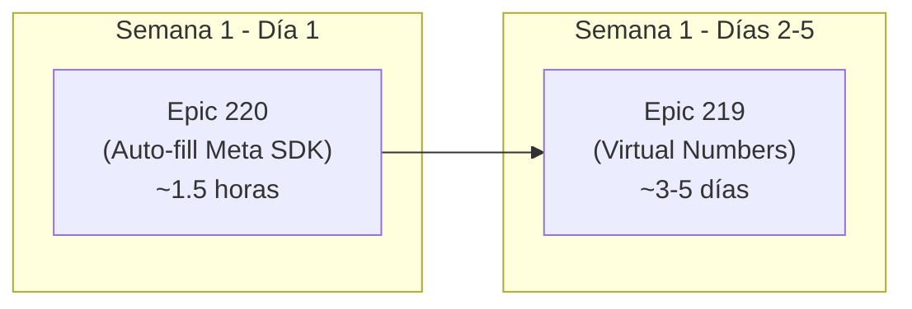

# Plan de Onboarding Zero-Fricción para WhatsApp

> **Objetivo**: Eliminar la fricción de onboarding de WhatsApp para usuarios no técnicos ("Marco") que se frustran con los formularios de Meta (sitio web, datos de empresa, Facebook Login).

---

## Contexto del Problema

Cuando un usuario común con WhatsApp Business en su celular quiere usar Xerpa:
1. Hace clic en "Conectar con Facebook".
2. Meta le abre un popup que le pide: **Nombre de empresa, País, Sitio web** (obligatorio).
3. El usuario **no tiene sitio web** → se frustra → **abandona**.

### Soluciones Propuestas

| # | Solución | Impacto | Esfuerzo |
|---|---------|---------|----------|
| **Epic 220** | Auto-completar los campos de Meta desde Xerpa (0 formularios visibles) | Alto | **Bajo (1-2 días)** |
| **Epic 219** | Número virtual en 1 clic sin Facebook ni Meta | Máximo | **Medio (3-5 días)** |

**Prioridad de implementación:** Epic 220 primero (es rápido y mejora el flujo actual de inmediato), luego Epic 219 (ofrece la experiencia definitiva).

---

## Epic 220: Zero-Friction Embedded Signup (Auto-fill Business Profile)

**Objetivo**: Eliminar completamente los campos manuales del popup de Meta Embedded Signup pre-llenando automáticamente los datos del negocio que Xerpa ya tiene en su base de datos.

### Descubrimiento Técnico Clave

Meta soporta oficialmente el pre-llenado de datos de empresa via `extras.setup.business` en el SDK de `FB.login()`:

```javascript
FB.login(callback, {
  config_id: '<CONFIG_ID>',
  extras: {
    setup: {
      business: {
        name: 'Abarrotes Don Pepe',        // ← del campo business_name de Xerpa
        website: 'https://xerpaa.com',      // ← URL genérica de Xerpa
        address: {
          streetAddress1: 'Av. Constituyentes 123',
          city: 'Ciudad de México',
          state: 'CDMX',
          zipPostal: '01000',
          country: 'MX'
        }
      },
      phone: {
        displayName: 'Abarrotes Don Pepe',  // ← nombre para el perfil de WhatsApp
        category: 'OTHER'
      }
    },
    featureType: 'whatsapp_business_app_onboarding',
    sessionInfoVersion: '3',
    coex: true
  }
});
```

**Resultado:** El usuario abre el popup de Meta y los campos ya vienen llenos. Solo hace clic en "Siguiente" → selecciona su número → "Listo". **Cero escritura manual.**

### Código Actual (Lo que vamos a cambiar)

**Archivo**: `frontend/components/WhatsAppModal.tsx`, líneas 56-78

```typescript
// ANTES: setup vacío → Meta obliga al usuario a llenar todo manualmente
extras: {
  setup: {},  // ← VACÍO
  featureType: 'whatsapp_business_app_onboarding',
  sessionInfoVersion: '3',
  coex: true,
}
```

### Tareas

#### Task 220.1 (BE): Endpoint de Pre-fill Data
**Archivo**: `backend/app/api/integrations.py`

Extender el endpoint existente `GET /integrations/whatsapp/config` para incluir los datos del negocio del usuario:

```python
# Response actual:
{ "app_id": "...", "config_id": "..." }

# Response nuevo:
{
  "app_id": "...",
  "config_id": "...",
  "prefill": {
    "business_name": "Abarrotes Don Pepe",   # de BusinessProfile.business_name
    "address": "Av. Constituyentes 123",      # de BusinessProfile.address (si existe)
    "city": "Ciudad de México",               # de BusinessProfile.city (si existe)
    "state": "CDMX",                          # de BusinessProfile.state (si existe)
    "zip": "01000",                           # de BusinessProfile.zip_code (si existe)
    "country": "MX"                           # default o de BusinessProfile.country
  }
}
```

**Acceptance Criteria:**
- **Given** un usuario autenticado con un `BusinessProfile` existente,
- **When** llama a `GET /integrations/whatsapp/config`,
- **Then** el response incluye un objeto `prefill` con `business_name` y datos de dirección (los campos vacíos se omiten del objeto, no se envían como strings vacíos).

**Estimado**: 30 minutos.

---

#### Task 220.2 (FE): Inyectar Pre-fill en FB.login()
**Archivo**: `frontend/components/WhatsAppModal.tsx`

Usar los datos de `prefill` del config para poblar `extras.setup.business`:

```typescript
// DESPUÉS: setup poblado con datos del negocio
extras: {
  setup: {
    business: {
      name: config.prefill?.business_name || '',
      website: 'https://xerpaa.com',  // URL genérica siempre presente
      ...(config.prefill?.address && {
        address: {
          streetAddress1: config.prefill.address,
          city: config.prefill.city || '',
          state: config.prefill.state || '',
          zipPostal: config.prefill.zip || '',
          country: config.prefill.country || 'MX'
        }
      })
    },
    phone: {
      displayName: config.prefill?.business_name || '',
      category: 'OTHER'
    }
  },
  featureType: 'whatsapp_business_app_onboarding',
  sessionInfoVersion: '3',
  coex: true,
}
```

**Acceptance Criteria:**
- **Given** un usuario con `business_name = "Abarrotes Don Pepe"` en su perfil,
- **When** hace clic en "Conectar con Facebook",
- **Then** el popup de Meta muestra los campos "Nombre" y "Sitio web" ya pre-llenados con "Abarrotes Don Pepe" y "https://xerpaa.com" respectivamente.
- **And** el usuario NO tiene que escribir nada manualmente en el formulario de perfil de empresa.

**Estimado**: 1 hora.

---

#### Task 220.3 (FE): Fallback para usuarios sin BusinessProfile
**Archivo**: `frontend/components/WhatsAppModal.tsx`

Si el usuario aún no tiene `BusinessProfile` (recién creó su cuenta), el campo `website` se pre-llena con `https://xerpaa.com` como mínimo, y `business_name` se deja vacío (el usuario solo tendría que escribir su nombre de negocio en el popup, nada más).

**Acceptance Criteria:**
- **Given** un usuario SIN `BusinessProfile` completado,
- **When** hace clic en "Conectar con Facebook",
- **Then** el campo "Sitio web" ya viene pre-llenado con `https://xerpaa.com`.
- **And** el usuario solo necesita escribir el nombre de su negocio (1 solo campo).

**Estimado**: 15 minutos (incluido en Task 220.2).

---

### Resumen Epic 220

| Task | Scope | Archivo Principal | Estimado |
|------|-------|-------------------|----------|
| 220.1 | Backend - Endpoint prefill data | `integrations.py` | 30 min |
| 220.2 | Frontend - Inyectar setup.business en FB.login | `WhatsAppModal.tsx` | 1 hora |
| 220.3 | Frontend - Fallback `xerpaa.com` sin perfil | `WhatsAppModal.tsx` | Incluido en 220.2 |
| **Total** | | | **~1.5 horas** |

---

## Epic 219: Xerpa-Provisioned WhatsApp Virtual Numbers (1-Click Onboarding) [REFINADO]

**Objetivo**: Permitir que usuarios no técnicos ("Marco") activen un número de WhatsApp con IA en **1 solo clic**, sin Facebook Login, sin formularios de Meta, sin verificación de sitio web.

### Arquitectura de Alto Nivel

```
┌─────────────────────────────────────────────────────────────────────┐
│                        USUARIO EN XERPA                             │
│                                                                     │
│  ┌─────────────────────────────────────────────────────────────┐    │
│  │  Settings > Integrations > WhatsApp                         │    │
│  │                                                             │    │
│  │  ┌───────────────────────┐  ┌───────────────────────────┐   │    │
│  │  │  ⚡ Activar WhatsApp  │  │  🔗 Usar Mi Número Actual │   │    │
│  │  │     con IA (1 clic)   │  │   (Conectar con Facebook) │   │    │
│  │  │                       │  │                           │   │    │
│  │  │  Xerpa te asigna un   │  │  Vincula tu WhatsApp      │   │    │
│  │  │  número +52 dedicado  │  │  Business existente       │   │    │
│  │  │  en 3 segundos.       │  │  (requiere cuenta Meta)   │   │    │
│  │  └───────────────────────┘  └───────────────────────────┘   │    │
│  └─────────────────────────────────────────────────────────────┘    │
└─────────────────────────────────────────────────────────────────────┘
                           │
                    Click en "Activar"
                           │
                           ▼
┌─────────────────────────────────────────────────────────────────────┐
│                      BACKEND DE XERPA                               │
│                                                                     │
│  1. Llama Twilio API → Compra número +52 XX XXXX XXXX (~$2/mes)    │
│  2. Llama Meta Graph API → Registra el número en el WABA de Xerpa  │
│  3. Llama Meta Graph API → Suscribe webhooks para el número        │
│  4. Guarda Integration en DB con provider_type="xerpa_provisioned" │
│  5. Retorna al frontend: "Tu número es +52 55 1234 5678"           │
│                                                                     │
│  Tiempo total: ~3 segundos                                          │
└─────────────────────────────────────────────────────────────────────┘
```

### Infraestructura Existente que Reutilizamos

| Componente | Archivo | Estado |
|-----------|---------|--------|
| `create_twilio_subaccount()` | `provisioner.py` L31-46 | ✅ Ya existe |
| `buy_mexican_number()` | `provisioner.py` L48-77 | ✅ Ya existe |
| `provision_whatsapp_sender()` | `provisioner.py` L79-180 | ✅ Ya existe (orchestrator completo con retry) |
| `release_whatsapp_sender()` | `provisioner.py` L185-262 | ✅ Ya existe (cleanup + Meta deregister) |
| `POST /whatsapp/provision` endpoint | `integrations.py` | ✅ Ya existe |
| `MessagingService.get_engine()` factory | `__init__.py` | ✅ Ya soporta `twilio_subaccount` |
| `TwilioSubaccountEngine` | `twilio_engine.py` | ✅ Ya existe |
| `MetaCloudEngine` | `meta_cloud_engine.py` | ✅ Ya existe |

### Lo que FALTA implementar

#### Task 219.1 (BE): Meta WABA Binding para Números Comprados por Twilio
**Archivo**: `backend/app/services/messaging/provisioner.py`

Después de comprar el número en Twilio, necesitamos registrarlo en el WABA central de Xerpa vía Meta Graph API:

```python
# Paso nuevo después de buy_mexican_number():

# 1. Agregar el número al WABA de Xerpa
POST https://graph.facebook.com/v22.0/{XERPA_WABA_ID}/phone_numbers
Headers: Authorization: Bearer {META_SYSTEM_USER_TOKEN}
Body: {
  "cc": "52",           # código de país
  "phone_number": "5512345678",  # número sin código de país
  "migrate_phone_number": false
}

# 2. Verificar el número (Meta envía SMS al número Twilio)
POST https://graph.facebook.com/v22.0/{phone_number_id}/request_code
Body: { "code_method": "SMS", "language": "es_MX" }

# 3. Confirmar el código de verificación
POST https://graph.facebook.com/v22.0/{phone_number_id}/verify_code
Body: { "code": "<codigo_recibido_via_twilio>" }

# 4. Registrar el número para Cloud API
POST https://graph.facebook.com/v22.0/{phone_number_id}/register
Body: { "messaging_product": "whatsapp", "pin": "123456" }
```

**Desafío Técnico Principal**: Interceptar el SMS de verificación de Meta que llega al número de Twilio. Requiere:
- Configurar un webhook de Twilio para mensajes SMS entrantes en el número recién comprado.
- Parsear el código de verificación automáticamente.
- Completar el flujo de verificación sin intervención del usuario.

**Acceptance Criteria:**
- **Given** un número +52 recién comprado en Twilio,
- **When** el sistema ejecuta el flujo de binding,
- **Then** el número queda registrado en el WABA de Xerpa con status "connected" en Meta y webhooks activos.
- **And** todo el proceso es invisible para el usuario (0 clics adicionales).

**Estimado**: 1-2 días (incluye manejo del SMS de verificación).

---

#### Task 219.2 (BE): Endpoint Unificado de Provisioning 1-Click
**Archivo**: `backend/app/api/integrations.py`

Crear o refinar `POST /integrations/whatsapp/provision-virtual`:

```python
@router.post("/whatsapp/provision-virtual")
async def provision_virtual_number(
    area_code: Optional[str] = None,
    db: AsyncSession = Depends(get_db),
    current_user: User = Depends(get_current_user)
):
    """
    1-Click: Compra número Twilio + Registra en Meta WABA + Activa webhooks.
    El usuario no necesita Facebook Login ni datos de empresa.
    """
    # 1. Verificar que el usuario tiene BusinessProfile
    # 2. Verificar que no tiene ya una integración WhatsApp activa
    # 3. Llamar provision_whatsapp_sender() (ya existe)
    # 4. Llamar meta_bind_to_xerpa_waba() (Task 219.1)
    # 5. Retornar número asignado
```

**Acceptance Criteria:**
- **Given** un usuario autenticado sin integración WhatsApp activa,
- **When** llama a `POST /whatsapp/provision-virtual`,
- **Then** recibe en <5 segundos un response con `{ phone_number: "+525512345678", status: "connected" }`.
- **And** la integración queda guardada con `provider_type: "xerpa_provisioned"`.

**Estimado**: 4 horas.

---

#### Task 219.3 (FE): Dual-Path UI en WhatsAppModal
**Archivo**: `frontend/components/WhatsAppModal.tsx`

Rediseñar el Step 1 del modal para ofrecer 2 caminos claros:

```
┌──────────────────────────────────────────────────────┐
│          Conecta WhatsApp con IA                      │
│                                                      │
│  ⚡ Opción 1: Número Nuevo Inteligente               │
│  ┌────────────────────────────────────────────┐      │
│  │  Xerpa te asigna un número +52 dedicado    │      │
│  │  con IA en 3 segundos.                     │      │
│  │                                            │      │
│  │  • Sin Facebook  • Sin formularios         │      │
│  │  • Número exclusivo para tu negocio        │      │
│  │                                            │      │
│  │  [ ⚡ Activar Número Nuevo ]                │      │
│  └────────────────────────────────────────────┘      │
│                                                      │
│  📱 Opción 2: Usar Mi Número de WhatsApp Business    │
│  ┌────────────────────────────────────────────┐      │
│  │  Vincula el número que ya usas en la app   │      │
│  │  de WhatsApp Business de tu celular.       │      │
│  │                                            │      │
│  │  • Requiere cuenta de Facebook             │      │
│  │  • Tu número sigue funcionando en el cel   │      │
│  │                                            │      │
│  │  [ 🔗 Conectar con Facebook ]               │      │
│  └────────────────────────────────────────────┘      │
│                                                      │
│  🔧 Configurar manualmente (Desarrolladores)         │
└──────────────────────────────────────────────────────┘
```

**Acceptance Criteria:**
- **Given** un usuario sin integración WhatsApp activa,
- **When** abre el modal de WhatsApp,
- **Then** ve 2 opciones claramente diferenciadas.
- **When** hace clic en "Activar Número Nuevo",
- **Then** ve un spinner de 3 segundos y luego su número +52 asignado.

**Estimado**: 3-4 horas.

---

#### Task 219.4 (BE): Webhook Router para Números Provisioned
**Archivo**: `backend/app/api/whatsapp.py`

Los números provisioned por Xerpa están bajo el WABA central de Xerpa. El webhook de Meta envía TODOS los mensajes al mismo endpoint. Necesitamos un router que identifique a qué negocio pertenece cada mensaje entrante:

```python
# En el webhook handler, después de extraer phone_number_id:
# 1. Buscar Integration WHERE settings->>'phone_number_id' == incoming_phone_number_id
# 2. Si es meta_cloud_api (usuario conectó su propio número): procesar normal
# 3. Si es xerpa_provisioned: routear al business_id correcto del tenant
```

**Acceptance Criteria:**
- **Given** un mensaje entrante de WhatsApp al webhook de Xerpa,
- **When** el número receptor es un número virtual provisioned,
- **Then** el sistema identifica el business correcto y procesa el mensaje en su contexto.

**Estimado**: 2-3 horas.

---

#### Task 219.5 (Billing): Lifecycle & Costos del Número Virtual
**Scope**: Lógica de negocio (NO requiere Stripe todavía)

- El costo del número Twilio (+52 MX) es ~$2 USD/mes.
- Al cancelar suscripción o desactivar WhatsApp: llamar `release_whatsapp_sender()` (ya existe) que libera el número en Twilio y deregistra en Meta.
- Implementar un Celery beat task que revise números sin actividad >30 días para reciclaje.

**Acceptance Criteria:**
- **Given** un usuario que desactiva su integración WhatsApp,
- **When** el sistema procesa la desactivación,
- **Then** el número Twilio se libera, el registro de Meta se deregistra, y el número queda disponible para otro usuario.

**Estimado**: 2-3 horas.

---

### Resumen Epic 219

| Task | Scope | Archivo Principal | Estimado | Dependencias |
|------|-------|-------------------|----------|-------------|
| 219.1 | Backend - Meta WABA Binding + SMS verify | `provisioner.py` | 1-2 días | Ninguna |
| 219.2 | Backend - Endpoint 1-Click Provision | `integrations.py` | 4 horas | 219.1 |
| 219.3 | Frontend - Dual-Path UI | `WhatsAppModal.tsx` | 3-4 horas | 219.2 |
| 219.4 | Backend - Webhook Router multi-tenant | `whatsapp.py` | 2-3 horas | 219.1 |
| 219.5 | Backend - Lifecycle & reciclaje | `provisioner.py` + Celery | 2-3 horas | 219.2 |
| **Total** | | | **~3-5 días** | |

---

## Orden de Implementación Recomendado



### Fase 1: Epic 220 (Impacto inmediato, esfuerzo mínimo)
1. ✅ Task 220.1 → Backend prefill endpoint (30 min)
2. ✅ Task 220.2 → Frontend inyecta datos en FB.login (1 hora)
3. 🧪 Prueba E2E: verificar que el popup de Meta muestra campos pre-llenados

### Fase 2: Epic 219 (Experiencia definitiva)
1. ✅ Task 219.1 → Meta WABA Binding + verificación SMS (1-2 días)
2. ✅ Task 219.2 → Endpoint 1-Click (4 horas)
3. ✅ Task 219.4 → Webhook Router multi-tenant (2-3 horas)
4. ✅ Task 219.3 → Frontend Dual-Path UI (3-4 horas)
5. ✅ Task 219.5 → Lifecycle & billing (2-3 horas)
6. 🧪 Prueba E2E: usuario hace 1 clic → recibe número → recibe mensajes

---

## Riesgos y Mitigaciones

| Riesgo | Probabilidad | Mitigación |
|--------|-------------|-----------|
| Meta no permite pre-llenar `website` en ciertas regiones | Baja | Fallback: `website` siempre se pre-llena con `https://xerpaa.com` |
| SMS de verificación de Meta tarda >30 seg en llegar a Twilio | Media | Implementar polling con timeout de 60 seg + retry automático |
| Twilio no tiene números +52 disponibles en el momento | Baja | Pool de números pre-comprados (warm pool de 5-10 números) |
| Costos de números Twilio se acumulan sin usuarios activos | Media | Task 219.5: reciclaje automático de números inactivos >30 días |
