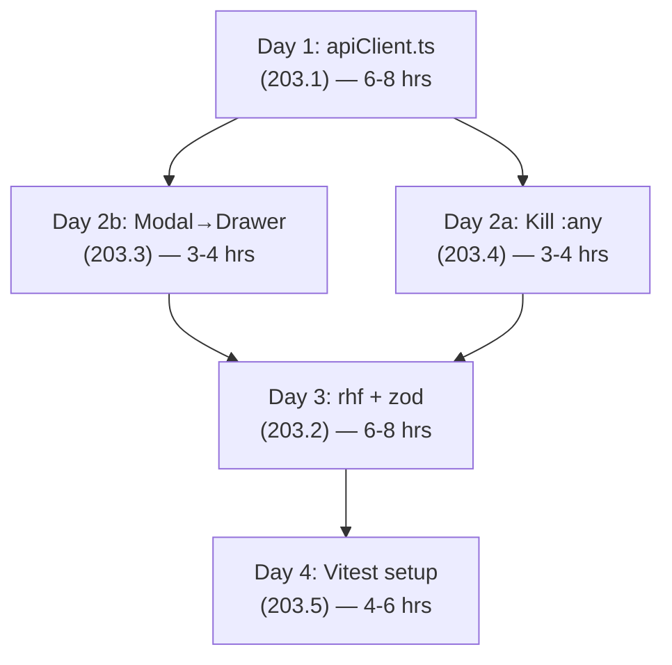

# Phase 6: Frontend Architecture — Sprint Plan

> **Sprint Start**: 2026-07-30
> **Branch**: `refactor/phase-6-frontend-architecture` (from `staging`)
> **Estimated Total**: ~4 days

---

## Pre-Sprint Checklist

- [ ] Create branch `refactor/phase-6-frontend-architecture` from `staging`
- [ ] Verify `npm run build` passes cleanly on current staging
- [ ] Verify all 58 backend tests are still green

---

## Codebase Snapshot (Verified via grep)

| Metric | Current State |
|---|---|
| `apiClient.ts` | **Does not exist** — only `lib/api.ts` (server-only `serverFetch`) |
| Raw `fetch()` with inline `Authorization` | **45 files**, 49 total files with `fetch()` |
| Legacy modals still present | `ClientModal.tsx` (orphaned), `StoreModal.tsx` (active in `trade/page.tsx`) |
| v2 Drawers | `AccountDrawer`, `CatalogDrawer`, `ClientDrawer`, `ContactDrawer`, `FieldNoteDrawer`, `ManageAttributesDrawer`, `ManageFieldsDrawer`, `OrderDrawer`, `ServiceDrawer` |
| `: any` annotations | **87 instances** across frontend |
| `react-hook-form` / `zod` | **Not installed**, zero usage |
| Test files | **Zero** — no Vitest, no RTL, no Jest |
| `types/api.ts` | **4,591 lines** — auto-generated via `openapi-typescript` |
| Zustand store | `store/authStore.ts` (not `lib/store.ts`) |

---

## Task 1: Centralized API Client — `apiClient.ts` (203.1)

**Priority**: 🔴 Highest — every other task benefits from this
**Estimate**: 6–8 hours (45 files is bigger than originally scoped)

### 1A. Create `frontend/lib/apiClient.ts` (~1.5 hrs)

Create a typed wrapper around `fetch` that:
- Reads the auth token from the Zustand store (`store/authStore.ts`)
- Injects `Authorization: Bearer <token>` automatically
- Sets `Content-Type: application/json` by default
- Provides typed methods: `api.get<T>()`, `api.post<T>()`, `api.put<T>()`, `api.patch<T>()`, `api.delete<T>()`
- Handles 401 responses globally (clear token, redirect to `/login`)
- Uses `NEXT_PUBLIC_API_URL` from `config.ts`
- Exports a singleton instance
- Provides `api.upload<T>()` for `FormData` calls (no Content-Type override)

```typescript
// Target shape:
const apiClient = {
  get:    <T>(path: string, opts?) => Promise<T>,
  post:   <T>(path: string, body?, opts?) => Promise<T>,
  put:    <T>(path: string, body?, opts?) => Promise<T>,
  patch:  <T>(path: string, body?, opts?) => Promise<T>,
  delete: <T>(path: string, opts?) => Promise<T>,
  upload: <T>(path: string, formData: FormData, opts?) => Promise<T>,
}
```

### 1B. Migrate all 45 files to `apiClient` (~5–6 hrs)

Migrate in batches, verifying `npm run build` after each batch:

| Batch | Files | Notes |
|-------|-------|-------|
| **Batch 1: Drawers** | `AccountDrawer` (14), `ClientDrawer` (6), `CatalogDrawer` (5), `ContactDrawer`, `FieldNoteDrawer`, `OrderDrawer`, `ServiceDrawer`, `ManageAttributesDrawer`, `ManageFieldsDrawer` | Highest density — biggest bang for the buck |
| **Batch 2: Trade pages** | `trade/actions/page` (10), `trade/stores/[id]/page` (7), `trade/retailers/[id]/page` (7), `trade/orders/[id]/page` (4), `trade/notes/page`, `trade/prospects/`, `trade/products/`, `trade/stores/page` | Core B2B flows |
| **Batch 3: Settings & Admin** | `admin/page` (6), `IntegrationsPanel` (5), `GeneralSettings`, `settings/` subcomponents | Admin/config pages |
| **Batch 4: Other** | `onboarding/page` (4), `ClientCalendar` (4), `DashboardHome`, `crm/page`, `conversations/`, `services/`, remaining files | Everything else |

> **Note**: Leave `lib/api.ts` (`serverFetch`) untouched — it serves Next.js server components which don't use Bearer tokens.

### 1C. Acceptance Criteria
- [ ] `grep -r "Authorization" frontend/app/ frontend/components/ frontend/hooks/` returns **0 results** outside `apiClient.ts`
- [ ] `npm run build` passes
- [ ] Manual smoke test: login → dashboard → store detail → create order → CRM → settings

---

## Task 2: Modal-to-Drawer Migration (203.3)

**Priority**: 🟡 Medium
**Estimate**: 3–4 hours
**Goal**: Delete `ClientModal.tsx` and `StoreModal.tsx`; all code uses v2 Drawers.

### Current State

| Legacy Modal | Status | v2 Equivalent | Consumer |
|---|---|---|---|
| `ClientModal.tsx` (26 KB) | **Orphaned** — no page imports it | `ClientDrawer.tsx` | None currently |
| `StoreModal.tsx` (20 KB) | **Active** — used in `trade/page.tsx` | `AccountDrawer.tsx` | `app/trade/page.tsx` |

### Steps

1. **Audit `StoreModal` vs `AccountDrawer` props** (~30 min)
   - Diff form fields, callbacks, and state between the two
   - Identify any missing features in `AccountDrawer`

2. **Port missing features to `AccountDrawer`** (~1–2 hrs)
   - Add any fields or behaviors from `StoreModal` that `AccountDrawer` lacks
   - Ensure `onSuccess` / refresh callbacks match

3. **Swap `StoreModal` → `AccountDrawer` in `trade/page.tsx`** (~30 min)
   - Update imports and state variables (`isModalOpen` → drawer open state)

4. **Delete legacy modals** (~15 min)
   - Remove `components/ClientModal.tsx` (already orphaned, safe delete)
   - Remove `components/StoreModal.tsx` (after swap is verified)

5. **Audit remaining modals** (~30 min)
   - Review if other legacy modals (`AddAppointmentModal`, `AddCategoryModal`, `AddProductModal`, `RescheduleAppointmentModal`, `TelegramModal`, `WhatsAppModal`) should also be flagged for future migration
   - Document findings but do NOT migrate in this sprint

### Acceptance Criteria
- [ ] `grep -r "ClientModal\|StoreModal" frontend/` returns **0 results**
- [ ] `npm run build` passes
- [ ] Smoke test: create/edit store from `trade/page.tsx` via AccountDrawer

---

## Task 3: Eliminate `: any` Type Annotations (203.4)

**Priority**: 🟡 Medium
**Estimate**: 3–4 hours
**Goal**: Reduce 87 → 0 `: any` annotations.

### Strategy

Since `types/api.ts` is already **4,591 lines** of auto-generated types from `openapi-typescript`, most proper types already exist. The work is importing and applying them.

### 3A. Create type re-export helpers (~30 min)

Create `frontend/types/models.ts` that re-exports the most-used component schemas from `api.ts` with friendly names:

```typescript
import type { components } from './api';

export type Store = components['schemas']['StoreResponse'];
export type Client = components['schemas']['ClientResponse'];
export type Product = components['schemas']['ProductResponse'];
// ... etc
```

This avoids deeply nested `components['schemas']['...']` imports everywhere.

### 3B. Fix top offenders (~3 hrs)

| File | `: any` count | Strategy |
|---|---|---|
| `components/v2/ClientDrawer.tsx` | 12 | Import `Client` type, type form state & API responses |
| `components/v2/AccountDrawer.tsx` | 10 | Import `Store` type, type form state & API responses |
| `components/ClientModal.tsx` | 8 | **Will be deleted in Task 2** — skip |
| `app/trade/retailers/[id]/page.tsx` | 7 | Type page state + API responses |
| `app/trade/stores/[id]/page.tsx` | 7 | Type page state + API responses |
| `app/trade/actions/page.tsx` | 7 | Type action lists + filters |
| `app/settings/components/GeneralSettings.tsx` | 6 | Type settings form state |
| `app/settings/components/IntegrationsPanel.tsx` | 5 | Type integration configs |
| `app/trade/notes/page.tsx` | 5 | Type field note data |
| Remaining ~20 instances | spread | Event handlers, minor state |

### Acceptance Criteria
- [ ] `grep -rc ': any' frontend/app/ frontend/components/ frontend/hooks/ frontend/lib/ frontend/store/` returns **0**
- [ ] `npm run build` passes
- [ ] No regressions in existing type generation (`npm run gen:api` still works)

---

## Task 4: `react-hook-form` + `zod` for Drawer Forms (203.2)

**Priority**: 🟡 Medium
**Estimate**: 1 day (~6–8 hrs)
**Goal**: Replace manual `useState` form management in v2 Drawer components with `react-hook-form` + `zod` validation.

### 4A. Install dependencies (~15 min)
```bash
cd frontend && npm install react-hook-form zod @hookform/resolvers
```

### 4B. Create shared Zod schemas (`lib/schemas/`) (~1.5 hrs)

| Schema File | Validates |
|---|---|
| `lib/schemas/account.ts` | Store/Account create & edit forms |
| `lib/schemas/client.ts` | Client create & edit forms |
| `lib/schemas/catalog.ts` | Product/catalog forms |
| `lib/schemas/order.ts` | Order creation forms |
| `lib/schemas/contact.ts` | Contact detail forms |
| `lib/schemas/fieldNote.ts` | Field note entry forms |

Cross-reference with `backend/app/schemas/` Pydantic models to ensure field parity.

### 4C. Refactor Drawer components (~4–5 hrs)

For each Drawer:
1. Replace `useState` per-field with `useForm({ resolver: zodResolver(Schema), defaultValues })` 
2. Replace `onChange` handlers with `register()` or `Controller` for controlled components (shadcn `Select`, date pickers)
3. Replace manual validation with Zod schema
4. Wire `handleSubmit` to `apiClient.post/put`
5. Show field-level errors via `formState.errors`

Priority order:
1. `AccountDrawer.tsx` (most complex — 14 fetch calls, 10 `: any`)
2. `ClientDrawer.tsx` (6 fetch calls, 12 `: any`)
3. `CatalogDrawer.tsx` (5 fetch calls)
4. `OrderDrawer.tsx`
5. `ContactDrawer.tsx`, `FieldNoteDrawer.tsx` (simpler)

### 4D. Create `FormField` wrapper (~30 min)

A thin component connecting `react-hook-form` `Controller` with shadcn `Input`, `Select`, `Textarea` for consistent error styling.

### Acceptance Criteria
- [ ] All Drawer forms use `useForm` + `zodResolver`
- [ ] Field-level validation errors render on blur/submit
- [ ] No manual `useState` for individual form fields in Drawers
- [ ] `npm run build` passes

---

## Task 5: Vitest + React Testing Library Setup (203.5)

**Priority**: 🟢 Lower (but foundational)
**Estimate**: 4–6 hours
**Goal**: Establish frontend testing infrastructure with initial coverage on critical paths.

### 5A. Install & configure (~1.5 hrs)

```bash
cd frontend && npm install -D vitest @testing-library/react @testing-library/jest-dom @testing-library/user-event jsdom @vitejs/plugin-react
```

Create:
- `frontend/vitest.config.ts` — jsdom environment, path aliases matching `tsconfig.json`, setup files
- `frontend/vitest.setup.ts` — `import '@testing-library/jest-dom'`
- Add to `package.json`: `"test": "vitest"`, `"test:ci": "vitest run"`

### 5B. Write foundational tests (~3–4 hrs)

| Test File | Coverage Target |
|---|---|
| `lib/__tests__/apiClient.test.ts` | Token injection, 401 handling, JSON parsing, upload method |
| `store/__tests__/authStore.test.ts` | Login, logout, token persistence |
| `lib/schemas/__tests__/account.test.ts` | Zod schema: valid inputs, missing required fields, invalid formats |
| `components/v2/__tests__/AccountDrawer.test.tsx` | Renders form, submits valid data, shows validation errors |
| `components/v2/__tests__/ClientDrawer.test.tsx` | Renders form, field-level validation |

### Acceptance Criteria
- [ ] `npm test` runs and passes
- [ ] At least 10 test cases covering apiClient, Zustand store, and 1 Drawer component
- [ ] CI-compatible: `npm run test:ci` exits with code 0

---

## Execution Order & Dependencies



| Day | Tasks | Hours | Notes |
|-----|-------|-------|-------|
| **Day 1** | Task 1 (apiClient.ts) | 6–8 | Foundation — everything depends on this |
| **Day 2** | Task 2 (Modal→Drawer) + Task 3 (kill `: any`) | 6–8 | **Parallelizable** — touch different files |
| **Day 3** | Task 4 (react-hook-form + zod) | 6–8 | Requires drawers to be final + types clean |
| **Day 4** | Task 5 (Vitest) + Final QA | 4–6 | Test the new infra; full smoke test |

---

## Risk Mitigation

| Risk | Impact | Mitigation |
|------|--------|------------|
| 45-file `apiClient` migration breaks auth flows | 🔴 High | Migrate in 4 batches, `npm run build` + smoke test after each |
| `StoreModal` deletion removes features not in `AccountDrawer` | 🟡 Med | Audit props diff **before** deleting (Task 2 Step 1) |
| Zod schemas drift from backend Pydantic models | 🟡 Med | Cross-reference `backend/app/schemas/` when writing Zod schemas |
| `: any` removal causes cascading type errors | 🟡 Med | Create `types/models.ts` re-exports first, then fix top-down |
| Vitest conflicts with Next.js module resolution | 🟡 Med | Use `@vitejs/plugin-react` + explicit alias config from `tsconfig.json` |
| Scope creep from 6 remaining legacy modals | 🟢 Low | Document in Task 2 audit but do NOT migrate this sprint |

---

## Definition of Done

- [ ] All 5 tasks' acceptance criteria met
- [ ] `npm run build` passes with zero errors
- [ ] `npm test` passes with ≥10 tests
- [ ] Zero raw `fetch()` with inline auth headers outside `apiClient.ts`
- [ ] Zero `ClientModal.tsx` or `StoreModal.tsx` in codebase
- [ ] Zero `: any` annotations in `app/`, `components/`, `hooks/`, `lib/`, `store/`
- [ ] All Drawer forms use `react-hook-form` + `zod`
- [ ] `HANDOFF_STATE.md` updated
- [ ] `HANDOFF_LOG.md` appended
- [ ] `prioritized_tasks.md` updated with ✅ for Phase 6
- [ ] PR opened to `staging`
