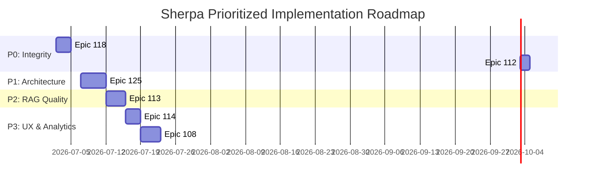

# PM Prioritization & Technical Assessment: Sherpa Pending Epics

This report evaluates the validity and priority of the pending epics (**108**, **112**, **113**, **114**, **118**, **119**, and **125**) based on a multi-agent architectural audit. It provides a structured breakdown, developer backlog specifications with Given/When/Then acceptance criteria, and a concrete execution roadmap.

---

## 🎯 High-Level Prioritization Matrix

| Epic | Category | Complexity | Validity | Recommendation / Action |
| :--- | :--- | :--- | :--- | :--- |
| **Epic 118** | Data Integrity (Bug Fix) | Low-Medium | **Critical** | **P0 (Immediate):** Fix orphaned vectors on store deletion, hook competitor creation, and sync bulk csv gateway imports to prevent RAG blindspots. |
| **Epic 112 (Task 6)** | Cost / Performance | Medium | **High** | **P0 (Immediate):** Prune LangGraph messages to eliminate Redis summary double-sending, saving **40–60%** in tokens. |
| **Epic 125** | System Architecture | Medium-High | **High** | **P1 (Next Sprint):** Migrate Enum objectives to dynamic DB-backed tables; compile runtime Pydantic schemas to block LLM hallucinations. |
| **Epic 113** | AI Search Quality | Medium | **High** | **P2 (Planned):** Implement 2-hop recursive PostgreSQL SQL CTE search (bypassing Neo4j) and RRF relational weighting. |
| **Epic 114 (Task 5)** | Usability (Mobile) | Medium | **Medium-High** | **P3 (Planned):** Convert dense mobile drawers to swipe-up bottom-sheets with pill controls. |
| **Epic 108 (Tasks 4-6)** | Feature Expansion | Medium | **Medium** | **P3 (Planned):** Build dashboard analytics APIs and Celery Beat anniversary trigger background tasks. |
| **Epic 119** | Scale Ingestion | Very High | **Low (MVP)** | **Deferred (Post-MVP):** Defer 3-step mapping wizard and split-screen deduplication conflict UI to protect MVP launch timelines. |

---

## 🔍 Detailed Epic Analysis

### 1. Epic 118: Real-Time Knowledge Sync (P0 — Immediate)
* **The Audit Finding**: While marked complete in log history, a codebase audit revealed three major vector sync gaps:
  1. **Store Deletion**: Deleting a store triggers SQL database cascade deletes, but fails to queue vector deletions for related `StoreNote` and `Competitor` documents, leaving orphaned records in the vector database.
  2. **Competitor Creation**: The POST `/competitor` endpoint does not trigger background vectorization.
  3. **Gateway Ingestion**: CSV bulk uploads bypass the Celery vectorization queue entirely.
* **Verdict**: **Valid & Urgent**. If RAG data doesn't sync in real time, the Sales Brain suffers from context hallucinations and data blindspots.

### 2. Epic 112 (Task 112.6): ReAct Agent Benchmarking (P0 — Immediate)
* **The Audit Finding**: LangGraph's checkpointer (`AsyncPostgresSaver`) only manages stateless multi-turn session persistence—it does not track latency or costs. Additionally, there is a **context redundancy**: the LLM receives the conversation history twice (once as a serialized Redis summary inside the system prompt and once as raw messages in the LangGraph message list).
* **Verdict**: **Valid & Urgent**. Pruning raw message history in the graph state machine to rely on Redis summaries for older turns will cut input tokens by **40–60%** on deep conversations.

### 3. Epic 125: Dynamic Strategy & Action Objectives (P1 — Next Sprint)
* **The Audit Finding**: Hardcoding Action Objectives as Python Enums makes the platform rigid. To make Sherpa vertical-agnostic (e.g., adaptable to pharma, beverage, or retail sales), objectives must live in the database.
* **Hallucination Risk**: High if the LLM outputs arbitrary text labels that do not match the database primary keys.
* **Mitigation**: Fetch active objectives from the DB and compile the Pydantic schema **dynamically** at runtime using Pydantic's `create_model()` inside the Celery extraction task. Passing this model to the `instructor` client forces structured JSON outputs matching only DB values.

### 4. Epic 113: Relational Graph-Enriched RAG (P2 — Planned)
* **The Audit Finding**: A dedicated GraphDB (Neo4j) is unnecessary. A 2-hop search (Store $\rightarrow$ Client $\rightarrow$ Sibling Stores) can be traversed in `< 10ms` in PostgreSQL using a recursive CTE.
* **Confidence Gating**: Any AI-extracted links from text with confidence $< 0.85$ must be set to `pending_verification` to prevent hallucinated relationships from polluting retriever results.
* **Ranking**: Relational CTE hits should be assigned a high Reciprocal Rank Fusion (RRF) weight multiplier ($2.0$) over Keyword ($1.5$) and Semantic ($1.0$) hits.

### 5. Epic 114 & 108: Mobile Ingestion & Analytics Ledger (P3 — Planned)
* **Mobile (114.5)**: Current drawers scroll heavily on mobile. We recommend vaul-based swipe-up bottom-sheets and segmented toggle pills.
* **Ledger (108.4/6)**: Aggregates dashboard analytics using indexes on `StoreAction.objective`. Trigger proposed anniversary actions dynamically via a Celery Beat cron job.

### 6. Epic 119: Guided Bulk Ingestion Wizard (Deferred — Post-MVP)
* **The Audit Finding**: A 3-step file upload layout with a custom interactive column mapper and a split-screen side-by-side duplicate conflict resolver represents **11 Developer-Days of high-risk frontend code**.
* **PM Decision**: **Scope Exclusion**. For an MVP, we will use lightweight backend natural-key deduplication (overwrite or ignore). We will defer the complex mapping UI to post-MVP.

---

## 📋 Developer Backlog Tickets (Given/When/Then)

### Task 118.6: Vector Deletion Cascade & Competitor Creation Vectorization
* **Objective**: Fix orphaned vector data gaps during entity deletions and creations.
* **Acceptance Criteria**:
  * *Given* an active Store with 5 associated StoreNotes,
  * *When* the Store is deleted via `DELETE /api/v1/trade/stores/{id}`,
  * *Then* the cascade handler queues `delete_vector_task` for the store, all 5 notes, and any linked competitors.
  * *Given* a new competitor recorded via `POST /api/v1/trade/competitor`,
  * *When* successfully saved in the DB,
  * *Then* the endpoint triggers `sync_vector_task.delay(competitor.id, "competitor")`.

### Task 112.6: LangGraph Message History Pruning Node
* **Objective**: Reduce token usage and remove summary redundancy in the agent loop.
* **Acceptance Criteria**:
  * *Given* an active LangGraph chat session with 10 messages,
  * *When* the agent enters the tool call loop,
  * *Then* the pruning node truncates messages older than 2 turns, passing only the Redis summary in the system prompt.

### Task 125.2: Dynamic Pydantic Schema Compilation for Celery Extraction
* **Objective**: Compile validation models dynamically to prevent LLM objective classification hallucinations.
* **Acceptance Criteria**:
  * *Given* a Celery ingestion job parsing a field note,
  * *When* the task initializes,
  * *Then* it queries active objectives from the DB, constructs a dynamic `Enum` using `create_model`, and passes the compiled schema to the `instructor` client.

---

## 📅 Implementation Roadmap (Gantt)

