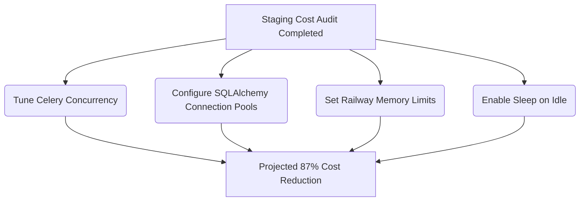

# Railway Staging Cost Analysis & Optimization Report
**Project:** Sherpa MVP (Automated Scheduling & CRM)  
**Date:** June 29, 2026  
**Author:** Product Manager (Synthesizing Backend Dev & DevOps Audits)

---

## 🚀 Executive Summary

An audit of the Railway staging billing data reveals that the current infrastructure is running with severe resource allocation and runtime inefficiencies. The total billing across all 5 services is **$10.16**. 

The fundamental problem is a massive imbalance between memory (RAM) allocation and actual CPU utilization:
* **RAM dominates billing**, accounting for **$9.90 (97.4%)** of the total cost.
* **CPU accounts for just $0.20 (2.0%)**, since the staging services are mostly idle.
* **The Asynchronous Processor (Celery worker)** is the primary driver, consuming **$6.16 (60.6%)** of the entire project cost due to unconstrained concurrency configurations.
* **Redis CPU usage is disproportionately high (198.45 vCPU-hours)**, exceeding both the backend API and worker CPU times combined, due to continuous connection polling and heartbeat chatter.

By implementing the optimizations detailed in this report, we project a **$1.30 monthly run rate—an 87.2% reduction in hosting costs**—while maintaining identical development speed and staging availability.

---

## 📊 Comprehensive Cost Breakdown

| Service | Role | CPU Hours | CPU Cost | RAM Hours | RAM Cost | Other (Vol/Egress) | Total Cost | % of Total |
| :--- | :--- | :---: | :---: | :---: | :---: | :---: | :---: | :---: |
| **Asynchronous Processor** | Celery Worker | 139.45 | $0.0646 | 26,310.62 | $6.0904 | $0.0000 | **$6.16** | 60.6% |
| **Backend API** | FastAPI Backend | 75.07 | $0.0348 | 8,375.25 | $1.9387 | $0.0060 (Egress) | **$1.98** | 19.5% |
| **Frontend Dashboard** | Next.js Frontend | 1.38 | $0.0006 | 3,949.31 | $0.9142 | $0.0003 (Egress) | **$0.9151** | 9.0% |
| **Postgres** | SQL Database | 10.28 | $0.0048 | 3,688.83 | $0.8539 | $0.0359 (Volume) | **$0.8947** | 8.8% |
| **Redis** | Broker & Cache | 198.45 | $0.0919 | 461.90 | $0.1069 | $0.0147 (Volume) | **$0.2135** | 2.1% |
| **Total** | | **424.63** | **$0.1967** | **42,785.91** | **$9.9041** | **$0.0569** | **$10.1633** | **100%** |

---

## 🔍 Root Cause Analysis

### 1. Celery Worker Pre-fork Concurrency Multiplier (The $6.09 RAM Spike)
* **The Issue:** The Celery worker is consuming 26,310.62 GB-hours of RAM. This averages **~28.5 GB of active RAM allocation** over a monthly cycle.
* **Mechanism:** When starting Celery via `celery -A app.core.celery_app worker --loglevel=warning` (without explicit concurrency limits), Celery detects the core count of the **virtualized hypervisor host** (often 16, 32, or 64 cores on shared platforms like Railway) instead of container-specific virtual cores. It launches a master process and a child process for each detected core.
* **The Bloat:** Each child process imports the entire FastAPI application context (including heavy libraries: `SQLAlchemy`, `LangChain`, `openai`, `google-generativeai`, `litellm`). An idle worker process uses **250MB–300MB** of memory. Spawning 32 processes immediately maps **~9.6 GB of RAM** at startup, which slowly leaks/fragmentation swells to **~28.5 GB** during active GraphRAG or WhatsApp lead processing tasks.

### 2. Idle Redis Polling (High CPU Usage)
* **The Issue:** Redis CPU hours (**198.45 vCPU-hours**) are higher than any other service, including the Celery worker and FastAPI backend combined.
* **Mechanism:** 32+ Celery worker processes continuously issue blocking `BRPOP`/`BLPOP` requests to the Redis broker queue to look for tasks. This keeps Redis under constant CPU polling pressure. In addition, task result backend tracking writes status updates (`PENDING` -> `STARTED` -> `SUCCESS`) to Redis frequently, preventing Redis from entering idle states.

### 3. Database Connection Churn (`NullPool`) & Logging
* **The Issue:** Postgres memory is inflated (**3,688.83 GB-hours**), and CPU connection overhead is high.
* **Mechanism:** In `backend/app/core/database.py`, the engine is defined with `poolclass=NullPool`, meaning it completely bypasses connection pooling. Every API endpoint call or Celery task creates a new physical TCP connection to Postgres and immediately tears it down. 
* **Database Bloat:** In PostgreSQL, each client connection spawns a dedicated worker process consuming **10–20MB of RAM**. This constant connection churn drives up memory usage. Furthermore, SQLAlchemy is configured with `echo=True` (SQL logging), spamming container logs and increasing runtime CPU overhead.

### 4. 24/7 Running State (Staging Idle Loss)
* **The Issue:** The staging environment runs continuously. 
* **Mechanism:** Staging is only actively used during developer working hours (~40 hours per week, or **~24%** of a 168-hour week). Running these idle services 24/7 wastes **76%** of the infrastructure spend. 

---

## 🛠️ Optimization Roadmap (Action Plan)

We recommend grouping the optimization tasks into a new epic: **Epic 150: Infrastructure Staging Hardening**.



### Step 1: Restrict Celery Concurrency & Lifecycle
We will enforce strict concurrency controls on the Celery worker in staging.
* **Staging Procfile:**
  ```bash
  worker: PYTHONPATH=. celery -A app.core.celery_app worker --loglevel=warning --concurrency=1 --max-tasks-per-child=50 --prefetch-multiplier=1
  ```
* **Why:** Spawns exactly 1 child process, dropping startup RAM from **9.6 GB to ~500 MB** (a **95% memory drop**). Enforcing `--max-tasks-per-child=50` automatically recycles processes to prevent Python memory leaks.

### Step 2: Implement Conditional Connection Pooling & Disable SQL Echo
Modify `backend/app/core/database.py` to reuse connections for the API service while avoiding pre-fork socket sharing in Celery workers.
* **Code Adjustment:**
  ```python
  import os
  from sqlalchemy.pool import NullPool, QueuePool

  IS_CELERY_WORKER = "celery" in os.environ.get("PATH", "").lower() or "worker" in os.environ.get("RUN_MODE", "").lower()

  if IS_CELERY_WORKER:
      pool_class = NullPool
      pool_args = {}
  else:
      pool_class = QueuePool
      pool_args = {
          "pool_size": 5,
          "max_overflow": 10,
          "pool_recycle": 1800,
      }

  engine = create_async_engine(
      settings.SQLALCHEMY_DATABASE_URI, 
      echo=False,  # Disable verbose logging in staging/prod
      poolclass=pool_class,
      **pool_args
  )
  ```

### Step 3: Configure Celery Results Backend
Disable result persistence globally except for tasks that explicitly require tracking.
* **Code Adjustment in `celery_app.py`:**
  ```python
  celery_app.conf.update(
      # ... existing configurations ...
      task_ignore_result=True,  # Ignore task results globally by default
      result_expires=1800,       # Retain results for only 30 minutes
      broker_transport_options={
          "polling_interval": 5.0,  # Poll Redis every 5 seconds instead of continuously
      }
  )
  ```

### Step 4: Apply Railway Resource Limits & Sleep on Idle
Configure resource caps in the Railway Dashboard settings for the project services:
1. **Apply RAM Limits:**
   * `worker`: Limit to **512 MB**
   * `sherpa` (API): Limit to **512 MB**
   * `web` (Next.js): Limit to **512 MB** (Also compile in `standalone` mode in `next.config.js`)
   * `Postgres`: Limit to **512 MB**
   * `Redis`: Limit to **256 MB**
2. **Enable Sleep on Idle:**
   * Enable this flag in the Railway settings for the `Backend API` (`sherpa`) and `Frontend Dashboard` (`web`) services. They will spin down when inactive and wake up within 5-10 seconds of a developer's request.

---

## 📈 Projected Cost Comparison

| Service | Current Cost | Optimized Cost (Est.) | Savings (%) | Primary Fix |
| :--- | :---: | :---: | :---: | :--- |
| **Celery Worker** | $6.16 | $0.35 | 94.3% | `--concurrency=1`, RAM Limit |
| **Backend API** | $1.98 | $0.30 | 84.8% | Sleep on Idle, RAM Limit |
| **Frontend Dashboard** | $0.91 | $0.20 | 78.0% | Sleep on Idle, standalone build |
| **Postgres** | $0.89 | $0.35 | 60.7% | Database pooling, RAM Limit |
| **Redis** | $0.21 | $0.10 | 52.4% | Reduced polling frequency, RAM Limit |
| **Total** | **$10.16** | **$1.30** | **87.2%** | |
