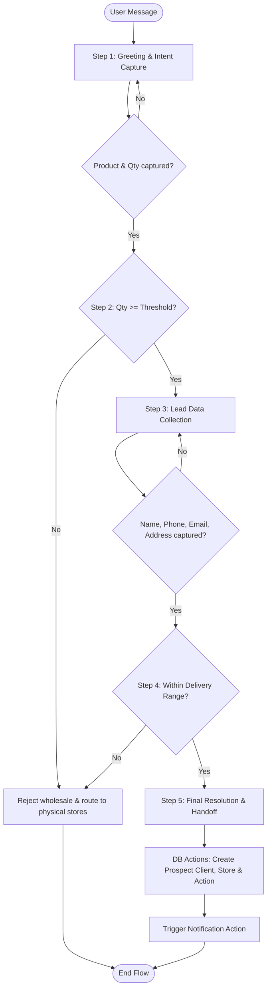

# Plan: Prospect Qualification Flow, Delivery Range Check, and Sandbox Fix

This document outlines the implementation plan for the **WhatsApp/Telegram Prospect Flow** according to the new requirements.

---

## 1. Conversational Logic & State Machine

Currently, the `ProspectQualifier` tries to collect all 6 fields in a single step before evaluating anything. We will restructure the LangGraph state machine into distinct sequential phases:

### Conversational State
We will adjust the `ProspectQualifierState` schema to include:
*   `product`: Optional[str] (resolved Product ID)
*   `quantity`: Optional[int]
*   `name`: Optional[str]
*   `phone`: Optional[str]
*   `email`: Optional[str]
*   `address`: Optional[str] (Construction site address)
*   `phase`: `str` (tracks the current conversational step: `"intent"`, `"collecting"`, `"rehearsing"`, `"completed"`, `"rejected"`)

---

## 2. Implementation Steps

### Step 1 & 2: Intent Capture & Quantity Qualification
*   **System Prompt Instruction**: The AI will first ask ONLY for the product of interest and desired quantity. It will be instructed not to ask for personal details until quantity qualification is passed.
*   **Immediate Validation**: Once a product and quantity are identified:
    1.  Look up the product's `wholesale_threshold` in the database.
    2.  If `quantity < threshold`, route to the rejection path:
        *   Retrieve the business's physical stores from the database.
        *   Provide a polite response listing nearby stores and end the conversation.
    3.  If `quantity >= threshold`, set `phase = "collecting"` and proceed.

### Step 3: Lead Data Collection
*   **System Prompt Instruction**: Once in the `"collecting"` phase, the AI will ask for:
    1.  Full Name
    2.  Phone Number
    3.  Email Address
    4.  Construction Site Address (Dirección de la Obra)
*   The AI will call `update_prospect_data` to store these fields.

### Step 4: Delivery Range Validation (Condition 2)
Once the address is provided:
1.  **Cost-Zero Geocoding (Nominatim API)**:
    *   Call Nominatim (OpenStreetMap's free geocoding endpoint) to convert the construction site address text to coordinates `(lat, lng)`.
    *   *Timeout/Fallback*: If geocoding fails or times out, we fall back to searching for city/state keywords in the address.
2.  **Distance Validation (Haversine Formula)**:
    *   Fetch the coordinates of the business's physical stores.
    *   Calculate the distance from the construction site to the nearest store using the Haversine formula (implemented locally in Python, cost-zero).
    *   If the nearest store is within **50 km** (or a configurable radius): Proceed to Step 5.
    *   Otherwise: Route to rejection path (inform the user delivery is out of range, list nearest stores, and end the flow).

### Step 5: Final Resolution & Handoff
1.  **User-Facing Response**: Confirm that their request is qualified and a commercial representative will contact them shortly.
2.  **Database Recording**:
    *   Create a `Client` record with `is_prospect = True`.
    *   Create a `Store` record for the construction site with `is_prospect = True`.
    *   Create a `StoreAction` (Proposed Commercial) record mapping the client to the construction site store.
3.  **Notification Action**:
    *   Create a helper method `notify_sales_rep(lead_data)` in `backend/app/services/prospect_qualifier.py`.
    *   Since mailing is not set up and SMS is work-in-progress, this helper will:
        1.  Insert the notification payload into the `StoreAction` details (visible on the CRM Dashboard immediately).
        2.  Log the SMS notification payload to a log file (`logs/notifications.log`) for verification in the sandbox.
        3.  Provide a clean injection hook where you can plug in Twilio or external APIs once ready.

---

## 3. Fixing the Prospect Simulator Sandbox Bug

The sandbox gets stuck because the thread is marked `is_completed = True` in Postgres checkpoints, and subsequent messages are short-circuited to return the cached final response.

**The Fix**:
In `ProspectQualifier.get_response`, we will refine the sandbox greeting detector:
1.  Check if the message contains common greetings (*"hola"*, *"buenas"*, *"buen día"*, etc.) OR if it is a short message (< 15 characters).
2.  If the sender is a sandbox user (contains `"sandbox"`) and the state is completed, we will **automatically delete** the checkpoints and conversation history for this thread.
3.  This ensures that typing "Hola, buen día" in the sandbox will always start a fresh simulator run.

---

## 4. Acceptance Criteria Verification Plan

We will write a test file `/backend/test_simulated_session_3.py` containing automated test cases to verify:
1.  **Low Quantity path**: Greets user -> input: "Quiero 5 sacos" -> AI rejects and suggests nearby physical stores.
2.  **Valid wholesale path**: Input: "Quiero 100 sacos" -> AI proceeds to collect details.
3.  **Out-of-range delivery**: Input details with location "Tokyo, Japan" -> Nominatim geocoding triggers -> distance > 50km -> AI rejects due to delivery range.
4.  **Successful qualification**: Input valid details -> AI accepts -> `StoreAction` created with metadata -> Notification method triggers.
5.  **Sandbox Reset**: Simulating a completed flow followed by a new greeting starts the flow over.
