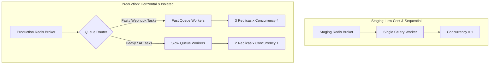

# Sherpa Scaling & Concurrency Plan: Parallel vs. Sequential Architecture
**Project:** Sherpa MVP (Automated Scheduling & CRM)  
**Author:** ScaleMaster (Lead Architect)  
**Date:** June 29, 2026  

---

## 🚀 1. Executive Summary

This plan outlines the architectural strategy for scaling background tasks and API operations within **Project Sherpa**. It addresses the user's concerns regarding parallel vs. sequential execution, details how to prevent bottlenecks in our staging and production environments, and provides a blueprint for horizontal scaling and task queue isolation.

By moving from unconstrained host-core-detected parallelism to a **Hybrid Horizontal Scaling Model**, we preserve system stability, support hundreds of concurrent users, and optimize operational costs.

---

## 🧠 2. Parallel vs. Sequential Execution: The Core Dilemma

To optimize our backend task runner (Celery) and database (Postgres), we must understand how they handle concurrent operations.

### A. Process-Level Parallelism (Celery Prefork Pool)
* **Definition:** Spawns multiple independent OS-level Python processes.
* **Staging Impact:** Autodetects shared hypervisor CPU cores (e.g. 32 cores) and forks 32 idle worker processes, consuming **9.6 GB of RAM** at startup.
* **Production Impact:** Allows true multi-core CPU utilization (bypassing the Python GIL). Essential for CPU-heavy tasks like cryptographic encryption, vector parsing, or heavy numeric calculation.
* **Risk:** Extremely high memory overhead. Memory is duplicated across processes, making the service prone to Out-of-Memory (OOM) crashes if unconstrained.

### B. Sequential Execution (Concurrency = 1)
* **Definition:** Spawns a single worker process that executes tasks one at a time.
* **Staging Impact:** Limits memory usage to **~300MB–500MB**, representing a **95% memory cost saving** in staging.
* **Production Impact:** Introduces high latency. If Task A is a slow AI GraphRAG task that takes **30 seconds**, and Task B is a time-sensitive appointment reminder, Task B will sit in the queue for 30 seconds. This is a bottleneck for concurrent users.

---

## 🏎️ 3. Sherpa Workload Profiling (CPU vs. I/O Bound)

An analysis of Sherpa's tasks shows that **90% of the workloads are I/O-bound** rather than CPU-bound:
* **Google Calendar Syncing:** Spends most of its time waiting on Google API HTTP responses.
* **WhatsApp / Telegram webhooks:** Spends time waiting on Twilio and external chat services.
* **GraphRAG Lead Extraction:** Spends time waiting on external LLM endpoint responses (OpenAI, Gemini).

Because these tasks spend most of their time waiting on the network rather than executing CPU cycles, we do **not** need high process-level parallelism. Instead, we can scale efficiently using **async coroutines** and **queue isolation**.

---

## 🛠️ 4. Hybrid Horizontal Scaling Architecture

To scale Sherpa to support many concurrent users without ballooning costs, we will split the staging and production environments into different configurations.

### A. Staging Configuration (Low-Cost / Sequential)
* **Celery Concurrency:** Set `--concurrency=1` or `--concurrency=2` via the start command.
* **Database Pooling:** Use `QueuePool` for the API server (reusing connections) and `NullPool` for Celery (preventing pre-fork socket sharing bugs).
* **Sleep on Idle:** Enabled for Web and API services to shut down during nights and weekends.

### B. Production Configuration (Horizontal Scaling & Queue Isolation)
To scale for hundreds of concurrent users without risk of OOM crashes:
1. **Explicit Concurrency Limits:** Configure Celery workers with a fixed concurrency budget (e.g., `--concurrency=2` or `--concurrency=4` depending on the container's CPU allocation). Never use default auto-detection.
2. **Horizontal Replication:** Scale workers by spinning up **multiple small container replicas** (e.g., 3 replicas running at 512MB RAM each) rather than 1 giant container with 1.5GB RAM.
3. **Queue Isolation (Preventing Cascading Bottlenecks):**
   * **Fast Queue (`celery_fast`):** For instant webhooks, calendar syncing, and notifications. Spawns workers configured with a concurrency of 4 to process tasks immediately.
   * **Heavy Queue (`celery_slow`):** Dedicated to slow GraphRAG extraction and LLM ingestion. Spawns workers configured with a concurrency of 1 or 2.
   * *Benefit:* If a user uploads a massive chat transcript that takes 45 seconds for GraphRAG to process, it will only block the slow queue. High-priority calendar syncs and chat webhooks continue running instantly in the fast queue.

---

## 📋 5. Actionable Implementation Backlog

### Task 150.6: Celery Queue Isolation Setup
* **Description:** Add config settings in `celery_app.py` to define two queues: `fast_queue` and `slow_queue`. Route short I/O tasks (`send_upcoming_reminders`, `sync_all_calendars`) to `fast_queue` and heavy AI tasks (`ingestion`, `knowledge`) to `slow_queue`.
* **Acceptance Criteria:**
  * *Given* a task dispatcher context,
  * *When* `sync_single_calendar` is dispatched,
  * *Then* it is routed to the `fast_queue`.
  * *When* a GraphRAG knowledge extraction task is dispatched,
  * *Then* it is routed to the `slow_queue`.

### Task 150.7: Configure Horizontal Production Procfile
* **Description:** Update production deployment settings to start separate worker processes targeting specific queues.
* **Staging/Prod Worker Start Commands:**
  * Fast Workers: `celery -A app.core.celery_app worker -Q fast_queue --concurrency=4 --loglevel=warning`
  * Slow Workers: `celery -A app.core.celery_app worker -Q slow_queue --concurrency=1 --loglevel=warning`
* **Acceptance Criteria:**
  * *Given* the production environment,
  * *When* the Celery workers are launched,
  * *Then* the fast workers only process tasks from `fast_queue` with concurrency 4, and slow workers only process tasks from `slow_queue` with concurrency 1.
