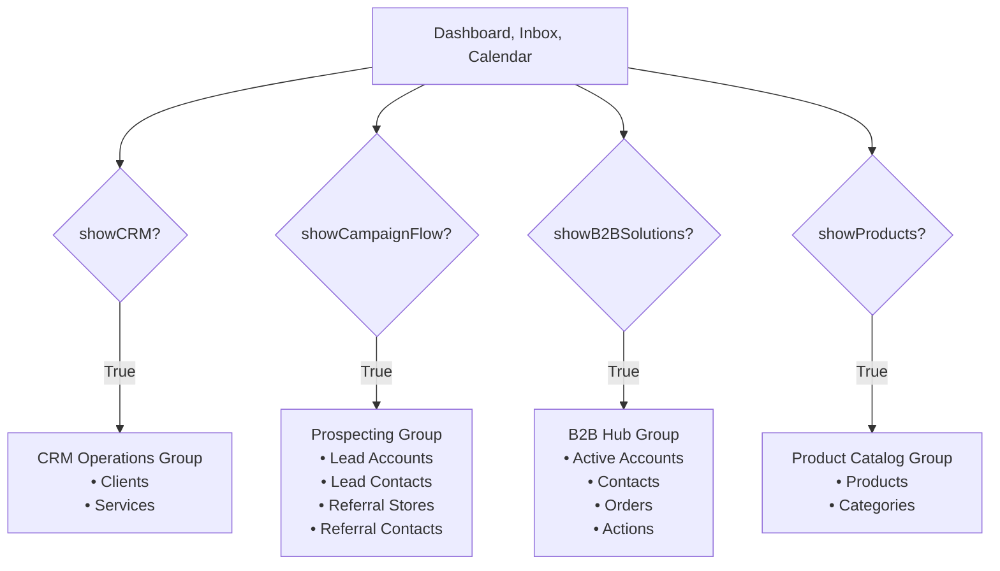

# Sidebar Navigation Diagnosis & Recommendation Report

We completed a diagnostic audit of the sidebar navigation at [Sidebar.tsx](file:///Users/bernardo/projects/sherpa/frontend/components/Sidebar.tsx) to address why users with **Automated Intake & Campaigns** and **Products & Categories Catalog** enabled (but B2B Solutions disabled) cannot see the **Prospecting** menu.

---

## 1. Technical Diagnosis
The primary reason the "Prospecting" menu is hidden is a structural nesting dependency in the React tree:

1. **Prospecting Nested in B2B Solutions:** 
   The rendering of the Prospecting section (which contains the Wholesale/Retail lead channels) is wrapped inside the `{showB2BSolutions && (...)}` conditional block (lines 144–275).
   * Even though the inner check `{showCampaignFlow && (...)}` is correct, the parent condition fails (`showB2BSolutions = false`), leaving the entire section unrendered.

2. **Catalog Setup Hidden:**
   The "Products Catalog" setup links are nested either inside `showCRM` (lines 119–142) or inside `showB2BSolutions` (lines 288–324). 
   * If a user profile has both B2B Solutions and CRM Operations disabled (`showCRM = false`, `showB2BSolutions = false`) but has the Products Catalog enabled (`showProducts = true`), the catalog setup menu is completely hidden.

3. **Point of Sale & Orders Fallback Link:**
   When B2B is disabled but campaigns are active, a fallback block is rendered to show **"Point of Sale"** (`/trade/stores`) and **"Orders"** (`/trade/orders`). This ensures lower-tier users can manage physical locations and review incoming customer purchases without needing access to the full B2B Hub.

---

## 2. UX/UI Recommendations

### Renaming "CRM Operations" to "Prospecting" (Not Recommended)
While renaming "CRM Operations" might appear to resolve the grouping, it creates a **semantic taxonomy clash**:
* **CRM Operations** represents post-conversion, operational entities (existing active Clients and booked Services).
* **Prospecting** represents top-of-funnel leads (inbound campaigns, cold leads, referrals).
Placing active, converted clients under a header labeled "Prospecting" would confuse users.

### The Decoupled Layout Solution
The cleanest and most robust UX approach is to **completely decouple the navigation groups**. Rather than nesting modules, each group should be governed independently by its corresponding feature flag.



### Decoupled Logic & Mapping Table

| Menu Group | Required Feature Flag(s) | Child Menu Items | Route & Parameters | UX Purpose |
| :--- | :--- | :--- | :--- | :--- |
| **Core** | None (Always visible) | Dashboard<br>Inbox<br>Calendar | `/`<br>`/conversations`<br>`/calendar` (if `showScheduling`) | General daily workflow & communications. |
| **Prospecting** | `showCampaignFlow` | Lead Accounts<br>Lead Contacts<br>Referral Stores<br>Referral Contacts<br>*Fallback: Point of Sale & Orders* | `/trade/prospects/accounts?segment=wholesale`<br>`/trade/prospects/contacts?segment=wholesale`<br>`/trade/prospects/accounts?segment=retail`<br>`/trade/prospects/contacts?segment=retail`<br>*`/trade/stores` & `/trade/orders` (if `!showB2BSolutions`)* | Pre-conversion inbound intake & campaign lead tracking. If B2B is disabled, provides direct access to Stores and Orders. |
| **B2B Hub** | `showB2BSolutions` | Active Accounts<br>Contacts<br>Orders<br>Actions | `/trade/stores`<br>`/trade/retailers`<br>`/trade/orders`<br>`/trade/actions` | Operational wholesale partner accounts, order processing, and territory actions. |
| **CRM Operations** | `showCRM` | Clients<br>Services | `/crm`<br>`/services` (if `showServices`) | Standard B2C/B2B relationship database and bookings. |
| **Product Catalog** | `showProducts` | Products<br>Categories | `/trade/products?tab=products`<br>`/trade/products?tab=categories` | Inventory, SKU catalog, and category setup. |

---

## 3. Frontend Implementation Specs

To resolve the nesting, the conditional blocks in the sidebar should be rendered independently at the top level. Below is the proposed JSX structural outline:

```tsx
// 1. Core Productivity Group (Always rendered)
<div className="space-y-1">
  <SidebarLink href="/" icon={LayoutDashboard} name="Dashboard" active={pathname === '/'} />
  <SidebarLink href="/conversations" icon={MessageSquare} name="Inbox" active={pathname === '/conversations'} />
  {showScheduling && (
    <SidebarLink href="/calendar" icon={Calendar} name="Calendar" active={pathname === '/calendar'} />
  )}
</div>

// 2. CRM Operations Group (Independent)
{showCRM && (
  <div className="space-y-1 pt-2 border-t border-gray-100">
    <div className="px-4 py-1.5 text-slate-500 font-bold text-xs uppercase tracking-wider">
      CRM Operations
    </div>
    <SidebarLink href="/crm" icon={Users} name="Clients" active={pathname === '/crm'} />
    {showServices && (
      <SidebarLink href="/services" icon={Scissors} name="Services" active={pathname === '/services'} />
    )}
  </div>
)}

// 3. B2B Hub Group (Independent)
{showB2BSolutions && (
  <div className="space-y-1 pt-2 border-t border-gray-100">
    <button onClick={toggleB2BHub} className="...">
      <span>B2B Hub</span>
    </button>
    {isB2BHubOpen && (
      <div className="pl-9 space-y-1">
        <Link href="/trade/stores">Active Accounts</Link>
        <Link href="/trade/retailers">Contacts</Link>
        <Link href="/trade/orders">Orders</Link>
        <Link href="/trade/actions">Actions</Link>
      </div>
    )}
  </div>
)}

// 4. Prospecting Group (Independent)
{showCampaignFlow && (
  <div className="space-y-4 pt-2 border-t border-gray-100">
    <div className="space-y-1">
      <button onClick={toggleProspecting} className="...">
        <span>Prospecting</span>
      </button>
      {isProspectingOpen && (
        <div className="pl-6 space-y-2">
          {/* Wholesale & Retail Submenus */}
          ...
        </div>
      )}
    </div>
    {/* Optional B2B Fallback links */}
    {!showB2BSolutions && (
      <div className="space-y-1 pt-2 border-t border-slate-100">
        <SidebarLink href="/trade/stores" icon={MapPin} name="Point of Sale" active={pathname.startsWith('/trade/stores')} />
        <SidebarLink href="/trade/orders" icon={Package} name="Orders" active={pathname.startsWith('/trade/orders')} />
      </div>
    )}
  </div>
)}

// 5. Product Catalog Group (Independent)
{showProducts && (
  <div className="space-y-1 pt-2 border-t border-gray-100">
    <button onClick={toggleProductsCatalog} className="...">
      <span>Products Catalog</span>
    </button>
    {isProductsCatalogOpen && (
      <div className="pl-9 space-y-1">
        <Link href="/trade/products?tab=products">Products</Link>
        <Link href="/trade/products?tab=categories">Categories</Link>
      </div>
    )}
  </div>
)}
```

---

## 4. Accessibility Specs (WCAG 2.1)
1. **Typography Contrast:** Change category header text classes from `text-slate-400` to `text-slate-500` to satisfy the **4.5:1** contrast ratio.
2. **Keyboard Accessibility:** Use native `<button>` tags with `aria-expanded` attributes for all collapsible submenus.
