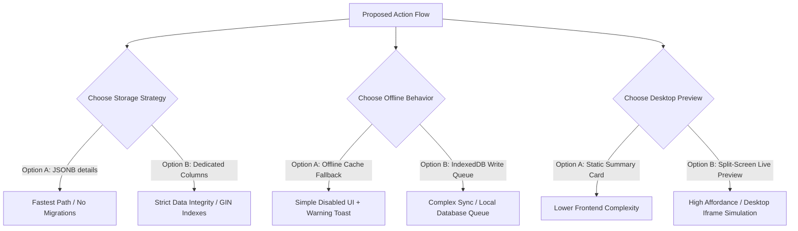

# Trade-Offs & Scoping Analysis: Trade/Actions Flow

This document details the recommendation trade-offs and decision points for implementing the new dynamic `/trade/actions` CRM interface, comparing the proposals from the Backend, UX/UI, and Product Manager subagents.

---

## ⚖️ Core Architectural Trade-offs & Options

### 1. Database Storage: Flexible JSONB vs. Dedicated Columns

*   **Option A: JSONB Details Storage (PM Recommendation)**
    *   **Description**: Store Action Title, Guidelines (Description), and Target Metric Goal inside the existing `details` JSONB column (e.g. `details: {"title": "...", "description": "...", "target_value": 150}`).
    *   **Pros**:
        *   **Zero Database Schema Churn**: Adheres strictly to the *Zero-Trust database migration rule* (avoids Alembic migrations, database locks, and potential production downtime).
        *   **Velocity**: Ready to build immediately; zero backend schema changes required.
    *   **Cons**:
        *   **Loss of Database-Level Type Safety**: Cannot enforce NOT NULL or numeric validations at the SQL level (requires manual Pydantic and JSON Schema validation).
        *   **Query Performance**: Harder to index. Requires setting up functional GIN indexes later if query volume grows.

*   **Option B: Dedicated SQL Columns (Backend Architect Recommendation)**
    *   **Description**: Run an Alembic migration to add explicit columns (`title` VARCHAR, `description` TEXT, `target_value` NUMERIC) to the `store_actions` table.
    *   **Pros**:
        *   **Strict Integrity**: Structural columns are guaranteed to be present and typed correctly at the SQL level.
        *   **BI & Performance**: Allows clean, fast B-Tree indexing and simple SQL aggregations (e.g. `SUM(result_value) / SUM(target_value)`) for sales performance reporting.
    *   **Cons**:
        *   **Migration Overhead**: Requires creating, testing, and running an Alembic schema upgrade on staging/production databases.

---

### 2. Mobile Offline Operations: Read-Only Cache vs. Write Queue

*   **Option A: Read-Only Cache Fallback (PM Recommendation)**
    *   **Description**: If the sales rep loses internet connection, the UI displays a connection warning toast and disables the "Complete Action" submit button.
    *   **Pros**: Simplest to implement. Extremely low complexity and zero state synchronization bugs.
    *   **Cons**: Reps must wait to get internet connection to submit action resolutions.

*   **Option B: Local IndexedDB Write Queue (UX/UI Expert Recommendation)**
    *   **Description**: Offline writes are queued locally inside the browser's IndexedDB and dispatched in the background once connection is restored.
    *   **Pros**: Premium offline-first experience.
    *   **Cons**: High frontend complexity. Requires conflict resolution handling if data was updated elsewhere while offline.

---

### 3. Desktop Creation Desk: Static Summary Card vs. Interactive Live Preview

*   **Option A: Static Summary Card (PM Recommendation)**
    *   **Description**: As the manager fills out the action form on desktop, a simple static box summarizes the action details as a text preview.
    *   **Pros**: Clean, simple layout; implemented in minutes.
    *   **Cons**: Less visually engaging.

*   **Option B: Split-Screen Live Mobile Preview (UX/UI Expert Recommendation)**
    *   **Description**: A live mockup panel on the right side of the screen simulates the rep's mobile card layout in real-time.
    *   **Pros**: High usability; managers see exactly what the representative sees on site.
    *   **Cons**: Extra component duplication and state sync complexity.

---

## 🗳️ Decision Required

Please review the trade-offs and choose your preferred options:

1.  **Storage Strategy**: Option A (JSONB Details) OR Option B (Dedicated SQL Columns)
2.  **Offline Behavior**: Option A (Cache Fallback) OR Option B (IndexedDB Queue)
3.  **Desktop Preview**: Option A (Static Card) OR Option B (Split-Screen Live Preview)
