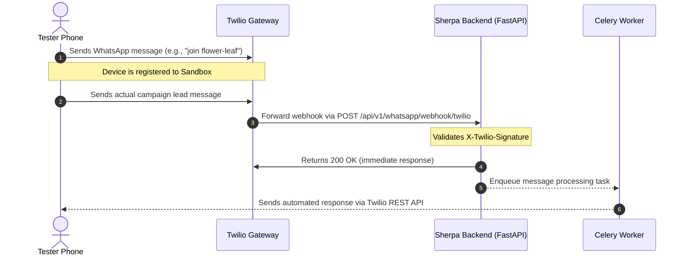

# Twilio WhatsApp Sandbox & Trial Account Configuration Guide

This guide outlines the exact steps to configure your Twilio Trial account to connect and route WhatsApp messages to and from **Sherpa**.



---

## 📋 Step 1: Retrieve Your Twilio Credentials
1. Log in to the [Twilio Console](https://console.twilio.com/).
2. On the **Console Dashboard** (homepage), locate and copy the following credentials:
   - **Account SID**: Starts with `AC...`
   - **Auth Token**: Click *Show* to reveal and copy it.
3. In the left navigation pane, go to **Messaging** > **Try it out** > **Send a WhatsApp message**.
4. Note your **Sandbox WhatsApp Number** (typically `+1 415 523 8886`).
5. Note the **Sandbox Join Code** assigned to your account (e.g., `join flower-leaf` or `join <some-words>`).

---

## 🛠️ Step 2: Configure Environment Variables in Sherpa

To make the credentials available to the FastAPI backend and Celery workers, configure the environment variables either in your local development environment or in your Railway production deployment.

### Option A: Railway (Production/Staging)
1. Go to your **Railway Project Console**.
2. Click on the **Backend API** (`sherpa`) service.
3. Navigate to the **Variables** tab.
4. Add the following key-value pairs:
   - `TWILIO_ACCOUNT_SID` = `ACXXXXXXXXXXXXXXXXXXXXXXXXXXXXXXXX`
   - `TWILIO_AUTH_TOKEN` = `your_actual_auth_token`
   - `TWILIO_WHATSAPP_NUMBER` = `+14155238886` (Use the Sandbox number retrieved in Step 1)
5. Repeat these environment variables for the **Asynchronous Processor** (`worker`) service so the background workers can send outgoing replies.
6. Railway will automatically redeploy the services to apply the new configuration.

### Option B: Local Development
If you are running Sherpa locally:
1. Create a `.env` file under the `/backend` directory if it does not already exist:
   ```bash
   touch /Users/bernardo/projects/sherpa/backend/.env
   ```
2. Add the credentials to the [backend/.env](file:///Users/bernardo/projects/sherpa/backend/.env) file:
   ```env
   TWILIO_ACCOUNT_SID=ACXXXXXXXXXXXXXXXXXXXXXXXXXXXXXXXX
   TWILIO_AUTH_TOKEN=your_actual_auth_token
   TWILIO_WHATSAPP_NUMBER=+14155238886
   ```

---

## 🔗 Step 3: Configure Twilio Sandbox Webhook
To deliver incoming messages to Sherpa, Twilio must know where to forward them.

1. In the Twilio Console, navigate to **Messaging** > **Try it out** > **Send a WhatsApp message**.
2. Click on the **Sandbox settings** tab (next to *Sandbox*).
3. In the **When a message comes in** field:
   - Enter your deployed backend webhook URL:
     `https://<YOUR_BACKEND_DOMAIN>/api/v1/whatsapp/webhook/twilio`
     *(For local testing, use a tool like Ngrok or Cloudflare Tunnels to expose your local port `8000`, e.g., `https://xxxx.ngrok-free.app/api/v1/whatsapp/webhook/twilio`)*
   - Verify that the HTTP method is set to **POST**.
4. Click **Save**.

> [!IMPORTANT]
> The webhook URL is secured with signature verification using your `TWILIO_AUTH_TOKEN` to prevent spoofing. Ensure that `TWILIO_AUTH_TOKEN` is correctly set in your environment variables, otherwise signature validation checks will fail with a `403 Forbidden` error.

---

## 📲 Step 4: Register and Test Your Device (Trial Constraints)
Because you are using a Twilio Sandbox and a trial account:
1. Open WhatsApp on your personal testing device.
2. Send your account's specific **Sandbox Join Code** (e.g., `join flower-leaf` or `join <your-code>`) to the Twilio Sandbox WhatsApp number (e.g., `+1 415 523 8886`).
3. You will receive a reply from Twilio confirming your device is linked to the Sandbox.
4. Now, open your Sherpa UI Dashboard:
   - Go to the Settings panel: [IntegrationsPanel.tsx](file:///Users/bernardo/projects/sherpa/frontend/app/settings/components/IntegrationsPanel.tsx#L287)
   - Click to open the WhatsApp Setup modal: [WhatsAppModal.tsx](file:///Users/bernardo/projects/sherpa/frontend/components/WhatsAppModal.tsx)
   - Enter your personal WhatsApp number (include country code, e.g. `+52 1 ...`).
   - Check the opt-in compliance checkbox and submit.
5. Send a message from your WhatsApp (like a simulated campaign lead) to the Twilio Sandbox number, and check the Sherpa dashboard and Celery worker logs to verify message ingestion and responses!

---

## 🔍 Verification & Troubleshooting
* **Backend Webhook Handler**: Defined in [whatsapp.py:twilio_whatsapp_webhook](file:///Users/bernardo/projects/sherpa/backend/app/api/whatsapp.py#L162)
* **Outgoing Message Task**: Defined in [messages.py:send_twilio_reply](file:///Users/bernardo/projects/sherpa/backend/app/tasks/messages.py#L16)
* **Diagnostics**: The Sherpa settings panel runs a live health check using `GET /api/v1/whatsapp/status` to test credentials directly against Twilio's Account API. If it displays "disconnected" or "auth failed", double-check that your `TWILIO_ACCOUNT_SID` and `TWILIO_AUTH_TOKEN` match exactly and contain no trailing spaces.
