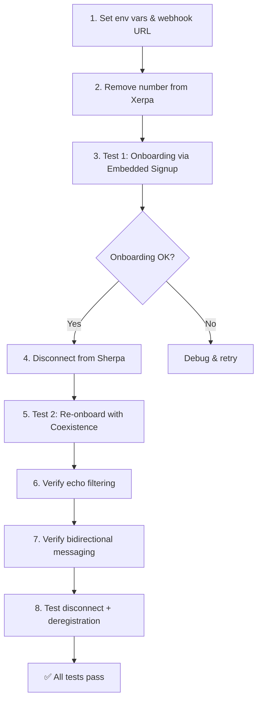

# WhatsApp Tech Provider — Test Plan

## Context
Sherpa is now an approved Meta Tech Provider. This plan covers testing the full onboarding and coexistence flows once the [code changes](file:///Users/bernardo/projects/sherpa/temp/whatsapp-code-changes.md) are implemented.

---

## Pre-requisites (One-Time Setup)

| # | Action | Who | Where |
|---|--------|-----|-------|
| 1 | All 4 code changes implemented and deployed | Dev | See [whatsapp-code-changes.md](file:///Users/bernardo/projects/sherpa/temp/whatsapp-code-changes.md) |
| 2 | Remove the phone number from Xerpa's WABA | You | Xerpa's dashboard or Meta Business Manager → WhatsApp Manager → Phone Numbers |
| 3 | Set env vars: `META_APP_ID`, `META_APP_SECRET`, `META_SYSTEM_USER_TOKEN`, `META_EMBEDDED_SIGNUP_CONFIG_ID` | You | `.env` (local) or Railway (staging) |
| 4 | Expose the webhook URL to the internet | You | Use `ngrok` locally, or test against staging Railway |
| 5 | Register webhook URL with Meta | You | Meta App Dashboard → WhatsApp → Configuration → Callback URL: `https://<domain>/api/v1/whatsapp/webhook`, Verify Token: `sherpa_v1` |
| 6 | Have at least one approved template (e.g. `hello_communication` in `es`) | You | Meta Business Manager → WhatsApp Manager → Message Templates |

> [!WARNING]
> **Do NOT delete the number from Meta Business Manager** — just remove it from Xerpa. If you delete it entirely, you lose your display name, quality rating, and messaging tier. The proper path is a **migration** (Xerpa releases → Sherpa's Embedded Signup picks it up).

---

## Test 1: Full Onboarding as a Non-Technical User

**Goal**: Simulate a real customer connecting their WhatsApp Business number to Sherpa through the Embedded Signup wizard.

### Test Steps

| Step | Action | Expected Result |
|------|--------|-----------------|
| 1 | Log into Sherpa → Settings → Integrations | WhatsApp tile shows "Disconnected" |
| 2 | Click "Connect" → WhatsApp modal opens | Step 1 intro screen renders |
| 3 | Click "Comenzar Configuración" | Pre-flight screen asks "¿Ya usas WhatsApp Business?" |
| 4 | Click "Sí, ya tengo WhatsApp Business" | Facebook connect screen with compliance checkbox |
| 5 | Check the compliance checkbox, click "Conectar con Facebook" | Meta popup opens, asks you to log in and select your WABA + phone number |
| 6 | Complete the Meta popup flow | Modal transitions to loading, then success with phone number displayed |
| 7 | Back on Settings → Integrations | WhatsApp tile shows "Connected" with your phone number and usage at 0 |

### Validation Checks

| Check | How |
|-------|-----|
| Integration record created | `GET /api/v1/integrations/whatsapp/usage/{business_id}` returns data |
| Webhook receiving | Send a WhatsApp message TO your business number → check server logs for `whatsapp_webhook` activity |
| Outbound works | Use `/meta-review` page → Messaging tab → send test message to your personal phone |
| Template fallback works | Wait 24h+ (or test with a fresh conversation) → system should auto-send template instead of free-form text |

### Bonus: Test the "No tengo WhatsApp Business" path

| Step | Action | Expected Result |
|------|--------|-----------------|
| 1 | On the pre-flight screen, click "No, uso WhatsApp normal" | 3-step migration guide appears (Download → Transfer → Come back) |
| 2 | Review the guide content | Instructions are clear, non-technical, in Spanish |
| 3 | Click "Ya lo instalé, continuar" | Proceeds to Facebook connect screen normally |

---

## Test 2: Coexistence Mode (API + WhatsApp Business App)

**Goal**: Verify the number works on both the Cloud API (Sherpa) and the WhatsApp Business App on your phone simultaneously.

### Test Steps

| Step | Action | Expected Result |
|------|--------|-----------------|
| 1 | Ensure WhatsApp Business App is active on your phone with the business number | App works normally, you can send/receive messages |
| 2 | In Sherpa → Settings → Connect WhatsApp | Modal opens |
| 3 | Complete Embedded Signup flow | Meta popup shows "Connect your existing WhatsApp Business app" option with QR code pairing |
| 4 | Complete QR code pairing / verification in Meta popup | Success — number connected to both API and App |
| 5 | **From your phone**: send a WhatsApp message to a customer | Message appears in customer's chat; Sherpa webhook receives it but does NOT trigger AI auto-reply (echo filtered) |
| 6 | **Customer replies** to your business number | Sherpa webhook receives it AND processes it through the identity resolver + AI pipeline as normal |
| 7 | **From Sherpa** (`/meta-review` or automated flow): send a message | Customer receives it; message also appears in your WhatsApp Business App on your phone |

### Test 2b: Disconnect & Deregistration

| Step | Action | Expected Result |
|------|--------|-----------------|
| 1 | In Sherpa → Settings → Integrations → Disconnect WhatsApp | Confirmation prompt |
| 2 | Confirm disconnect | Integration removed from Sherpa |
| 3 | Check server logs | Should show `POST /{phone_number_id}/deregister` call to Meta Graph API |
| 4 | WhatsApp Business App on your phone | Still works normally — only the API connection was removed |

---

## Coexistence Maintenance Rules

> [!CAUTION]
> Once in Coexistence Mode, you **must**:
> - Open the WhatsApp Business App on your phone **at least once every 14 days** — otherwise Meta pauses the API connection
> - Keep the app installed — uninstalling disconnects the API
> - Avoid linking additional WhatsApp Web/Desktop sessions — can cause instability

---

## Recommended Execution Order

> [!TIP]
> Running both tests takes ~1 hour including Meta propagation delays.
