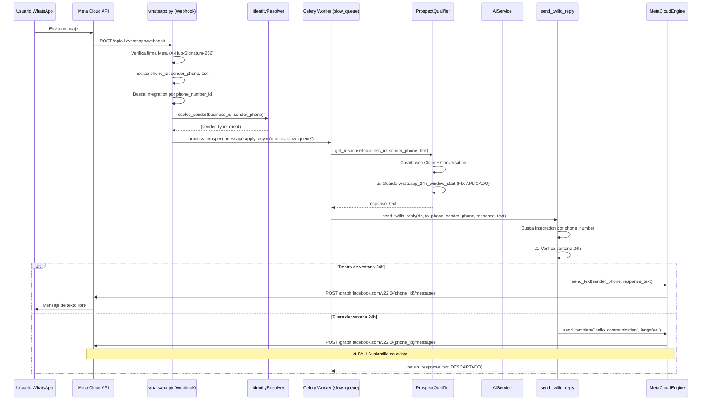

# 🔍 Auditoría Completa: Flujo WhatsApp (Meta Cloud API)

**Fecha:** 2026-08-07  
**Alcance:** Webhook entry → Identity resolution → Celery dispatch → AI processing → 24h window check → Message delivery  
**Estado:** ⚠️ **NO LISTO PARA PRUEBA** — 3 bugs críticos deben resolverse antes de probar.

---

## Arquitectura del Flujo



---

## Hallazgos por Severidad

### 🔴 CRÍTICOS (Bloquean la prueba)

#### C1. Respuesta de IA descartada fuera de ventana 24h
- **Archivo:** [messages.py:86-103](file:///Users/bernardo/projects/sherpa/backend/app/tasks/messages.py#L86-L103)
- **Problema:** Cuando `outside_window == True`, `send_twilio_reply` intenta enviar la plantilla `hello_communication` y ejecuta `return` inmediatamente. La respuesta generada por la IA (`body`) se **pierde para siempre** y nunca se entrega al usuario.
- **Impacto:** Aunque la IA genere una respuesta perfecta, el usuario nunca la recibe si el sistema cree que está fuera de la ventana de 24 horas.

#### C2. Plantilla `hello_communication` no existe o mal configurada
- **Archivo:** [messages.py:87-97](file:///Users/bernardo/projects/sherpa/backend/app/tasks/messages.py#L87-L97)
- **Problema:** El fallback de plantilla usa `hello_communication` con idioma `es`, pero:
  1. Esta plantilla puede no existir en tu cuenta WABA de staging.
  2. Se envía sin `components` — si la plantilla requiere parámetros (`{{1}}`), Meta la rechaza con 404.
- **Evidencia en logs:** `Template name does not exist in the translation` (error real de la prueba anterior).

#### C3. `AttributeError` potencial en despacho de sales_rep y distributor
- **Archivo:** [whatsapp.py:199-204](file:///Users/bernardo/projects/sherpa/backend/app/api/whatsapp.py#L199-L204)
- **Problema:** Los bloques de `sales_rep` y `distributor_retailer` acceden `client.id` directamente sin verificar si `client` es `None`. Si `IdentityResolver` no encuentra un cliente, el webhook crashea con `AttributeError`.
- **Comparación:** Los bloques de `customer` (L194) y `prospect` (L207) SÍ usan `client.id if client else None`.

```python
# ❌ Vulnerable (L199-204)
elif sender_type == "sales_rep":
    process_sales_rep_message.apply_async(args=[business.id, client.id, ...])

# ✅ Correcto (L194, L207)
client_id = client.id if client else None
process_customer_message.apply_async(args=[business.id, client_id, ...])
```

---

### 🟠 ALTO (No bloquean la prueba de prospecto, pero son bugs reales)

#### H1. Solo se procesa el primer mensaje del batch de Meta
- **Archivo:** [whatsapp.py:80-81](file:///Users/bernardo/projects/sherpa/backend/app/api/whatsapp.py#L80-L81)
- **Problema:** Meta puede enviar múltiples mensajes en un solo webhook payload dentro del array `messages[]`. El handler solo procesa `messages[0]`, descartando todos los demás.
- **Impacto:** Si un usuario envía mensajes rápidos consecutivos, algunos se pierden.

#### H2. Búsqueda de integración en memoria carga TODAS las integraciones
- **Archivo:** [whatsapp.py:98-102](file:///Users/bernardo/projects/sherpa/backend/app/api/whatsapp.py#L98-L102) y [messages.py:28-31](file:///Users/bernardo/projects/sherpa/backend/app/tasks/messages.py#L28-L31)
- **Problema:** Ambos puntos ejecutan `select(Integration).where(provider == 'whatsapp')` cargando TODAS las integraciones de WhatsApp en memoria, luego filtran con Python. Con N clientes, esto escala O(N).

#### H3. Bypass silencioso de firma Meta si `META_APP_SECRET` no está configurado
- **Archivo:** [webhook_security.py:17-20](file:///Users/bernardo/projects/sherpa/backend/app/core/webhook_security.py#L17-L20)
- **Problema:** Si `META_APP_SECRET` no está seteado en producción, la verificación se omite con solo un `logger.warning`. Esto viola la regla de seguridad "No unauthenticated endpoints" de AGENTS.md.

---

### 🟡 BAJO (Deuda técnica, no bloquean funcionalidad)

#### L1. Función `send_twilio_reply` nombrada incorrectamente
- **Archivo:** [messages.py:20](file:///Users/bernardo/projects/sherpa/backend/app/tasks/messages.py#L20)
- **Problema:** La función se llama `send_twilio_reply` pero maneja tanto Twilio como Meta Cloud API. Además, importa `from twilio.rest import Client` (L7) que no se usa en ningún lugar.

#### L2. `httpx.AsyncClient` creado por cada request
- **Archivo:** [meta_cloud_engine.py:42](file:///Users/bernardo/projects/sherpa/backend/app/services/messaging/meta_cloud_engine.py#L42)
- **Problema:** Se crea un nuevo cliente HTTP por cada invocación de `send_text`, `send_media`, `send_template`, y `mark_as_read`, generando overhead innecesario de TLS handshakes.

#### L3. `run_prospect_message` no limpia `To` con `clean_num`
- **Archivo:** [messages.py:185](file:///Users/bernardo/projects/sherpa/backend/app/tasks/messages.py#L185)
- **Problema:** A diferencia de los otros flujos, usa `payload.get("To", "")` sin pasar por `clean_num`. Mitigado internamente por `send_twilio_reply` que limpia con `clean_to`.

#### L4. Commits dentro de `IdentityResolver.resolve_sender`
- **Archivo:** [identity_resolver.py](file:///Users/bernardo/projects/sherpa/backend/app/services/identity_resolver.py)
- **Problema:** El resolver ejecuta `db.add()` + `db.commit()` cuando auto-crea un sales rep client, causando boundaries de transacción inesperados.

---

## Estado del Fix ya Aplicado

| Componente | Antes | Después del Fix |
|---|---|---|
| [prospect_qualifier.py:906-911](file:///Users/bernardo/projects/sherpa/backend/app/services/prospect_qualifier.py#L906-L911) | ❌ No guardaba `whatsapp_24h_window_start` | ✅ Ahora guarda timestamp al recibir mensaje |

> [!IMPORTANT]
> Este fix **es necesario pero no suficiente**. Resuelve que la ventana de 24h se trackee correctamente, pero el bug C1 (respuesta descartada cuando `outside_window == True`) sigue siendo un riesgo latente si la conversación se retoma después de 24 horas.

---

## Plan de Acción: Qué Corregir Antes de la Prueba

### Paso 1: Fix C1 — No descartar la respuesta de IA fuera de ventana (CRÍTICO)

Cambiar la lógica en `send_twilio_reply` para que, cuando esté fuera de ventana, **envíe el texto libre directamente** y deje que Meta lo rechace con un error explícito, en lugar de silenciosamente descartar la respuesta. Para primer contacto (la prueba), la ventana SÍ estará activa gracias al fix de prospect_qualifier, pero necesitamos que el fallback sea robusto.

**Cambio propuesto en [messages.py:86-103](file:///Users/bernardo/projects/sherpa/backend/app/tasks/messages.py#L86-L103):**
```python
if outside_window:
    # Intentar reactivar con plantilla, pero NO descartar el body
    logger.warning("Outside 24h window for %s. Sending template first.", sender_phone)
    await engine.send_template(
        to_number=sender_phone,
        template_name=default_template,
        language=integration.settings.get("default_template_lang", "es")
    )
    # NO return aquí — continuar para intentar enviar el texto libre
```

### Paso 2: Fix C2 — Crear plantilla o cambiar fallback

**Opción A (Rápida):** Cambiar el default de `hello_communication` a `hello_world` que es la plantilla que Meta crea automáticamente en toda cuenta WABA.

**Opción B (Correcta):** Crear la plantilla `hello_communication` en tu WABA de staging desde el panel de Meta con el texto de reactivación apropiado.

### Paso 3: Fix C3 — Safe access a `client.id`

Agregar validación `client.id if client else None` en las líneas 200 y 204 de `whatsapp.py`.

---

## Veredicto Final

| Componente del Flujo | Estado |
|---|---|
| Webhook recibe mensajes de Meta | ✅ Funcional |
| Firma X-Hub-Signature-256 se valida | ✅ Funcional (META_APP_SECRET seteado en staging) |
| Integration se encuentra por phone_number_id | ✅ Funcional |
| Identidad del sender se resuelve | ✅ Funcional (nuevo sender → `prospective_client`) |
| Task se despacha a Celery `slow_queue` | ✅ Funcional |
| Worker recoge el task | ✅ Funcional |
| ProspectQualifier genera respuesta | ✅ Funcional |
| Ventana 24h se trackea correctamente | ✅ **CORREGIDO** (fix aplicado) |
| `send_twilio_reply` entrega el mensaje | ⚠️ **Funcional con fix**, pero C1 es riesgo latente |
| Plantilla fallback funciona | ❌ **ROTO** — `hello_communication` no existe en WABA |
| Dispatch de sales_rep/distributor es seguro | ❌ **ROTO** — `client.id` sin null check |

> [!WARNING]
> **Para la prueba de prospecto, con los 3 fixes aplicados (C1 + C2 + C3 + el fix de prospect_qualifier ya aplicado), el flujo debería funcionar end-to-end.** Los bugs H1-H3 y L1-L4 se pueden abordar después como deuda técnica.
