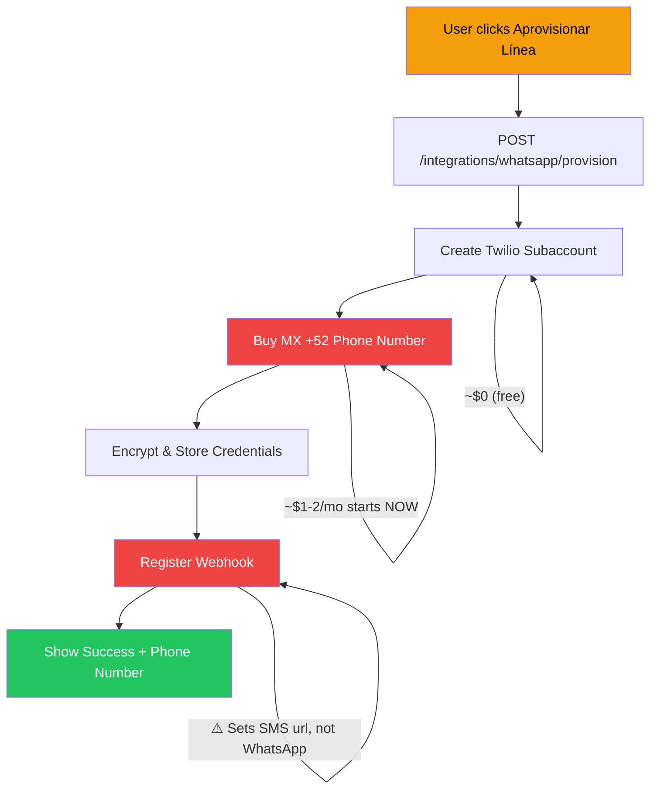

# 🛑 WhatsApp Provisioning Audit — DO NOT TEST YET

**Date:** 2026-07-17 | **Verdict: NOT SAFE TO RUN**

The provisioning pipeline has **6 critical defects** that will either waste real money or produce a non-functional integration. Here's the full picture.

---

## TL;DR — What happens when you click "Aprovisionar Línea"



> [!CAUTION]
> The number purchase is **immediate and real**. Even if everything else fails, you're billed from the moment of purchase.

---

## 🔴 Critical Defects (6 issues — any one is a blocker)

### 1. Webhook registers SMS, not WhatsApp
**File:** [twilio_engine.py](file:///Users/bernardo/projects/sherpa/backend/app/services/messaging/twilio_engine.py) (line 66-68)

The webhook registration sets `sms_url` on the phone number:
```python
self.client.incoming_phone_numbers(numbers[0].sid).update(
    sms_url=webhook_url,
    sms_method="POST"
)
```
WhatsApp messages through Twilio use the **WhatsApp Sender / Messaging Service** configuration, not the raw phone number's `sms_url`. **Result: provisioning "succeeds" but no WhatsApp messages will ever arrive.**

---

### 2. No Meta/Facebook Business Account linking
**File:** Entire [messaging/](file:///Users/bernardo/projects/sherpa/backend/app/services/messaging/) directory

Twilio requires every WhatsApp number to be linked to a Meta Business Account via Embedded Signup (you saw this yourself in the Twilio console). The provisioner skips this step entirely. **The purchased number will work for SMS/Voice only, not WhatsApp.**

Research doc exists at `docs/research/whatsapp_embedded_signup.md` acknowledging this — but it's not implemented.

---

### 3. Retry logic creates orphan subaccounts (wasted money)
**File:** [provisioner.py](file:///Users/bernardo/projects/sherpa/backend/app/services/messaging/provisioner.py) (lines 107-138)

Each retry attempt creates a **new** subaccount from scratch. If attempt 1 creates a subaccount but fails on number purchase, attempt 2 creates a **second** subaccount. The first one is never cleaned up. While subaccounts are free, any numbers purchased on orphaned accounts remain billable.

---

### 4. No admin role gate — any user can provision
**File:** [integrations.py](file:///Users/bernardo/projects/sherpa/backend/app/api/integrations.py) (line 218)

The endpoint only requires `get_current_user`. Any authenticated field rep can call `POST /whatsapp/provision` and trigger real Twilio billing. No admin check, no approval workflow.

---

### 5. No rate limit on provision endpoint
**File:** [integrations.py](file:///Users/bernardo/projects/sherpa/backend/app/api/integrations.py) (line 218)

No `@limiter.limit()` decorator. A buggy frontend or malicious user could spam the endpoint, creating dozens of subaccounts and purchasing dozens of numbers.

---

### 6. Re-provisioning over a "connected" integration is not blocked
**File:** [provisioner.py](file:///Users/bernardo/projects/sherpa/backend/app/services/messaging/provisioner.py) (lines 89-104)

If an integration already exists with `status: "connected"`, the code falls through and provisions **again** — creating a duplicate subaccount and buying a second number. No guard clause.

---

## 🟡 High-Risk Issues (won't block your test but will bite later)

| # | Issue | File | Impact |
|---|-------|------|--------|
| 7 | Webhook failure silently swallowed — user sees "success" but pipeline is dead | [provisioner.py:159-164](file:///Users/bernardo/projects/sherpa/backend/app/services/messaging/provisioner.py#L159-L164) | Dead integration |
| 8 | Disconnect flow deletes DB row before confirming Twilio cleanup | [integrations.py:274-295](file:///Users/bernardo/projects/sherpa/backend/app/api/integrations.py#L274-L295) | Lost orphan resources |
| 9 | `release_whatsapp_sender()` silently aborts on decryption failure | [provisioner.py:185-218](file:///Users/bernardo/projects/sherpa/backend/app/services/messaging/provisioner.py#L185-L218) | Leaked billing |
| 10 | Superadmin alerts write to ephemeral log file (lost on Railway restart) | [provisioner.py:14-29](file:///Users/bernardo/projects/sherpa/backend/app/services/messaging/provisioner.py#L14-L29) | Silent failures |
| 11 | No `unique_together` on `(business_id, provider)` in DB | [integration.py model](file:///Users/bernardo/projects/sherpa/backend/app/models/integration.py) | Duplicate records |
| 12 | Encryption key change = all stored tokens unrecoverable | [encryption.py](file:///Users/bernardo/projects/sherpa/backend/app/core/encryption.py) | Total lockout |

---

## 📋 Documentation Gaps

| What's missing | Impact |
|---|---|
| **No `.env.example`** file anywhere in the repo | No reference for required Twilio env vars |
| **Deployment guide** has zero WhatsApp/Twilio mentions | [deployment_guide.md](file:///Users/bernardo/projects/sherpa/docs/deployment_guide.md) |
| **Twilio setup guide was deleted** | Was at `temp/twilio_setup_guide.md`, confirmed in HANDOFF_LOG but file no longer exists |
| **docker-compose.yml** has no Twilio env vars | Local dev can't test messaging without manual setup |

---

## 💰 Cost Exposure Summary

| Resource | Cost | When charged |
|----------|------|-------------|
| Twilio subaccount creation | Free | — |
| MX (+52) phone number | ~$1-2/month | **Immediately on purchase** |
| Orphan from retry (worst case) | ~$1-2/month extra per attempt | Indefinite until manually found and released |
| WhatsApp messaging | Free first 1K service convos/month | After provisioning (if it worked) |

---

## ✅ What IS working correctly

| Component | Status |
|---|---|
| Frontend wizard (4-step modal) | ✅ Clean UX, proper error handling |
| Inbound webhook endpoint (`/whatsapp/webhook/twilio`) | ✅ Fully implemented with per-tenant signature validation |
| Identity-based message routing | ✅ Resolves sender role, dispatches to Celery queues |
| Encryption service | ✅ Fernet encryption works (fragile key management though) |
| Integration model & CRUD | ✅ Functional |
| Usage caps (200 msg/month) | ✅ Redis-based counter with hard block |
| Admin panel for managing integrations | ✅ Exists |

---

## 🎯 Recommended Fix Order Before Testing

### Must-fix (before any live test):

1. **Add guard clause** for already-connected integrations (prevents duplicate billing)
2. **Add admin role check** on provision endpoint
3. **Add rate limit** on provision endpoint  
4. **Fix retry idempotency** — resume from failed step, don't restart
5. **Acknowledge the Meta/WABA gap** — decide: test as SMS-only, or implement Embedded Signup first?

### Should-fix (before going to production):

6. Fix webhook registration to target WhatsApp Sender, not `sms_url`
7. Add DB unique constraint on `(business_id, provider)`
8. Make disconnect atomic (confirm Twilio release before deleting DB row)
9. Create `.env.example` with all required vars
10. Surface provisioning failures via real alerts (not ephemeral log files)

---

> [!IMPORTANT]
> **Bottom line:** If you click "Aprovisionar Línea" right now, you will pay ~$1-2/month for a Mexican phone number that **cannot receive WhatsApp messages**. The money is real, the WhatsApp integration is not. Fix items 1-4 minimum before testing, and decide on item 5 (Meta/WABA) to determine if this feature can ship at all without Embedded Signup.
